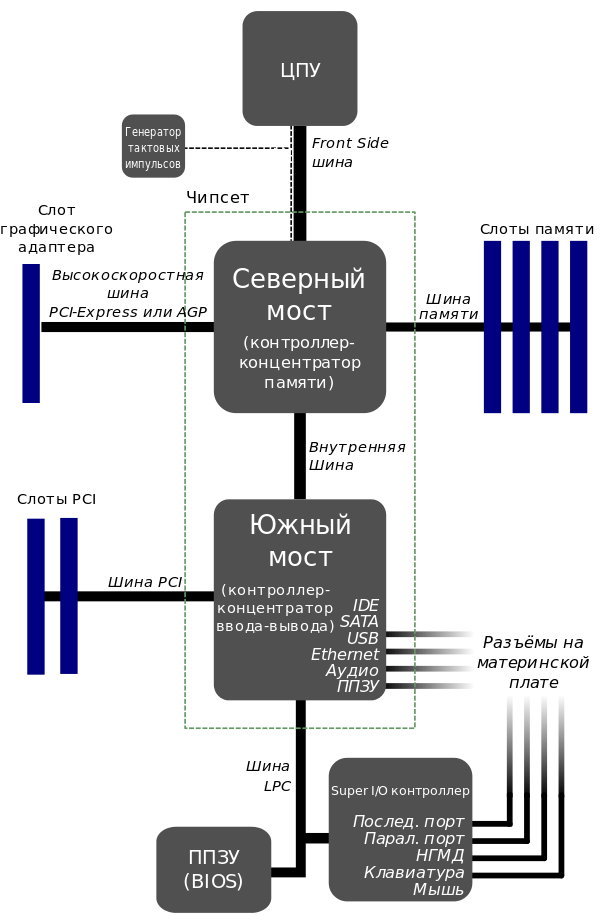

## Moterboard 

### FormFactor
### Socket
### sRAM
### sPCI-Express
#### x16
#### x1
### sSATA-III
### sBackPanel
#### USB3.1
#### USB3.o
#### EthernetRJ-45
#### S_PDIF
#### HDMI
#### Audio
### OverClocKing
## CPU
### Cache
#### L1
#### L2
#### L3
### ClockSpeed (ClSp)
#### InternalClSp
#### ExternalClSp
### BitDepth
### DementionTechProc
### Socket
### Power
#### ThermalDesignPower (TDP)
#### AverageCPUPower (ACP)
### ProcessorOperatingTemperature
### Multiplier_SystemBus
### InegratedGraphicsCore
### NumberCore
## RAM
### MemoryType
#### DDR3
#### DDR4
#### DDR5
### FormFactor
#### DIMM
#### SO-DIMM
### MemiryModuleSize
### ClockSpeed
#### Timing
#### CASLatency (CL)
#### RASToCASDelay (tRCD)
#### RowPrechargeDelay (tRD)
#### ActivatePrechargeDelay (tRAS)
## Colling
### RPM (RevPerMin)
### CFM (AmountAirSupplied)
### dB
### BearingTipe
### ConnectionSocket
### Design
## StorageDevice
### HDD
#### CashMemory
#### RAIDEdition
#### NCQ
#### iSATA-III
#### iSAS
### SSD
#### SingleLevelCell (SLC)
#### MultiLevelCell (MLC)
#### TripleLevelCell (TLC)
#### QuadLevelCell (QLC)
### SSHD

 
