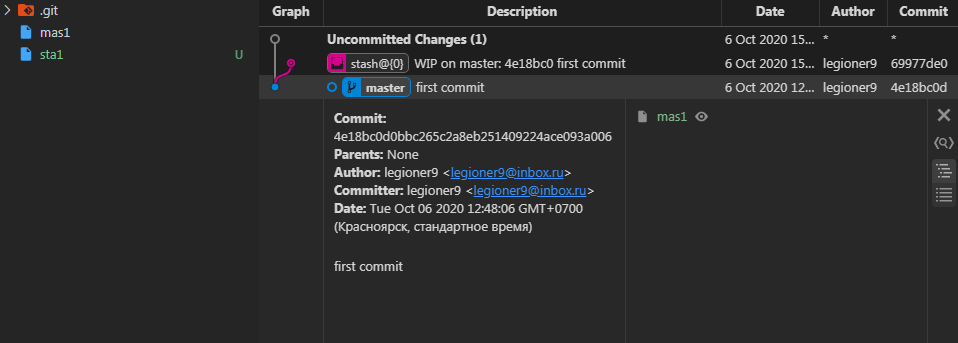
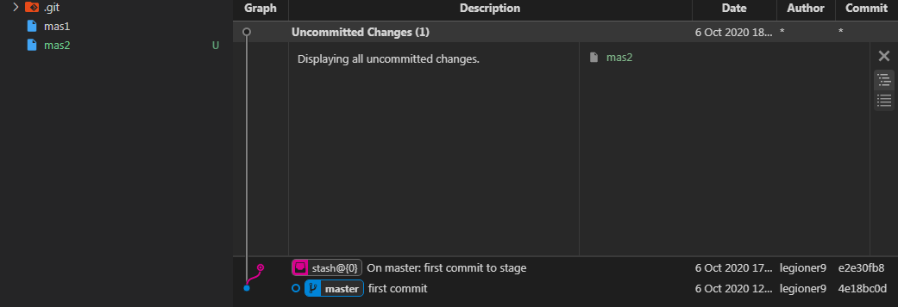
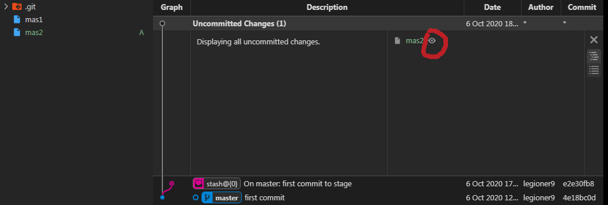
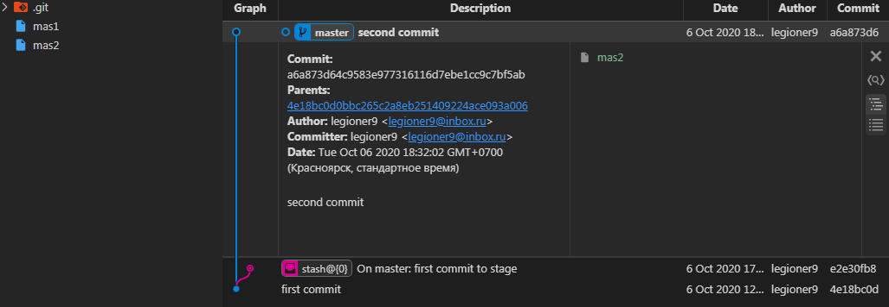

## create {shape_}
    $ git init
        Initialized empty Git repository in E:/Node_projects/Pre_Git/Start_set_1/Plan_proj_init_1/.git/

    {shape_1}={
        {st}={}
        {fs}={}
        {ws}={}
        {in}={}
        {lr}={}
        {ur}={}
        }

## create (change of) {wd} 

$ touch mas1

    {shape_1}={
        {st}={}        
        {fs}={}
        {ws}={}
        {in}={}
        {lr}={}
        {ur}={}
        }
            (*)
            {{wd} lo }[touch <mas1>]
    {shape_2}={
        {st}={}
        {fs}={mas1:''}
        {ws}={mas1:''}
        {in}={}
        {lr}={}
        {ur}={}
        }

    $ git lg
        fatal: your current branch 'master' does not have any commits yet

    $ git st
        On branch master

        No commits yet

        Untracked files:
        (use "git add <file>..." to include in what will be committed)
                mas1

## create (change of) {in}
    $ git add mas1

    {shape_2}={
        {st}={}
        {fs}={mas1:''}
        {ws}={mas1:''}
        {in}={}
        {lr}={}
        {ur}={}
        }
            (*)
            {{wd} up {in}}[git add <mas1>]
    {shape_2}={
        {st}={}
        {fs}={mas1:''}
        {ws}={}
        {in}={mas1:''}
        {lr}={}
        {ur}={}
        }

    $ git st
        On branch master

        No commits yet

        Changes to be committed:
        (use "git rm --cached <file>..." to unstage)
                new file:   mas1    

## first commit 

    $ git co mas1 -m 'first commit'
        [master (root-commit) 4e18bc0] first commit
        1 file changed, 0 insertions(+), 0 deletions(-)
        create mode 100644 mas1    

    $ git lg
        * 4e18bc0 - (HEAD -> master) first commit (8 minutes ago) <legioner9>

    {shape_2}={
        {st}={}
        {fs}={mas1:''}
        {ws}={}
        {in}={mas1:''}
        {lr}={}
        {ur}={}
        }
            (*)
            {{in} up {lr}}[git co <mas1> [-m 'first commit']]
    {shape_3}={
        {st}={}
        {fs}={mas1:''}
        {ws}={}
        {in}={}
        {lr}={
            4e18bc0[
                mas1:'',
            ]
        }
        {ur}={}
        }

## create $ touch mas2

    $ touch mas2

    {shape_3}={
        {st}={}
        {fs}={mas1:''}
        {ws}={}
        {in}={}
        {lr}={
            4e18bc0[
                mas1:'',
            ]
        }
        {ur}={}
        }
            (*)    
            {{wd} lo}[touch <mas2>]
    {shape_4}={
        {st}={}
        {fs}={
            mas1:'',
            mas2:'',
        }
        {ws}={mas2:''}
        {in}={}
        {lr}={
            4e18bc0[
                mas1:'',
            ]
        }
        {ur}={}
        }

## add mas2

    $ git add mas2

    {shape_4}={
        {st}={}
        {fs}={
            mas1:'',
            mas2:'',
        }
        {ws}={mas2:''}
        {in}={}
        {lr}={
            4e18bc0[
                mas1:'',
            ]
        }
        {ur}={}
        }
            (*)
            {{wd} up {in}}[git add <mas2>]
    {shape_5}={
        {st}={}
        {fs}={
            mas1:'',
            mas2:'',
        }        
        {ws}={}
        {in}={mas2:''}
        {lr}={
            4e18bc0[
                mas1:'',
            ]
        }
        {ur}={}
        }

## {wd} dn {sh}

    $ touch sta1
    $ git add sta1
    $ git st
        On branch master
        Changes to be committed:
        (use "git restore --staged <file>..." to unstage)
                new file:   sta1

### {{in} dn {wd}}
    $ git restore --staged sta1
    $ git st
        On branch master
        Untracked files:
        (use "git add <file>..." to include in what will be committed)
                sta1
    $ git add sta1
    $ git stash push -m 'first commit to stage'
        Saved working directory and index state On master: first commit to stage

    {shape_5}={
        {st}={}
        {ws}={}
        {in}={mas2:''}
        {lr}={
            4e18bc0[
                mas1:'',
            ]
        }
            (*)
            {{wd} lo}[touch <sta1>]
            (*)
            {{wd} up {in}}[git add <sta1>]
            (*)
            {{in} dn {sh}}[git stash push [-m 'first commit to stage'] ]
    {shape_6}={
        {st}={
            e2e30f[
                sta1:'',
            ]
        }
        {ws}={}
        {in}={}
        {lr}={
            4e18bc0[
                mas1:'',
            ]
        }

## second commit comm2

    $ touch mas2

    $ git add mas2

    $ git co mas2 -m 'second commit'
        [master a6a873d] second commit
        1 file changed, 0 insertions(+), 0 deletions(-)
        create mode 100644 mas2

    {shape_6}={
        {st}={
            e2e30f[
                sta1:'',
            ]
        }
        {ws}={}
        {in}={}
        {lr}={
            4e18bc0[
                mas1:'',
            ]
        }
        (*)
{{wd lo}} [touch mas2] 
{{wd} up {in}} [git add mas2]
{{in} up {}} [git co mas2 -m 'second commit']
