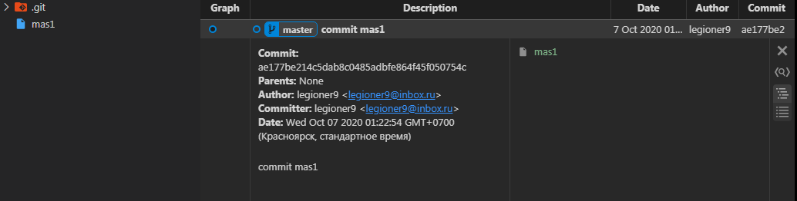
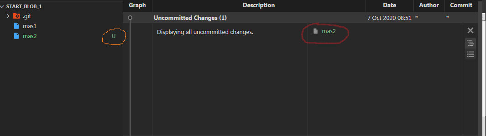
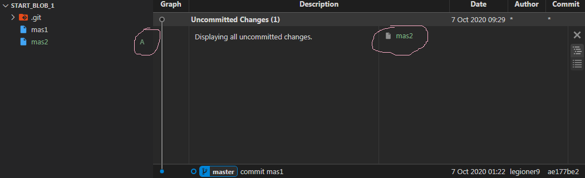
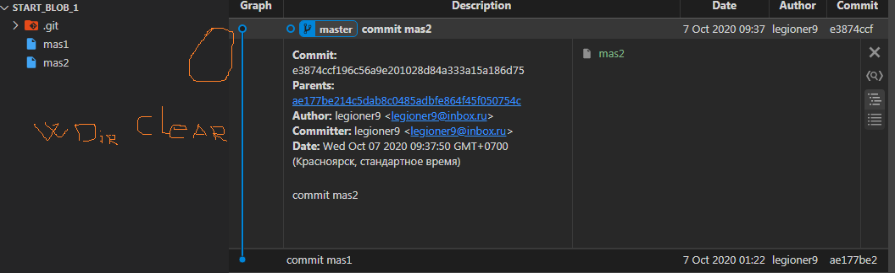
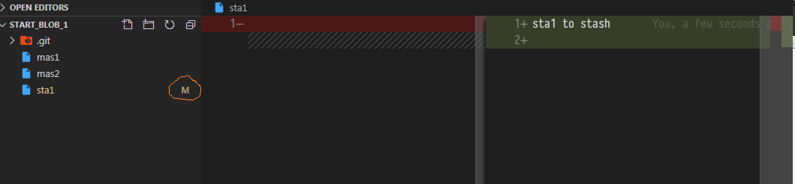
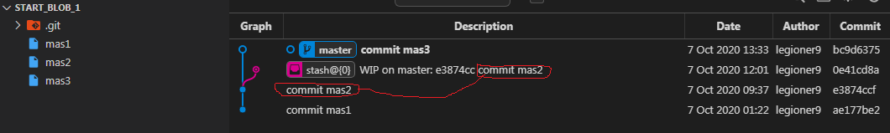

## {st} - (blob|ident) area :ident{stash}::blob: + :blob:
## {fs} - (file) area :file:
## {ws} - (ident) area :wd::file: - label on unstage file 
## {in} - (ident) area :in::file: - label on stage file
## {lr} - (blob|ident) area :ident{local repo}::blob: + :blob:
## {ur} - (blob|ident) area :ident{upstr repo}::blob: + :blob:

## git init
    $ git init
        Initialized empty Git repository in E:/Node_projects/Pre_Git/Start_set_1/Start_blob_1/.git/

    {shape_1}={
        {st}={}
        {fs}={}
        {ws}={}
        {in}={}
        {lr}={}
        {ur}={}
        }

## create mas1

    $ touch mas1

    {shape_1}={
        {st}={}
        {fs}={}
        {ws}={}
        {in}={}
        {lr}={}
        {ur}={}
        }
            (*) 
            {{fs} lo} [touch <mas1>]
    {shape_2}={
        {st}={}
        {fs}={
            mas1:'',
        }
        {ws}={}
        {in}={}
        {lr}={}
        {ur}={}
        }
         
##  add mas1

    $ git add mas1
    $ git st
        On branch master

        No commits yet

        Changes to be committed:
        (use "git rm --cached <file>..." to unstage)
                new file:   mas1

    {shape_2}={
        {st}={}
        {fs}={
            mas1:'',
        }
        {ws}={
            mas1:'',
        }
        {in}={}
        {lr}={}
        {ur}={}
        }
            (*)
            {{ws} up {in}} [git add <mas1>]
    {shape_3}={
        {st}={}
        {fs}={
            mas1:'',
        }
        {ws}={}
        {in}={
            mas1:'',
        }
        {lr}={}
        {ur}={}
        }

## commit mas1

    $ git commit mas1 -m 'commit mas1'
        [master (root-commit) ae177be] commit mas1
        1 file changed, 0 insertions(+), 0 deletions(-)
        create mode 100644 mas1

    {shape_3}={
        {st}={}
        {fs}={
            mas1:'',
        }
        {ws}={}
        {in}={
            mas1:'',
        }
        {lr}={}
        {ur}={}
        }
            (*)
            {{in} up {lr}} [git commit <mas1> [-m 'commit mas1']]
    {shape_4}={
        {st}={}
        {fs}={
            mas1:'',
        }
        {ws}={}
        {in}={}
        {lr}={
            [master (root-commit) ae177be]:[
                mas1:'',
            ]
        }
        {ur}={}
        }

## touch mas2

   $ touch mas2

    {shape_4}={
        {st}={}
        {fs}={
            mas1:'',
        }
        {ws}={}
        {in}={}
        {lr}={
            [master (root-commit) ae177be]:[
                mas1:'',
            ]
        }
        {ur}={}
        }
            (*)
            {{fs} lo} [touch <mas2>]
            {{ws} up {in}} [git add <mas2>]
    {shape_5}={
            {st}={}
            {fs}={
                mas1:'',
                mas2:'',
            }
            {ws}={}
            {in}={
                mas2:'',            
            }
            {lr}={
                [master (root-commit) ae177be]:[
                    mas1:'',
                ]
            }
            {ur}={}
        }

    $ git co mas2 -m 'commit mas2'
        [master e3874cc] commit mas2
        1 file changed, 0 insertions(+), 0 deletions(-)
        create mode 100644 mas2

    $ git lg
        * e3874cc - (HEAD -> master) commit mas2 (17 minutes ago) <legioner9>
        * ae177be - commit mas1 (9 hours ago) <legioner9>

    $ git st
        On branch master
        nothing to commit, working tree clean

    {shape_5}={
            {st}={}
            {fs}={
                mas1:'',
                mas2:'',
            }
            {ws}={}
            {in}={
                mas2:'',            
            }
            {lr}={
                [master (root-commit) ae177be]:[
                    mas1:'',
                ]
            }
            {ur}={}
        }
            (*)
            {{in} up {lr}} [git co mas2 [-m 'commit mas2']]
    {shape_6}={
            {st}={}
            {fs}={
                mas1:'',
                mas2:'',
            }
            {ws}={}
            {in}={}
            {lr}={
                [master (root-commit) ae177be]:[
                    mas1:'',
                ],
                [master e3874cc]:[
                    mas2:'',
                ],
            }
            {ur}={}
        }
    
## sta1 go to {stash}

    $ touch sta1
    $ git add sta1
    $ echo 'sta1 to stash' > sta1
    
    {shape_6}={
            {st}={}
            {fs}={
                mas1:'',
                mas2:'',
            }
            {ws}={}
            {in}={}
            {lr}={
                [master (root-commit) ae177be]:[
                    mas1:'',
                ],
                [master e3874cc]:[
                    mas2:'',
                ],
            }
            {ur}={}
        }
        (*)
        {{fs} lo cr} [touch sta1]
        {{ws} up {in}} [git add sta1]
        {{fs} lo mo} [echo 'sta1 to stash' > sta1]
    {shape_7}={
            {st}={}
            {fs}={
                mas1:'',
                mas2:'',
            }
            {ws}={
                sta1:'sta1 to stash',
            }
            {in}={
                {
                sta1:'',
            }
            }
            {lr}={
                [master (root-commit) ae177be]:[
                    mas1:'',
                ],
                [master e3874cc]:[
                    mas2:'',
                ],
            }
            {ur}={}
        }        

    $ git stash
        warning: LF will be replaced by CRLF in sta1.
        The file will have its original line endings in your working directory
        Saved working directory and index state WIP on master: e3874cc commit mas2

### atten! {stash} add modif {ws}

    {shape_7}={
            {st}={}
            {fs}={
                mas1:'',
                mas2:'',
            }
            {ws}={
                sta1:'sta1 to stash',
            }
            {in}={
                {
                sta1:'',
            }
            }
            {lr}={
                [master (root-commit) ae177be]:[
                    mas1:'',
                ],
                [master e3874cc]:[
                    mas2:'',
                ],
            }
            {ur}={}
        }
            (*)
            {{ws(mod)} up {in} && {in} up {st}} [git stash]
    {shape_8}={
            {st}={
                [e3874cc commit mas2]:[
                    sta1:'sta1 to stash',
                ]
            }
            {fs}={
                mas1:'',
                mas2:'',
            }
            {ws}={}
            {in}={}
            }
            {lr}={
                [master (root-commit) ae177be]:[
                    mas1:'',
                ],
                [master e3874cc]:[
                    mas2:'',
                ],
            }
            {ur}={}
        }

## bring inside mas3   

    $ touch mas3
    $ git add mas3
    $ git co mas3 -m 'commit mas3'
    [master bc9d637] commit mas3
        1 file changed, 0 insertions(+), 0 deletions(-)
        create mode 100644 mas3

    {shape_8}={
            {st}={
                [e3874cc commit mas2]:[
                    sta1:'sta1 to stash',
                ]
            }
            {fs}={
                mas1:'',
                mas2:'',
            }
            {ws}={}
            {in}={}
            }
            {lr}={
                [master (root-commit) ae177be]:[
                    mas1:'',
                ],
                [master e3874cc]:[
                    mas2:'',
                ],
            }
            {ur}={}
        }
        (*)
        {{fs} lo cr} [touch mas3]
        {{ws} up {in}} [git add mas3]
        {{in} up {lr}} [git co mas3 -m 'commit mas3']
    {shape_9}={
            {st}={
                [e3874cc commit mas2]:[
                    sta1:'sta1 to stash',
                ]
            }
            {fs}={
                mas1:'',
                mas2:'',
                mas3:'',
            }
            {ws}={}
            {in}={}
            }
            {lr}={
                [master (root-commit) ae177be]:[
                    mas1:'',
                ],
                [master e3874cc]:[
                    mas2:'',
                ],
                [master bc9d637]:{
                    mas3:'',
                }
            }
            {ur}={}
        }