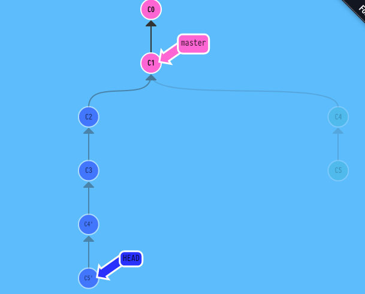

## file git config

    [user]
    	email = legioner9@inbox.ru
    	name = legioner9
    [core]
    	editor = 'C:/Program Files (x86)/Notepad++/notepad++.exe' -multiInst -notabbar -nosession -noPlugin
    [alias]
    	lg = log --color --graph --pretty=format:'%Cred%h%Creset -%C(yellow)%d%Creset %s %Cgreen(%cr) %C(bold blue)<%an>%Creset' --abbrev-commit
    	 
    

## commit [create commit from HEAD]

    //COM - commit
    //BR - branch
    //HEAD<->BR - BR is activ
    //BR->COM - BR poinds to COM
    //HEAD->COM - HEAD poinds to COM
    //chCOM!=ch(COM!)=(child from COM!)

    git {from HEAD->COM!} 
    commit {=> create chCOM! & HEAD->chCOM!};
     

## make branch [create branch from HEAD]

    git {HEAD->COM!} 
    branch <BR::new:arg> {=> create arg->COM!};
    
## checkout [transfer HEAD to arg1]

    git  checkout <COM:arg> {=> HEAD->arg};
    git  checkout <BR:arg> {=> HEAD<->arg};
    
### checkout -b [transfer HEAD to new branch]

    git {HEAD->COM!} 
    checkout -b <BR::new:arg> {=>create (BR::new<->HEAD)->COM!};
     
## merge [create & transfer HEAD to commit new(HEAD+arg1)']

    ch(COM) - chaild of COM

    git {with HEAD} 
    merge <COM:arg> {=> HEAD->(new ch(HEAD+arg))};

## rebase

    //comPAR=comPAR(COM,COM!) - common not close parent COM and COM!
    //chainPar=chainPar(COM!,PAR!=comPAR(COM,COM!)) - chain of //commits from COM! to PAR!
    //chainFree=chainFree(COM!,PAR!=comPAR(COM,COM!))=chainPar-comP//AR
    //first(chainFree) - first commit from chainFree
    //last(chainFree) - last commit from chainFree

    git {from HEAD->COM! to COM} 
    rebase <toCOM:arg> {=>  HEAD->last(chainFree) & ch(COM)=first(chainFree)}
     
    

## ^

    git checkout HEAD^
    
## ~ 

    git checkout HEAD~2
    

    

