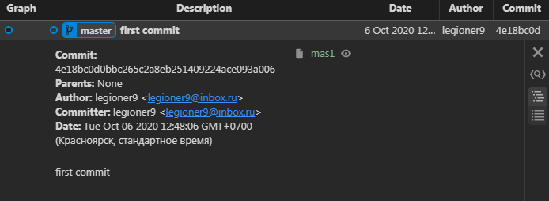
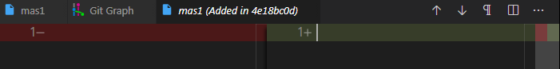

## create {shape_}
    $ git init
        Initialized empty Git repository in E:/Node_projects/Pre_Git/Start_set_1/Plan_proj_init_1/.git/

    {shape_1}={
        {st}={}
        {ws}={}
        {in}={}
        {lr}={}
        {ur}={}
        }

## create (change of) {wd} 

$ touch mas1

    {shape_1}={
        {st}={}
        {ws}={}
        {in}={}
        {lr}={}
        {ur}={}
        }
            (*)
            {{wd} lo {wd}}[touch <mas1>]
    {shape_2}={
        {st}={}
        {ws}={mas1:''}
        {in}={}
        {lr}={}
        {ur}={}
        }

    $ git lg
        fatal: your current branch 'master' does not have any commits yet

    $ git st
        On branch master

        No commits yet

        Untracked files:
        (use "git add <file>..." to include in what will be committed)
                mas1

## create (change of) {in}
    $ git add mas1

    {shape_2}={
        {st}={}
        {ws}={mas1:''}
        {in}={}
        {lr}={}
        {ur}={}
        }
            (*)
            {{wd} up {in}}[git add <mas1>]
    {shape_2}={
        {st}={}
        {ws}={}
        {in}={mas1:''}
        {lr}={}
        {ur}={}
        }

    $ git st
        On branch master

        No commits yet

        Changes to be committed:
        (use "git rm --cached <file>..." to unstage)
                new file:   mas1    

## first commit 

    $ git co mas1 -m 'first commit'
        [master (root-commit) 4e18bc0] first commit
        1 file changed, 0 insertions(+), 0 deletions(-)
        create mode 100644 mas1    

    $ git lg
        * 4e18bc0 - (HEAD -> master) first commit (8 minutes ago) <legioner9>

    {shape_2}={
        {st}={}
        {ws}={}
        {in}={mas1:''}
        {lr}={}
        {ur}={}
        }
            (*)
            {{in} up {lr}}[git co <mas1> [-m 'first commit']]
    {shape_2}={
        {st}={}
        {ws}={}
        {in}={}
        {lr}={
            4e18bc0[
                mas1:'',
            ]
        }
        {ur}={}
        }

