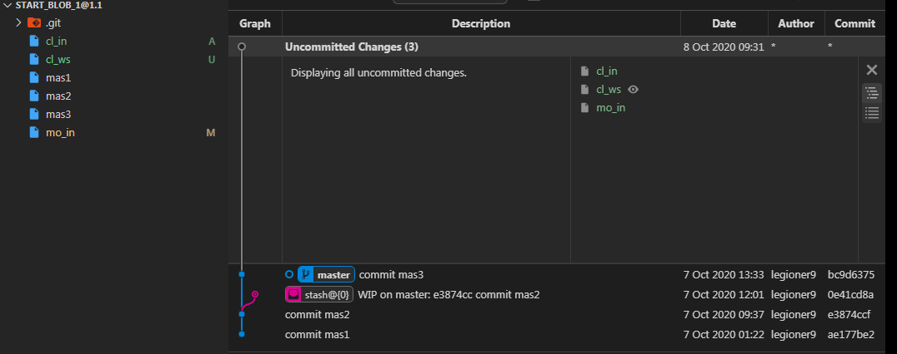
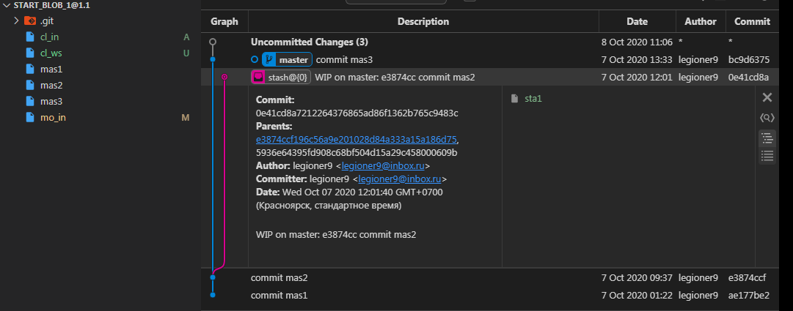

    {shape_11}={
            {st}={
                [e3874cc commit mas2]:[
                    sta1:'sta1 to stash',
                ]
            }
            {fs}={
                mas1:'',
                mas2:'',
                mas3:'',
                cl_ws:'',
                cl_in:'',
                mo_in:'modify mo_in',                
            }
            {ws}={
                cl_ws:'',
                mo_in:'modify mo_in',          
            }
            {in}={
                cl_in:'',
                mo_in:'',                                
            }
            }
            {lr}={
                [master (root-commit) ae177be]:[
                    mas1:'',
                ],
                [master e3874cc]:[
                    mas2:'',
                ],
                [master bc9d637]:{
                    mas3:'',
                }
            }
            {ur}={}
        }

    $ git st
        Refresh index: 100% (5/5), done.
        On branch master
        Changes to be committed:
        (use "git restore --staged <file>..." to unstage)
                new file:   cl_in
                new file:   mo_in

        Changes not staged for commit:
        (use "git add <file>..." to update what will be committed)
        (use "git restore <file>..." to discard changes in working directory)
                modified:   mo_in

        Untracked files:
        (use "git add <file>..." to include in what will be committed)
                cl_ws

    $ git lg
        * bc9d637 - (HEAD -> master) commit mas3 (20 hours ago) <legioner9>
        * e3874cc - commit mas2 (24 hours ago) <legioner9>
        * ae177be - commit mas1 (32 hours ago) <legioner9>

    $ git stash list
        stash@{0}: WIP on master: e3874cc commit mas2

## EXAMPLES
When recording your own work, the contents of modified files in your working tree are temporarily stored to a staging area called the "index" with git add. A file can be reverted back, only in the index but not in the working tree, to that of the last commit with `git restore --staged <file>`, which effectively reverts `git add` and prevents the changes to this file from participating in the next commit. After building the state to be committed incrementally with these commands, `git commit` (without any pathname parameter) is used to record what has been staged so far. This is the most basic form of the command. An example:

При записи вашей собственной работы содержимое измененных файлов в вашем рабочем дереве временно сохраняется в промежуточной области, называемой «индексом» с помощью `git add` . Файл может быть возвращен обратно, только в индексе, но не в рабочем дереве, к тому из последнего коммита `git restore --staged <file>`, что эффективно отменяет `git add` и предотвращает участие изменений этого файла в следующем коммите. После создания состояния, которое будет постепенно фиксироваться с помощью этих команд, `git commit`(без какого-либо параметра имени пути) используется для записи того, что было поставлено на данный момент. Это самая основная форма команды. Пример:

    $ edit hello.c
    $ git rm goodbye.c
    $ git add hello.c
    $ git commit
Instead of staging files after each individual change, you can tell `git commit` to notice the changes to the files whose contents are tracked in your working tree and do corresponding `git add` and `git rm` for you. That is, this example does the same as the earlier example if there is no other change in your working tree:

Вместо постановки файлов после каждого отдельного изменения, вы можете сказать , `git commit`чтобы заметить изменения в файлы, содержимое которых отслеживаются в рабочем дереве и сделать соответствующие `git add`и `git rm` для вас. То есть этот пример делает то же самое, что и предыдущий, если в вашем рабочем дереве нет других изменений:

    $ edit hello.c
    $ rm goodbye.c
    $ git commit -a
The command `git commit -a` first looks at your working tree, notices that you have modified hello.c and removed goodbye.c, and performs necessary `git add` and `git rm` for you.

Команда `git commit -a`сначала смотрит на ваше рабочее дереве, замечает , что вы изменили hello.c и снятую goodbye.c и выполняемые необходимы `git add`и `git rm`для вас.

After staging changes to many files, you can alter the order the changes are recorded in, by giving pathnames to git commit. When pathnames are given, the command makes a commit that only records the changes made to the named paths:

    $ edit hello.c hello.h
    $ git add hello.c hello.h
    $ edit Makefile
    $ git commit Makefile
This makes a commit that records the modification to Makefile. The changes staged for hello.c and hello.h are not included in the resulting commit. However, their changes are not lost — they are still staged and merely held back. After the above sequence, if you do:

    $ git commit
this second commit would record the changes to hello.c and hello.h as expected.

After a merge (initiated by git merge or git pull) stops because of conflicts, cleanly merged paths are already staged to be committed for you, and paths that conflicted are left in unmerged state. You would have to first check which paths are conflicting with git status and after fixing them manually in your working tree, you would stage the result as usual with git add:

    $ git status | grep unmerged
    unmerged: hello.c
    $ edit hello.c
    $ git add hello.c
After resolving conflicts and staging the result, git ls-files -u would stop mentioning the conflicted path. When you are done, run git commit to finally record the merge:

    $ git commit
As with the case to record your own changes, you can use `-a` option to save typing. One difference is that during a merge resolution, you cannot use git commit with pathnames to alter the order the changes are committed, because the merge should be recorded as a single commit. In fact, the command refuses to run when given pathnames (but see `-i` option).

## OUR LIVE

    $ git commit
        hint: Waiting for your editor to close the file...

in redactor:

    # Please enter the commit message for your changes. Lines starting
    # with '#' will be ignored, and an empty message aborts the commit.
    #
    # On branch master
    # Your branch is up to date with 'lo_repo/master'.
    #
    # Changes to be committed:
    #	new file:   cl_in
    #	new file:   mo_in
    #
    # Changes not staged for commit:
    #	modified:   mo_in
    #
    # Untracked files:
    #	cl_ws
    #
    
### git restore --staged  is opposit git add

    $ touch file_is
    $ git add file_is
    $ git co {aborting}
        hint: Waiting for your editor to close the file...
        
        # Changes to be committed:
        #	new file:   cl_in
        #	new file:   file_is
        #	new file:   mo_in
        #
        # Changes not staged for commit:
        #	modified:   mo_in
        #
        # Untracked files:
        #	cl_ws
        
    $ git restore --staged file_is
    
    $ git co {aborting}
    
        # Untracked files:
        #	cl_ws
        #	file_is
        
### git commit -a

    $ rm file_is
    $ git co {aborting}
        # Changes to be committed:
        #	new file:   cl_in
        #	new file:   mo_in
        #
        # Changes not staged for commit:
        #	modified:   mo_in
        #
        # Untracked files:
        #	cl_ws
    $ git co -a {aborting}
    # Changes to be committed:
        #	new file:   cl_in
        #	new file:   mo_in
        #
        # Untracked files:
        #	cl_ws
         

#### is commit without modified     

    

