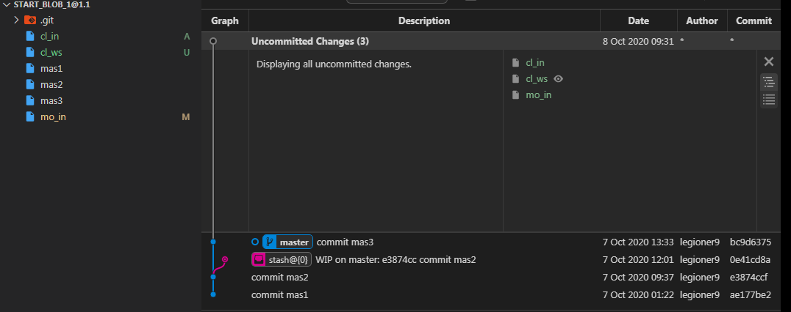

    {shape_11}={
            {st}={
                [e3874cc commit mas2]:[
                    sta1:'sta1 to stash',
                ]
            }
            {fs}={
                mas1:'',
                mas2:'',
                mas3:'',
                cl_ws:'',
                cl_in:'',
                mo_in:'modify mo_in',                
            }
            {ws}={
                cl_ws:'',
                mo_in:'modify mo_in',          
            }
            {in}={
                cl_in:'',
                mo_in:'',                                
            }
            }
            {lr}={
                [master (root-commit) ae177be]:[
                    mas1:'',
                ],
                [master e3874cc]:[
                    mas2:'',
                ],
                [master bc9d637]:{
                    mas3:'',
                }
            }
            {ur}={}
        }

    $ git st
        Refresh index: 100% (5/5), done.
        On branch master
        Changes to be committed:
        (use "git restore --staged <file>..." to unstage)
                new file:   cl_in
                new file:   mo_in

        Changes not staged for commit:
        (use "git add <file>..." to update what will be committed)
        (use "git restore <file>..." to discard changes in working directory)
                modified:   mo_in

        Untracked files:
        (use "git add <file>..." to include in what will be committed)
                cl_ws

    $ git lg
        * bc9d637 - (HEAD -> master) commit mas3 (20 hours ago) <legioner9>
        * e3874cc - commit mas2 (24 hours ago) <legioner9>
        * ae177be - commit mas1 (32 hours ago) <legioner9>

    $ git stash list
        stash@{0}: WIP on master: e3874cc commit mas2

    $ git st
        On branch master
        Changes to be committed:
        (use "git restore --staged <file>..." to unstage)
                new file:   cl_in
                new file:   mo_in

        Changes not staged for commit:
        (use "git add <file>..." to update what will be committed)
        (use "git restore <file>..." to discard changes in working directory)
                modified:   mo_in

        Untracked files:
        (use "git add <file>..." to include in what will be committed)
                .gitignore
                cl_ws

    $ git lg
        * bc9d637 - (HEAD -> master) commit mas3 (3 days ago) <legioner9>
        * e3874cc - commit mas2 (3 days ago) <legioner9>
        * ae177be - commit mas1 (3 days ago) <legioner9>

    $ git add -i
    
### git restore --staged  is opposit git add

    $ touch file_is
    $ git add file_is
    $ git co {aborting}
        hint: Waiting for your editor to close the file...
        
        # Changes to be committed:
        #	new file:   cl_in
        #	new file:   file_is
        #	new file:   mo_in
        #
        # Changes not staged for commit:
        #	modified:   mo_in
        #
        # Untracked files:
        #	cl_ws
        
    $ git restore --staged file_is
    
    $ git co {aborting}
    
        # Untracked files:
        #	cl_ws
        #	file_is

## [7.2 Инструменты Git - Интерактивное индексирование](https://git-scm.com/book/ru/v2/%D0%98%D0%BD%D1%81%D1%82%D1%80%D1%83%D0%BC%D0%B5%D0%BD%D1%82%D1%8B-Git-%D0%98%D0%BD%D1%82%D0%B5%D1%80%D0%B0%D0%BA%D1%82%D0%B8%D0%B2%D0%BD%D0%BE%D0%B5-%D0%B8%D0%BD%D0%B4%D0%B5%D0%BA%D1%81%D0%B8%D1%80%D0%BE%D0%B2%D0%B0%D0%BD%D0%B8%D0%B5)

    $ git add -i
        warning: LF will be replaced by CRLF in mo_in.
        The file will have its original line endings in your working directory
                   staged     unstaged path
          1:        +1/-0      nothing .gitignore
          2:        +0/-0      nothing cl_in
          3:        +0/-0        +1/-0 mo_in
        
        *** Commands ***
          1: [s]tatus     2: [u]pdate     3: [r]evert     4: [a]dd untracked
          5: [p]atch      6: [d]iff       7: [q]uit       8: [h]elp
        
    What now> q
        Bye.
        
## what that?:
                   staged     unstaged path
          1:        +1/-0      nothing .gitignore
          2:        +0/-0      nothing cl_in
          3:        +0/-0        +1/-0 mo_in
    
Lets make some changes:

    $ touch file_is

               staged     unstaged path
        1:        +1/-0      nothing .gitignore
        2:        +0/-0      nothing cl_in
        3:        +0/-0        +1/-0 mo_in
          
    $ git add file_is
    
               staged     unstaged path
        1:        +1/-0      nothing .gitignore
        2:        +0/-0      nothing cl_in
        3:        +0/-0      nothing file_is
        4:        +0/-0        +1/-0 mo_in
          
    $ echo 'modified file_is' > file_is
    
                   staged     unstaged path
        1:        +1/-0      nothing .gitignore
        2:        +0/-0      nothing cl_in
        3:        +0/-0        +1/-0 file_is
        4:        +0/-0        +1/-0 mo_in

    $ git co file_is -m 'what file_is'
    
        warning: LF will be replaced by CRLF in file_is.
        The file will have its original line endings in your working directory
        warning: LF will be replaced by CRLF in file_is.
        The file will have its original line endings in your working directory
        [master 717e92f] what file_is
         1 file changed, 1 insertion(+)
         create mode 100644 file_is

    $ git add -i
        warning: LF will be replaced by CRLF in mo_in.
        The file will have its original line endings in your working directory
                   staged     unstaged path
          1:        +1/-0      nothing .gitignore
          2:        +0/-0      nothing cl_in
          3:        +0/-0        +1/-0 mo_in
        
        *** Commands ***
          1: [s]tatus     2: [u]pdate     3: [r]evert     4: [a]dd untracked
          5: [p]atch      6: [d]iff       7: [q]uit       8: [h]elp
        What now> u
            warning: LF will be replaced by CRLF in mo_in.
            The file will have its original line endings in your working directory
                       staged     unstaged path
       
        Update> m
                       staged     unstaged path
            * 1:        +0/-0        +1/-0 [m]o_in
        Update>>
            warning: LF will be replaced by CRLF in mo_in.
            The file will have its original line endings in your working directory
            updated 1 path
            
         *** Commands ***
          1: [s]tatus     2: [u]pdate     3: [r]evert     4: [a]dd untracked
          5: [p]atch      6: [d]iff       7: [q]uit       8: [h]elp

    $ echo patch_1 >> file_is
    $ echo patch_2 >> file_is

   $ git add -i
        warning: LF will be replaced by CRLF in file_is.
        The file will have its original line endings in your working directory
                   staged     unstaged path
          1:        +1/-0      nothing .gitignore
          2:        +0/-0      nothing cl_in
          3:    unchanged        +2/-0 file_is
          4:        +1/-0      nothing mo_in

        What now> d
            warning: LF will be replaced by CRLF in file_is.
            The file will have its original line endings in your working directory
                       staged     unstaged path
              1:        +1/-0      nothing [.]gitignore
              2:        +0/-0      nothing [c]l_in
              3:        +1/-0      nothing [m]o_in
            Review diff>> 3
                diff --git a/mo_in b/mo_in
                new file mode 100644
                index 0000000..68feb25
                --- /dev/null
                +++ b/mo_in
                @@ -0,0 +1 @@
                +modify mo_in

    