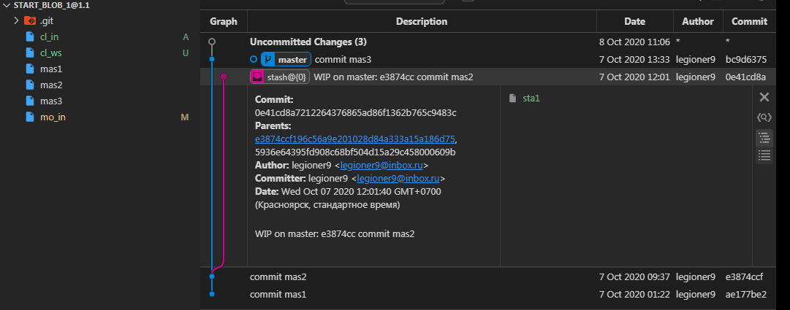

    {shape_11}={
            {st}={
                [e3874cc commit mas2]:[
                    sta1:'sta1 to stash',
                ]
            }
            {fs}={
                mas1:'',
                mas2:'',
                mas3:'',
                cl_ws:'',
                cl_in:'',
                mo_in:'modify mo_in',                
            }
            {ws}={
                cl_ws:'',
                mo_in:'modify mo_in',          
            }
            {in}={
                cl_in:'',
                mo_in:'',                                
            }
            }
            {lr}={
                [master (root-commit) ae177be]:[
                    mas1:'',
                ],
                [master e3874cc]:[
                    mas2:'',
                ],
                [master bc9d637]:{
                    mas3:'',
                }
            }
            {ur}={}
        }

    $ git st
        Refresh index: 100% (5/5), done.
        On branch master
        Changes to be committed:
        (use "git restore --staged \<file>..." to unstage)
                new file:   cl_in
                new file:   mo_in

        Changes not staged for commit:
        (use "git add \<file>..." to update what will be committed)
        (use "git restore \<file>..." to discard changes in working directory)
                modified:   mo_in

        Untracked files:
        (use "git add \<file>..." to include in what will be committed)
                cl_ws

    $ git lg
        * bc9d637 - (HEAD -> master) commit mas3 (20 hours ago) \<legioner9>
        * e3874cc - commit mas2 (24 hours ago) \<legioner9>
        * ae177be - commit mas1 (32 hours ago) \<legioner9>

    $ git stash list
        stash@{0}: WIP on master: e3874cc commit mas2

## NAME
`git-diff` - Show changes between commits, commit and working tree, etc

`git-diff` - Показать изменения между коммитами, коммитом и рабочим деревом и т. д.

## SYNOPSIS
    git diff [\<options>] [\<commit>] [--] [\<path>…​]
    git diff [\<options>] --cached [\<commit>] [--] [\<path>…​]
    git diff [\<options>] \<commit> [\<commit>…​] \<commit> [--] [\<path>…​]
    git diff [\<options>] \<commit>…​\<commit> [--] [\<path>…​]
    git diff [\<options>] \<blob> \<blob>
    git diff [\<options>] --no-index [--] \<path> \<path>
    
## DESCRIPTION
Show changes between the working tree and the index or a tree, changes between the index and a tree, changes between two trees, changes resulting from a merge, changes between two blob objects, or changes between two files on disk.

Отображение изменений между рабочим деревом и индексом или деревом, изменениями между индексом и деревом, изменениями между двумя деревьями, изменениями в результате слияния, изменениями между двумя объектами BLOB-объектов или изменениями между двумя файлами на диске.

### git diff [\<options>] [--] [\<path>…​]
This form is to view the changes you made relative to the index (staging area for the next commit). In other words, the differences are what you could tell Git to further add to the index but you still haven’t. You can stage these changes by using git-add(1).

Эта форма предназначена для просмотра изменений, которые вы внесли относительно индекса (промежуточная область для следующей фиксации). Другими словами, различия заключаются в том, что вы могли бы сказать Git о дальнейшем добавлении в индекс, но вы этого еще не сделали. Вы можете выполнить эти изменения с помощью git-add (1) .

### git diff [\<options>] --no-index [--] \<path> \<path>
This form is to compare the given two paths on the filesystem. You can omit the --no-index option when running the command in a working tree controlled by Git and at least one of the paths points outside the working tree, or when running the command outside a working tree controlled by Git. This form implies --exit-code.

Эта форма предназначена для сравнения двух указанных путей в файловой системе. Вы можете опустить эту --no-indexопцию при запуске команды в рабочем дереве, управляемом Git, и хотя бы один из путей указывает за пределами рабочего дерева, или при выполнении команды вне рабочего дерева, управляемого Git. Эта форма подразумевает --exit-code.

### git diff [\<options>] --cached [\<commit>] [--] [\<path>…​]
This form is to view the changes you staged for the next commit relative to the named \<commit>. Typically you would want comparison with the latest commit, so if you do not give \<commit>, it defaults to HEAD. If HEAD does not exist (e.g. unborn branches) and \<commit> is not given, it shows all staged changes. --staged is a synonym of --cached.

Эта форма предназначена для просмотра изменений, которые вы подготовили для следующего коммита относительно названного \<commit>. Обычно вам нужно сравнить с последней фиксацией, поэтому, если вы не укажете \<commit>, по умолчанию будет использоваться HEAD. Если HEAD не существует (например, нерожденные ветки) и \<commit> не задан, отображаются все поэтапные изменения. --staged является синонимом --cached.

### git diff [\<options>] \<commit> [--] [\<path>…​]
This form is to view the changes you have in your working tree relative to the named \<commit>. You can use HEAD to compare it with the latest commit, or a branch name to compare with the tip of a different branch.

Эта форма предназначена для просмотра изменений в вашем рабочем дереве относительно названного \<commit>. Вы можете использовать HEAD, чтобы сравнить его с последней фиксацией, или имя ветки, чтобы сравнить с кончиком другой ветки.

### git diff [\<options>] \<commit> \<commit> [--] [\<path>…​]
This is to view the changes between two arbitrary \<commit>.

Это для просмотра изменений между двумя произвольными \<commit>.

### git diff [\<options>] \<commit> \<commit>…​ \<commit> [--] [\<path>…​]
This form is to view the results of a merge commit. The first listed \<commit> must be the merge itself; the remaining two or more commits should be its parents. A convenient way to produce the desired set of revisions is to use the ^@ suffix. For instance, if master names a merge commit, git diff master master^@ gives the same combined diff as git show master.

Эта форма предназначена для просмотра результатов фиксации слияния. Первым в списке \<commit> должно быть само слияние; оставшиеся два или более коммитов должны быть его родительскими. Удобный способ произвести желаемый набор ревизий - использовать суффикс ^ @. Например, если masterименует фиксацию слияния, git diff master master^@дает ту же комбинированную разницу, что и git show master.

### git diff [\<options>] \<commit>..\<commit> [--] [\<path>…​]
This is synonymous to the earlier form (without the "..") for viewing the changes between two arbitrary \<commit>. If \<commit> on one side is omitted, it will have the same effect as using HEAD instead.

Это синоним предыдущей формы (без "..") для просмотра изменений между двумя произвольными \<commit>. Если \<commit> с одной стороны опущен, это будет иметь тот же эффект, что и использование HEAD.

### git diff [\<options>] \<commit>...\<commit> [--] [\<path>…​]
This form is to view the changes on the branch containing and up to the second \<commit>, starting at a common ancestor of both \<commit>. "git diff A...B" is equivalent to "git diff $(git merge-base A B) B". You can omit any one of \<commit>, which has the same effect as using HEAD instead.

Эта форма предназначена для просмотра изменений в ветви, содержащей и до второго \<commit>, начиная с общего предка обоих \<commit>. «git diff A ... B» эквивалентно «git diff $ (git merge-base AB) B». Вы можете опустить любой из \<commit>, что даст тот же эффект, что и использование HEAD.

Just in case you are doing something exotic, it should be noted that all of the \<commit> in the above description, except in the last two forms that use ".." notations, can be any \<tree>.

На всякий случай, если вы делаете что-то экзотическое, следует отметить, что все \<commit> в приведенном выше описании, за исключением двух последних форм, использующих нотацию «..», могут быть любыми \<tree>.

For a more complete list of ways to spell \<commit>, see "SPECIFYING REVISIONS" section in gitrevisions(7). However, "diff" is about comparing two endpoints, not ranges, and the range notations ("\<commit>..\<commit>" and "\<commit>...\<commit>") do not mean a range as defined in the "SPECIFYING RANGES" section in <a href="file:///E:/Node_projects/Node_Way/NBase/_Md/_Index/_Git/content/Docs/C_Program_Files_Git_mingw64_share_doc_git-doc/Point_learn/git-doc_converted/gitrevisions.html" target="_blank">gitrevisions(7)</a>.

Более полный список способов написания \<commit> см. В разделе « УКАЗАНИЕ ПРАВИЛ » в gitrevisions (7) . Однако "diff" - это сравнение двух конечных точек , а не диапазонов, и обозначения диапазона ("\<commit> .. \<commit>" и "\<commit> ... \<commit>") не означают диапазон, как определено в раздел « УКАЗАНИЕ ДИАПАЗОНОВ » в gitrevisions (7) .

### git diff [\<options>] \<blob> \<blob>
This form is to view the differences between the raw contents of two blob objects.

Эта форма предназначена для просмотра различий между необработанным содержимым двух объектов blob.

## OPTIONS
### -p
### -u
    --patch
Generate patch (see section on generating patches). This is the default.

Сгенерировать патч (см. Раздел о создании патчей). Это значение по умолчанию.

### -s
    --no-patch
Suppress diff output. Useful for commands like git show that show the patch by default, or to cancel the effect of --patch.

Подавить вывод diff. Полезно для таких команд, git showкоторые показывают патч по умолчанию или для отмены эффекта --patch.

### -U\<n>
    --unified=\<n>
Generate diffs with \<n> lines of context instead of the usual three. Implies --patch. Implies -p.

Создавайте различия с \<n> строками контекста вместо обычных трех. Подразумевает --patch. Подразумевает -p.

    --output=\<file>
Output to a specific file instead of stdout.

Вывод в конкретный файл вместо стандартного вывода.

    --output-indicator-new=\<char>
    --output-indicator-old=\<char>
    --output-indicator-context=\<char>
Specify the character used to indicate new, old or context lines in the generated patch. Normally they are +, - and ' ' respectively.

Укажите символ, используемый для обозначения новых, старых или контекстных строк в сгенерированном патче. Обычно это + , - и '' соответственно.

    --raw
Generate the diff in raw format.

Сгенерируйте разницу в необработанном формате.

    --patch-with-raw
Synonym for -p --raw.

Синоним для -p --raw.

    --indent-heuristic
Enable the heuristic that shifts diff hunk boundaries to make patches easier to read. This is the default.

Включите эвристику, которая смещает границы блока различий, чтобы патчи было легче читать. Это значение по умолчанию.

    --no-indent-heuristic
Disable the indent heuristic.

Отключите эвристику отступа.

    --minimal
Spend extra time to make sure the smallest possible diff is produced.

Потратьте дополнительное время на то, чтобы получить минимально возможную разницу.

    --patience
Generate a diff using the "patience diff" algorithm.

Сгенерируйте различие, используя алгоритм "терпения различий".

    --histogram
Generate a diff using the "histogram diff" algorithm.

Сгенерируйте разницу, используя алгоритм "гистограммы сравнения".

    --anchored=\<text>
Generate a diff using the "anchored diff" algorithm.

Сгенерируйте разницу, используя алгоритм "привязанной разницы".

This option may be specified more than once.

Эта опция может быть указана более одного раза

If a line exists in both the source and destination, exists only once, and starts with this text, this algorithm attempts to prevent it from appearing as a deletion or addition in the output. It uses the "patience diff" algorithm internally.

Если строка существует и в источнике, и в месте назначения, существует только один раз и начинается с этого текста, этот алгоритм пытается предотвратить ее появление в качестве удаления или добавления в выходных данных. Он использует внутренний алгоритм "терпения различий".

    --diff-algorithm={patience|minimal|histogram|myers}
Choose a diff algorithm. The variants are as follows:

Выберите алгоритм сравнения. Возможны следующие варианты:

    default, myers
The basic greedy diff algorithm. Currently, this is the default.

Базовый жадный алгоритм сравнения. В настоящее время это значение по умолчанию.

    minimal
Spend extra time to make sure the smallest possible diff is produced.

Потратьте дополнительное время на то, чтобы получить минимально возможную разницу.

    patience
Use "patience diff" algorithm when generating patches.

При создании патчей используйте алгоритм "терпение различий".

    histogram
This algorithm extends the patience algorithm to "support low-occurrence common elements".

Этот алгоритм расширяет алгоритм терпения, чтобы «поддерживать редко встречающиеся общие элементы».

For instance, if you configured the diff.algorithm variable to a non-default value and want to use the default one, then you have to use --diff-algorithm=default option.

Например, если вы настроили diff.algorithmпеременную на значение, отличное от значения по умолчанию, и хотите использовать значение по умолчанию, тогда вам нужно использовать --diff-algorithm=defaultoption.

    --stat[=\<width>[,\<name-width>[,\<count>]]]
Generate a diffstat. By default, as much space as necessary will be used for the filename part, and the rest for the graph part. Maximum width defaults to terminal width, or 80 columns if not connected to a terminal, and can be overridden by \<width>. The width of the filename part can be limited by giving another width \<name-width> after a comma. The width of the graph part can be limited by using --stat-graph-width=\<width> (affects all commands generating a stat graph) or by setting diff.statGraphWidth=\<width> (does not affect git format-patch). By giving a third parameter \<count>, you can limit the output to the first \<count> lines, followed by ... if there are more.

Создайте diffstat. По умолчанию столько места, сколько необходимо, будет использовано для части имени файла, а остальное - для части графика. По умолчанию максимальная ширина равна ширине терминала или 80 столбцам, если терминал не подключен, и может быть изменена с помощью \<width>. Ширина части имени файла может быть ограничена путем указания другой ширины \<name-width>после запятой. Ширина части графика может быть ограничена с помощью --stat-graph-width=\<width>(влияет на все команды, генерирующие график статистики) или путем настройки diff.statGraphWidth=\<width> (не влияет git format-patch). Задав третий параметр \<count>, вы можете ограничить вывод до первых \<count>строк, за которыми следует, ...если их больше.

These parameters can also be set individually with --stat-width=\<width>, --stat-name-width=\<name-width> and --stat-count=\<count>.

Эти параметры также можно настроить индивидуально с помощью --stat-width=\<width>, --stat-name-width=\<name-width>и --stat-count=\<count>.

    --compact-summary
Output a condensed summary of extended header information such as file creations or deletions ("new" or "gone", optionally "+l" if it’s a symlink) and mode changes ("+x" or "-x" for adding or removing executable bit respectively) in diffstat. The information is put between the filename part and the graph part. Implies --stat.

Выведите сжатую сводку расширенной информации заголовка, такой как создание или удаление файлов («новый» или «ушел», необязательно «+ l», если это символическая ссылка) и изменения режима («+ x» или «-x» для добавления или удаления исполняемый бит соответственно) в diffstat. Информация помещается между частью имени файла и частью графика. Подразумевает --stat.

    --numstat
Similar to --stat, but shows number of added and deleted lines in decimal notation and pathname without abbreviation, to make it more machine friendly. For binary files, outputs two - instead of saying 0 0.

Аналогично --stat, но показывает количество добавленных и удаленных строк в десятичной системе счисления и путь без сокращений, чтобы сделать его более удобным для машины. Для двоичных файлов выводит два, -а не говорит 0 0.

    --shortstat
Output only the last line of the --stat format containing total number of modified files, as well as number of added and deleted lines.

Выведите только последнюю строку --statформата, содержащую общее количество измененных файлов, а также количество добавленных и удаленных строк.

### -X[\<param1,param2,…​>]
    --dirstat[=\<param1,param2,…​>]
Output the distribution of relative amount of changes for each sub-directory. The behavior of --dirstat can be customized by passing it a comma separated list of parameters. The defaults are controlled by the diff.dirstat configuration variable (see git-config(1)). The following parameters are available:

Выведите распределение относительного количества изменений для каждого подкаталога. Поведение --dirstatможно настроить, передав ему список параметров, разделенных запятыми. Значения по умолчанию контролируются diff.dirstatпеременной конфигурации (см. Git-config (1) ). Доступны следующие параметры:

    changes
Compute the dirstat numbers by counting the lines that have been removed from the source, or added to the destination. This ignores the amount of pure code movements within a file. In other words, rearranging lines in a file is not counted as much as other changes. This is the default behavior when no parameter is given.

Вычислите числа дирстата, посчитав строки, которые были удалены из источника или добавлены к месту назначения. Это игнорирует количество движений чистого кода внутри файла. Другими словами, перестановка строк в файле не учитывается так же, как другие изменения. Это поведение по умолчанию, когда параметр не указан.

    lines
Compute the dirstat numbers by doing the regular line-based diff analysis, and summing the removed/added line counts. (For binary files, count 64-byte chunks instead, since binary files have no natural concept of lines). This is a more expensive --dirstat behavior than the changes behavior, but it does count rearranged lines within a file as much as other changes. The resulting output is consistent with what you get from the other --*stat options.

Вычислите числа dirstat, выполнив обычный анализ различий на основе строк и просуммировав количество удаленных / добавленных строк. (Для двоичных файлов вместо этого подсчитывайте 64-байтовые фрагменты, поскольку двоичные файлы не имеют естественного представления о строках). Это более затратное --dirstat поведение, чем changesповедение, но оно учитывает переупорядоченные строки в файле так же, как и другие изменения. Полученный результат согласуется с тем, что вы получаете от других --*statвариантов.

    files
Compute the dirstat numbers by counting the number of files changed. Each changed file counts equally in the dirstat analysis. This is the computationally cheapest --dirstat behavior, since it does not have to look at the file contents at all.

Вычислите числа dirstat, подсчитав количество измененных файлов. Каждый измененный файл одинаково учитывается при анализе dirstat. Это самое дешевое в вычислительном отношении --dirstatповедение, так как оно вообще не требует просмотра содержимого файла.

    cumulative
Count changes in a child directory for the parent directory as well. Note that when using cumulative, the sum of the percentages reported may exceed 100%. The default (non-cumulative) behavior can be specified with the noncumulative parameter.

Подсчитайте изменения в дочернем каталоге и для родительского каталога. Обратите внимание, что при использовании cumulativeсумма сообщаемых процентов может превышать 100%. С помощью параметра можно указать поведение по умолчанию (не кумулятивное) noncumulative.

    \<limit>
An integer parameter specifies a cut-off percent (3% by default). Directories contributing less than this percentage of the changes are not shown in the output.

Целочисленный параметр указывает процент отсечения (по умолчанию 3%). Каталоги, на долю которых приходится меньше этого процента изменений, не отображаются в выводе.

Example: The following will count changed files, while ignoring directories with less than 10% of the total amount of changed files, and accumulating child directory counts in the parent directories: --dirstat=files,10,cumulative.

Пример: Ниже будет рассчитывать измененные файлы, игнорируя при этих каталогах с менее чем 10% от общего количества измененных файлов и накапливают счетчики каталогов ребенка в родительских каталогах: --dirstat=files,10,cumulative.

    --cumulative
Synonym for --dirstat=cumulative

Синоним для --dirstat = кумулятивный

    --dirstat-by-file[=\<param1,param2>…​]
Synonym for --dirstat=files,param1,param2…​

Синоним для --dirstat = files, param1, param2…

    --summary
Output a condensed summary of extended header information such as creations, renames and mode changes.

Выведите сжатую сводку расширенной информации заголовка, такой как создание, переименование и изменение режима.

    --patch-with-stat
Synonym for -p --stat.

Синоним для -p --stat.

### -z
When --raw, --numstat, --name-only or --name-status has been given, do not munge pathnames and use NULs as output field terminators.

Когда --raw, --numstat, --name-onlyили --name-statusбыло дано, не munge и использовать имена путей NULs в качестве выходного поля терминаторов.

Without this option, pathnames with "unusual" characters are quoted as explained for the configuration variable core.quotePath (see git-config(1)).

Без этой опции пути с «необычными» символами заключаются в кавычки, как описано для переменной конфигурации core.quotePath(см. Git-config (1) ).

    --name-only
Show only names of changed files.

Показывать только имена измененных файлов.

    --name-status
Show only names and status of changed files. See the description of the --diff-filter option on what the status letters mean.

Показывать только имена и статус измененных файлов. --diff-filterЧто означают статусные буквы, смотрите в описании опции.

    --submodule[=\<format>]
Specify how differences in submodules are shown. When specifying --submodule=short the short format is used. This format just shows the names of the commits at the beginning and end of the range. When --submodule or --submodule=log is specified, the log format is used. This format lists the commits in the range like git-submodule(1) summary does. When --submodule=diff is specified, the diff format is used. This format shows an inline diff of the changes in the submodule contents between the commit range. Defaults to diff.submodule or the short format if the config option is unset.

Укажите, как отображаются различия в подмодулях. При указании --submodule=shortиспользуется краткий формат. Этот формат просто показывает имена коммитов в начале и конце диапазона. Если указано --submoduleили --submodule=log, используется формат журнала . В этом формате перечислены коммиты в диапазоне, как это делает git-submodule (1) summary . Если --submodule=diff указано, используется формат сравнения . Этот формат показывает встроенную разницу изменений в содержимом подмодуля между диапазоном фиксации. По умолчанию diff.submoduleили короткий формат, если параметр конфигурации не установлен.

    --color[=\<when>]
Show colored diff. --color (i.e. without =\<when>) is the same as --color=always. \<when> can be one of always, never, or auto. It can be changed by the color.ui and color.diff configuration settings.

Показать цветной diff. --color(т.е. без = \<when> ) то же самое, что и --color=always. \<если> может быть один из always, neverили auto. Его можно изменить с помощью параметров конфигурации color.uiи color.diff.

    --no-color
Turn off colored diff. This can be used to override configuration settings. It is the same as --color=never.

Отключить цветной дифференциал. Это можно использовать для переопределения параметров конфигурации. Это то же самое, что и --color=never.

    --color-moved[=\<mode>]
Moved lines of code are colored differently. It can be changed by the diff.colorMoved configuration setting. The \<mode> defaults to no if the option is not given and to zebra if the option with no mode is given. The mode must be one of:

Перемещенные строки кода окрашены по-разному. Его можно изменить в diff.colorMovedнастройках конфигурации. Для \<режим> по умолчанию установлено значение « нет», если параметр не задан, и « зебра», если задан параметр без режима. Режим должен быть одним из:

    no
Moved lines are not highlighted.

Перемещенные строки не выделяются.

    default
Is a synonym for zebra. This may change to a more sensible mode in the future.

Это синоним zebra. В будущем это может измениться на более разумный режим.

    plain
Any line that is added in one location and was removed in another location will be colored with color.diff.newMoved. Similarly color.diff.oldMoved will be used for removed lines that are added somewhere else in the diff. This mode picks up any moved line, but it is not very useful in a review to determine if a blockc of code was moved without permutation.

Любая строка, добавленная в одном месте и удаленная в другом, будет окрашена в color.diff.newMoved . Аналогичным образом color.diff.oldMoved будет использоваться для удаленных строк, которые добавляются где-то еще в diff. Этот режим выбирает любую перемещенную строку, но он не очень полезен при проверке, чтобы определить, был ли блок кода перемещен без перестановки.

    blocks
Blocks of moved text of at least 20 alphanumeric characters are detected greedily. The detected blocks are painted using either the color.diff.{old,new}Moved color. Adjacent blocks cannot be told apart.

Блоки перемещенного текста длиной не менее 20 буквенно-цифровых символов обнаруживаются жадно. Обнаруженные блоки окрашиваются с использованием либо color.diff. {Old, new} Цвет перемещен . Смежные блоки нельзя отличить друг от друга.

    zebra
Blocks of moved text are detected as in blocks mode. The blocks are painted using either the color.diff.{old,new}Moved color or color.diff.{old,new}MovedAlternative. The change between the two colors indicates that a new block was detected.

Блоки перемещенного текста длиной не менее 20 буквенно-цифровых символов обнаруживаются жадно. Обнаруженные блоки окрашиваются с использованием либо color.diff. {Old, new} Цвет перемещен . Смежные блоки нельзя отличить друг от друга.

    dimmed-zebra
Similar to zebra, but additional dimming of uninteresting parts of moved code is performed. The bordering lines of two adjacent blocks are considered interesting, the rest is uninteresting. dimmed_zebra is a deprecated synonym.

Аналогично зебре , но выполняется дополнительное затемнение неинтересных частей перемещаемого кода. Границы двух соседних кварталов считаются интересными, остальное - неинтересным. dimmed_zebraявляется устаревшим синонимом.

    --no-color-moved
Turn off move detection. This can be used to override configuration settings. It is the same as --color-moved=no.

Отключите обнаружение движения. Это можно использовать для переопределения параметров конфигурации. Это то же самое, что и --color-moved=no.

    --color-moved-ws=\<modes>
This configures how whitespace is ignored when performing the move detection for --color-moved. It can be set by the diff.colorMovedWS configuration setting. These modes can be given as a comma separated list:

Это настраивает, как игнорируются пробелы при выполнении обнаружения перемещения для --color-moved. Его можно установить в diff.colorMovedWSнастройках конфигурации. Эти режимы можно указать в виде списка, разделенного запятыми:

    no
Do not ignore whitespace when performing move detection.

Не игнорируйте пробелы при обнаружении движения.

    ignore-space-at-eol
Ignore changes in whitespace at EOL.

Игнорировать изменения в пробеле в EOL.

    ignore-space-change
Ignore changes in amount of whitespace. This ignores whitespace at line end, and considers all other sequences of one or more whitespace characters to be equivalent.

Игнорировать изменения количества пробелов. Это игнорирует пробелы в конце строки и считает все остальные последовательности одного или нескольких пробельных символов эквивалентными.

    ignore-all-space
Ignore whitespace when comparing lines. This ignores differences even if one line has whitespace where the other line has none.

Игнорировать пробелы при сравнении строк. Это игнорирует различия, даже если в одной строке есть пробелы, а в другой - нет.

    allow-indentation-change
Initially ignore any whitespace in the move detection, then group the moved code blocks only into a block if the change in whitespace is the same per line. This is incompatible with the other modes.

Первоначально игнорируйте любые пробелы при обнаружении перемещения, затем группируйте перемещенные блоки кода только в блок, если изменение пробелов одинаково для каждой строки. Это несовместимо с другими режимами.

    --no-color-moved-ws
Do not ignore whitespace when performing move detection. This can be used to override configuration settings. It is the same as --color-moved-ws=no.

Не игнорируйте пробелы при обнаружении движения. Это можно использовать для переопределения параметров конфигурации. Это то же самое, что и --color-moved-ws=no.

    --word-diff[=\<mode>]
Show a word diff, using the \<mode> to delimit changed words. By default, words are delimited by whitespace; see --word-diff-regex below. The \<mode> defaults to plain, and must be one of:

Показать разницу слов, используя \<режим> для разделения измененных слов. По умолчанию слова разделяются пробелами; см. --word-diff-regexниже. \<Режим> по умолчанию равняется простому и должен быть одним из:

    color
Highlight changed words using only colors. Implies --color.

Выделите измененные слова, используя только цвета. Подразумевает --color.

    plain
Show words as [-removed-] and {+added+}. Makes no attempts to escape the delimiters if they appear in the input, so the output may be ambiguous.

Показывать слова как [-removed-]и {+added+}. Не предпринимает попыток обойти разделители, если они появляются во входных данных, поэтому выходные данные могут быть неоднозначными.

    porcelain
Use a special line-based format intended for script consumption. Added/removed/unchanged runs are printed in the usual unified diff format, starting with a +/-/` ` character at the beginning of the line and extending to the end of the line. Newlines in the input are represented by a tilde ~ on a line of its own.

Используйте специальный построчный формат, предназначенный для использования скриптом. Добавленные / удаленные / неизмененные прогоны печатаются в обычном унифицированном формате сравнения, начиная с символа +/ -/ `` в начале строки и продолжаясь до конца строки. Новые строки во вводе представлены тильдой ~на отдельной строке.

    none
Disable word diff again.

Снова отключите слово diff.

Note that despite the name of the first mode, color is used to highlight the changed parts in all modes if enabled.

Обратите внимание, что, несмотря на название первого режима, цвет используется для выделения измененных частей во всех режимах, если он включен.

    --word-diff-regex=\<regex>
Use \<regex> to decide what a word is, instead of considering runs of non-whitespace to be a word. Also implies --word-diff unless it was already enabled.

Используйте \<regex>, чтобы определить, что такое слово, вместо того, чтобы рассматривать пробелы без пробелов как слово. Также подразумевается, --word-diffесли он еще не был включен.

Every non-overlapping match of the \<regex> is considered a word. Anything between these matches is considered whitespace and ignored(!) for the purposes of finding differences. You may want to append |[^[:space:]] to your regular expression to make sure that it matches all non-whitespace characters. A match that contains a newline is silently truncated(!) at the newline.

Каждое неперекрывающееся совпадение \<regex> считается словом. Все, что находится между этими совпадениями, считается пробелом и игнорируется (!) В целях поиска различий. Вы можете добавить |[^[:space:]]в свое регулярное выражение, чтобы убедиться, что оно соответствует всем непробельным символам. Совпадение, содержащее новую строку, молча обрезается (!) На новой строке.

For example, --word-diff-regex=. will treat each character as a word and, correspondingly, show differences character by character

Например, --word-diff-regex=.будет рассматривать каждый символ как слово и, соответственно, отображать различия посимвольно.

The regex can also be set via a diff driver or configuration option, see gitattributes(5) or git-config(1). Giving it explicitly overrides any diff driver or configuration setting. Diff drivers override configuration settings.

Регулярное выражение также можно установить с помощью драйвера diff или параметра конфигурации, см. Gitattributes (5) или git-config (1) . Предоставление его явно отменяет любой драйвер diff или настройку конфигурации. Драйверы различий переопределяют параметры конфигурации.

    --color-words[=\<regex>]
Equivalent to --word-diff=color plus (if a regex was specified) --word-diff-regex=\<regex>.

Эквивалентно --word-diff=colorплюсу (если было указано регулярное выражение) --word-diff-regex=\<regex>.

    --no-renames
Turn off rename detection, even when the configuration file gives the default to do so.

Отключите обнаружение переименования, даже если в файле конфигурации это указано по умолчанию.

    --[no-]rename-empty
Whether to use empty blobs as rename source.

Следует ли использовать пустые капли в качестве источника переименования.

    --check
Warn if changes introduce conflict markers or whitespace errors. What are considered whitespace errors is controlled by core.whitespace configuration. By default, trailing whitespaces (including lines that consist solely of whitespaces) and a space character that is immediately followed by a tab character inside the initial indent of the line are considered whitespace errors. Exits with non-zero status if problems are found. Not compatible with --exit-code.

Предупреждать, если изменения приводят к появлению маркеров конфликта или ошибок пробелов. То, что считается ошибкой пробелов, определяется core.whitespace конфигурацией. По умолчанию завершающие пробелы (включая строки, состоящие исключительно из пробелов) и символ пробела, за которым сразу же следует символ табуляции внутри начального отступа строки, считаются ошибками пробелов. Выход с ненулевым статусом при обнаружении проблем. Не совместим с --exit-code.

    --ws-error-highlight=\<kind>
Highlight whitespace errors in the context, old or new lines of the diff. Multiple values are separated by comma, none resets previous values, default reset the list to new and all is a shorthand for old,new,context. When this option is not given, and the configuration variable diff.wsErrorHighlight is not set, only whitespace errors in new lines are highlighted. The whitespace errors are colored with color.diff.whitespace.

Выделите ошибки пробелов в строках context, oldили newразности. Несколько значений разделяются запятой, noneсбрасывают предыдущие значения, defaultсбрасывают список на newи allявляется сокращением для old,new,context. Если этот параметр не указан и переменная конфигурации diff.wsErrorHighlightне задана, выделяются только ошибки пробелов в newстроках. Ошибки с пробелами отмечены color.diff.whitespace.

    --full-index
Instead of the first handful of characters, show the full pre- and post-image blob object names on the "index" line when generating patch format output.

Вместо первой горстки символов покажите полные имена объектов blob до и после изображения в строке «index» при создании выходных данных в формате патча.

    --binary
In addition to --full-index, output a binary diff that can be applied with git-apply. Implies --patch.

В дополнение к --full-indexвывести двоичную разницу, которую можно применить с git-apply. Подразумевает --patch.

    --abbrev[=\<n>]
Instead of showing the full 40-byte hexadecimal object name in diff-raw format output and diff-tree header lines, show only a partial prefix. This is independent of the --full-index option above, which controls the diff-patch output format. Non default number of digits can be specified with --abbrev=\<n>.

Вместо того, чтобы показывать полное 40-байтовое шестнадцатеричное имя объекта в выходных данных в формате diff-raw и в строках заголовка diff-tree, показывайте только частичный префикс. Это не зависит от --full-indexописанной выше опции, которая управляет выходным форматом diff-patch. Количество цифр не по умолчанию может быть указано с помощью --abbrev=\<n>.

### -B[\<n>][/\<m>]
    --break-rewrites[=[\<n>][/\<m>]]
Break complete rewrite changes into pairs of delete and create. This serves two purposes:

Разбейте полные изменения перезаписи на пары удаления и создания. Это служит двум целям:

It affects the way a change that amounts to a total rewrite of a file not as a series of deletion and insertion mixed together with a very few lines that happen to match textually as the context, but as a single deletion of everything old followed by a single insertion of everything new, and the number m controls this aspect of the -B option (defaults to 60%). -B/70% specifies that less than 30% of the original should remain in the result for Git to consider it a total rewrite (i.e. otherwise the resulting patch will be a series of deletion and insertion mixed together with context lines).

Это влияет на то, как изменение, которое сводится к полной перезаписи файла, не как серия удалений и вставок, смешанных вместе с очень несколькими строками, которые совпадают текстуально как контекст, а как однократное удаление всего старого, за которым следует однократная вставка всего нового, и число mуправляет этим аспектом опции -B (по умолчанию 60%). -B/70%указывает, что в результате должно оставаться менее 30% оригинала, чтобы Git считал его полной перезаписью (т. е. в противном случае полученный патч будет представлять собой серию удалений и вставок, смешанных с контекстными строками).

When used with -M, a totally-rewritten file is also considered as the source of a rename (usually -M only considers a file that disappeared as the source of a rename), and the number n controls this aspect of the -B option (defaults to 50%). -B20% specifies that a change with addition and deletion compared to 20% or more of the file’s size are eligible for being picked up as a possible source of a rename to another file.

При использовании с -M полностью перезаписанный файл также рассматривается как источник переименования (обычно -M рассматривает только файл, который исчез, как источник переименования), и число nуправляет этим аспектом параметра -B ( по умолчанию 50%). -B20%указывает, что изменение с добавлением и удалением по сравнению с 20% или более от размера файла может рассматриваться как возможный источник переименования в другой файл.

### -M[\<n>]
    --find-renames[=\<n>]
Detect renames. If n is specified, it is a threshold on the similarity index (i.e. amount of addition/deletions compared to the file’s size). For example, -M90% means Git should consider a delete/add pair to be a rename if more than 90% of the file hasn’t changed. Without a % sign, the number is to be read as a fraction, with a decimal point before it. I.e., -M5 becomes 0.5, and is thus the same as -M50%. Similarly, -M05 is the same as -M5%. To limit detection to exact renames, use -M100%. The default similarity index is 50%.

Обнаружение переименований. Если nуказан, то это порог индекса сходства (т. Е. Количества добавлений / удалений по сравнению с размером файла). Например, это -M90%означает, что Git должен рассматривать пару удаления / добавления как переименование, если более 90% файла не изменилось. Без %знака число следует читать как дробь с десятичной точкой перед ним. То есть -M5становится 0,5 и, таким образом, то же самое, что -M50%. Точно так -M05же, как -M5%. Чтобы ограничить обнаружение точным переименованием, используйте -M100%. Индекс подобия по умолчанию составляет 50%.

### -C[\<n>]
    --find-copies[=\<n>]
Detect copies as well as renames. See also --find-copies-harder. If n is specified, it has the same meaning as for -M\<n>.

Обнаруживать копии, а также переименовывать. См. Также --find-copies-harder. Если nуказан, то имеет то же значение, что и -M\<n>

    --find-copies-harder
For performance reasons, by default, -C option finds copies only if the original file of the copy was modified in the same changeset. This flag makes the command inspect unmodified files as candidates for the source of copy. This is a very expensive operation for large projects, so use it with caution. Giving more than one -C option has the same effect.

Из соображений производительности по умолчанию -Cопция находит копии только в том случае, если исходный файл копии был изменен в том же наборе изменений. Этот флаг заставляет команду проверять немодифицированные файлы как кандидатов в источник копии. Это очень дорогая операция для больших проектов, поэтому используйте ее с осторожностью. Тот -Cже эффект дает более одного варианта.

### -D
    --irreversible-delete
Omit the preimage for deletes, i.e. print only the header but not the diff between the preimage and /dev/null. The resulting patch is not meant to be applied with patch or git apply; this is solely for people who want to just concentrate on reviewing the text after the change. In addition, the output obviously lacks enough information to apply such a patch in reverse, even manually, hence the name of the option.

Пропускайте прообраз при удалении, то есть печатайте только заголовок, но не разницу между прообразом и /dev/null. Полученный пластырь не предназначен для применения с patchили git apply; это исключительно для людей, которые хотят просто сосредоточиться на рецензировании текста после изменения. Кроме того, в выходных данных явно не хватает информации, чтобы применить такой патч в обратном порядке, даже вручную, отсюда и название опции.

When used together with -B, omit also the preimage in the deletion part of a delete/create pair.

При использовании вместе с -B, опустите также прообраз в части удаления пары удаление / создание.

### -l\<num>
The -M and -C options require O(n^2) processing time where n is the number of potential rename/copy targets. This option prevents rename/copy detection from running if the number of rename/copy targets exceeds the specified number.

Параметры -Mи -Cтребуют времени обработки O (n ^ 2), где n - количество потенциальных целей переименования / копирования. Эта опция предотвращает запуск обнаружения переименования / копирования, если количество целей переименования / копирования превышает указанное число.

    --diff-filter=[(A|C|D|M|R|T|U|X|B)…​[*]]
Select only files that are Added (A), Copied (C), Deleted (D), Modified (M), Renamed (R), have their type (i.e. regular file, symlink, submodule, …​) changed (T), are Unmerged (U), are Unknown (X), or have had their pairing Broken (B). Any combination of the filter characters (including none) can be used. When * (All-or-none) is added to the combination, all paths are selected if there is any file that matches other criteria in the comparison; if there is no file that matches other criteria, nothing is selected.

Выбирать только те файлы, которые добавлены ( A), скопированы ( C), удалены ( D), изменены ( M), переименованы ( R), имеют измененный тип (например, обычный файл, символическая ссылка, подмодуль и т. Д.) ( T), Не объединены ( U), являются Неизвестно ( X), или их пара сломана ( B). Можно использовать любую комбинацию символов фильтра (включая отсутствие). Когда *(All-or-none) добавляется к комбинации, все пути выбираются, если есть какой-либо файл, который соответствует другим критериям в сравнении; если нет файла, соответствующего другим критериям, ничего не выбирается.

Also, these upper-case letters can be downcased to exclude. E.g. --diff-filter=ad excludes added and deleted paths.

Кроме того, эти заглавные буквы можно опустить, чтобы исключить их. Например, --diff-filter=adисключает добавленные и удаленные пути.

Note that not all diffs can feature all types. For instance, diffs from the index to the working tree can never have Added entries (because the set of paths included in the diff is limited by what is in the index). Similarly, copied and renamed entries cannot appear if detection for those types is disabled.

Обратите внимание, что не все различия могут включать все типы. Например, различия из индекса в рабочее дерево никогда не могут иметь добавленных записей (потому что набор путей, включенных в сравнение, ограничен тем, что находится в индексе). Точно так же скопированные и переименованные записи не могут появиться, если обнаружение для этих типов отключено.

### -S\<string>
Look for differences that change the number of occurrences of the specified string (i.e. addition/deletion) in a file. Intended for the scripter’s use.

Ищите различия, которые изменяют количество вхождений указанной строки (т. Е. Добавления / удаления) в файле. Предназначен для использования сценаристом.

It is useful when you’re looking for an exact block of code (like a struct), and want to know the history of that block since it first came into being: use the feature iteratively to feed the interesting block in the preimage back into -S, and keep going until you get the very first version of the block.

Это полезно, когда вы ищете точный блок кода (например, структуру) и хотите узнать историю этого блока с момента его появления: используйте эту функцию итеративно, чтобы передать интересный блок в прообразе обратно в -S, и продолжайте, пока не получите самую первую версию блока.

Binary files are searched as well.

Также выполняется поиск двоичных файлов.

### -G\<regex>
Look for differences whose patch text contains added/removed lines that match \<regex>.

щите отличия, текст патча которых содержит добавленные / удаленные строки, соответствующие \<regex>.

To illustrate the difference between -S\<regex> --pickaxe-regex and -G\<regex>, consider a commit with the following diff in the same file:

Чтобы проиллюстрировать разницу между -S\<regex> --pickaxe-regexи -G\<regex>, рассмотрим фиксацию со следующей разницей в том же файле:

\+    return frotz(nitfol, two->ptr, 1, 0);
...
\-    hit = frotz(nitfol, mf2.ptr, 1, 0);
While git log -G"frotz\(nitfol" will show this commit, git log -S"frotz\(nitfol" --pickaxe-regex will not (because the number of occurrences of that string did not change).

Пока git log -G"frotz\(nitfol"покажет эту фиксацию, git log -S"frotz\(nitfol" --pickaxe-regexне будет (потому что количество вхождений этой строки не изменилось).

Unless --text is supplied patches of binary files without a textconv filter will be ignored.

Если --textне предоставлены исправления двоичных файлов без фильтра textconv, будут игнорироваться.

See the pickaxe entry in gitdiffcore(7) for more information.

См. Запись о кирке в gitdiffcore (7) для получения дополнительной информации.

    --find-object=\<object-id>
Look for differences that change the number of occurrences of the specified object. Similar to -S, just the argument is different in that it doesn’t search for a specific string but for a specific object id.

Ищите различия, которые изменяют количество вхождений указанного объекта. Подобно этому -S, просто аргумент отличается тем, что он ищет не конкретную строку, а определенный идентификатор объекта.

The object can be a blob or a submodule commit. It implies the -t option in git-log to also find trees.

Объектом может быть большой двоичный объект или фиксация подмодуля. Это подразумевает -tвозможность git-logтакже находить деревья.

    --pickaxe-all
When -S or -G finds a change, show all the changes in that changeset, not just the files that contain the change in \<string>.

Когда -Sили -Gнаходит изменение, показывать все изменения в этом наборе изменений, а не только файлы, содержащие изменение в \<string>.

    --pickaxe-regex
Treat the \<string> given to -S as an extended POSIX regular expression to match.

Считайте переданную строку \<string> -Sрасширенным регулярным выражением POSIX для сопоставления.

### -O\<orderfile>
Control the order in which files appear in the output. This overrides the diff.orderFile configuration variable (see git-config(1)). To cancel diff.orderFile, use -O/dev/null.

Управляйте порядком, в котором файлы появляются на выходе. Это переопределяет diff.orderFileпеременную конфигурации (см. Git-config (1) ). Для отмены diff.orderFileиспользуйте -O/dev/null.

The output order is determined by the order of glob patterns in \<orderfile>. All files with pathnames that match the first pattern are output first, all files with pathnames that match the second pattern (but not the first) are output next, and so on. All files with pathnames that do not match any pattern are output last, as if there was an implicit match-all pattern at the end of the file. If multiple pathnames have the same rank (they match the same pattern but no earlier patterns), their output order relative to each other is the normal order.

Порядок вывода определяется порядком шаблонов глобусов в \<orderfile>. Все файлы с именами пути, соответствующими первому шаблону, выводятся первыми, все файлы с именами пути, которые соответствуют второму шаблону (но не первому), выводятся следующими, и так далее. Все файлы с путями, не соответствующими какому-либо шаблону, выводятся последними, как если бы в конце файла был неявный шаблон соответствия всем. Если несколько имен путей имеют одинаковый ранг (они соответствуют одному и тому же шаблону, но не более ранним шаблонам), их порядок вывода относительно друг друга является нормальным порядком.

\<orderfile> is parsed as follows:

\<orderfile> анализируется следующим образом:

- Blank lines are ignored, so they can be used as separators for readability.

Пустые строки игнорируются, поэтому их можно использовать в качестве разделителей для удобства чтения

- Lines starting with a hash ("#") are ignored, so they can be used for comments. Add a backslash ("\") to the beginning of the pattern if it starts with a hash.

Строки, начинающиеся с решетки (" #"), игнорируются, поэтому их можно использовать для комментариев. Добавьте обратную косую черту (" \") в начало шаблона, если он начинается с хеша.

- Each other line contains a single pattern.

Каждая другая строка содержит один узор.

Patterns have the same syntax and semantics as patterns used for fnmatch(3) without the FNM_PATHNAME flag, except a pathname also matches a pattern if removing any number of the final pathname components matches the pattern. For example, the pattern "foo*bar" matches "fooasdfbar" and "foo/bar/baz/asdf" but not "foobarx".

Шаблоны имеют тот же синтаксис и семантику, что и шаблоны, используемые для fnmatch (3) без флага FNM_PATHNAME, за исключением того, что имя пути также соответствует шаблону, если удаление любого числа компонентов окончательного имени пути соответствует шаблону. Например, шаблон " foo*bar" соответствует fooasdfbar"и" foo/bar/baz/asdf", но не" foobarx".

### -R
Swap two inputs; that is, show differences from index or on-disk file to tree contents.

Поменять местами два входа; то есть показать различия между содержимым индекса или файла на диске и содержимым дерева.

    --relative[=\<path>]
    --no-relative
When run from a subdirectory of the project, it can be told to exclude changes outside the directory and show pathnames relative to it with this option. When you are not in a subdirectory (e.g. in a bare repository), you can name which subdirectory to make the output relative to by giving a \<path> as an argument. --no-relative can be used to countermand both diff.relative config option and previous --relative.

При запуске из подкаталога проекта, с помощью этой опции можно указать исключить изменения вне каталога и показать относительные пути к нему. Когда вы не находитесь в подкаталоге (например, в пустом репозитории), вы можете указать, какой подкаталог будет выводиться относительно, указав \<path> в качестве аргумента. --no-relativeможет использоваться для отмены как diff.relativeопции конфигурации, так и предыдущей --relative.

### -a
    --text
Treat all files as text.

Считайте все файлы текстовыми.

    --ignore-cr-at-eol
Ignore carriage-return at the end of line when doing a comparison.

При сравнении игнорируйте возврат каретки в конце строки.

    --ignore-space-at-eol
Ignore changes in whitespace at EOL.

Игнорировать изменения в пробеле в EOL.

### -b
    --ignore-space-change
Ignore changes in amount of whitespace. This ignores whitespace at line end, and considers all other sequences of one or more whitespace characters to be equivalent.

Игнорировать изменения количества пробелов. Это игнорирует пробелы в конце строки и считает все остальные последовательности одного или нескольких пробельных символов эквивалентными.

### -w
    --ignore-all-space
Ignore whitespace when comparing lines. This ignores differences even if one line has whitespace where the other line has none.

Игнорировать пробелы при сравнении строк. Это игнорирует различия, даже если в одной строке есть пробелы, а в другой - нет

    --ignore-blank-lines
Ignore changes whose lines are all blank.

Игнорировать изменения, все строки которых пусты.

    --inter-hunk-context=\<lines>
Show the context between diff hunks, up to the specified number of lines, thereby fusing hunks that are close to each other. Defaults to diff.interHunkContext or 0 if the config option is unset.

Показать контекст между блоками различий, вплоть до указанного количества строк, тем самым объединяя блоки, расположенные близко друг к другу. По умолчанию diff.interHunkContextили 0, если параметр конфигурации не установлен.

### -W
    --function-context
Show whole surrounding functions of changes.

Показать все окружающие функции изменений.

    --exit-code
Make the program exit with codes similar to diff(1). That is, it exits with 1 if there were differences and 0 means no differences.

Выполните выход из программы с кодами, аналогичными diff (1). То есть, он завершается с 1, если были различия, а 0 означает отсутствие различий.

    --quiet
Disable all output of the program. Implies --exit-code.

Отключите весь вывод программы. Подразумевает --exit-code.

    --ext-diff
Allow an external diff helper to be executed. If you set an external diff driver with gitattributes(5), you need to use this option with git-log(1) and friends.

Разрешить выполнение внешнего помощника diff. Если вы устанавливаете внешний драйвер diff с помощью gitattributes (5) , вам нужно использовать эту опцию с git-log (1) и друзьями.

    --no-ext-diff
Disallow external diff drivers.

Запретить внешние драйверы различий.

    --textconv
    --no-textconv
Allow (or disallow) external text conversion filters to be run when comparing binary files. See gitattributes(5) for details. Because textconv filters are typically a one-way conversion, the resulting diff is suitable for human consumption, but cannot be applied. For this reason, textconv filters are enabled by default only for git-diff(1) and git-log(1), but not for git-format-patch(1) or diff plumbing commands.

Разрешить (или запретить) запуск внешних фильтров преобразования текста при сравнении двоичных файлов. Подробнее см. Gitattributes (5) . Поскольку фильтры textconv обычно являются односторонним преобразованием, полученное различие подходит для использования человеком, но не может применяться. По этой причине фильтры textconv включены по умолчанию только для git-diff (1) и git-log (1) , но не для команд git-format-patch (1) или diff.

    --ignore-submodules[=\<when>]
Ignore changes to submodules in the diff generation. \<when> can be either "none", "untracked", "dirty" or "all", which is the default. Using "none" will consider the submodule modified when it either contains untracked or modified files or its HEAD differs from the commit recorded in the superproject and can be used to override any settings of the ignore option in git-config(1) or gitmodules(5). When "untracked" is used submodules are not considered dirty when they only contain untracked content (but they are still scanned for modified content). Using "dirty" ignores all changes to the work tree of submodules, only changes to the commits stored in the superproject are shown (this was the behavior until 1.7.0). Using "all" hides all changes to submodules.

Игнорировать изменения субмодулей при генерации различий. \<when> может иметь значение «нет», «неотслеживаемый», «грязный» или «все», что является значением по умолчанию. Использование «none» будет считать подмодуль измененным, если он содержит неотслеживаемые или измененные файлы или его HEAD отличается от фиксации, записанной в суперпроекте, и может использоваться для переопределения любых настроек параметра игнорирования в git-config (1) или gitmodules ( 5) . Когда используется «неотслеживаемый», подмодули не считаются грязными, если они содержат только неотслеживаемый контент (но они по-прежнему сканируются на предмет измененного содержимого). Использование "dirty" игнорирует все изменения в дереве работы подмодулей, показаны только изменения в коммитах, хранящихся в суперпроекте (так было до 1.7.0). Использование «all» скрывает все изменения в подмодулях.

    --src-prefix=\<prefix>
Show the given source prefix instead of "a/".

Показывать заданный префикс источника вместо "a /".

    --dst-prefix=\<prefix>
Show the given destination prefix instead of "b/".

Показывать префикс получателя вместо «b /».

    --no-prefix
Do not show any source or destination prefix.

Не показывать префикс источника или назначения.

    --line-prefix=\<prefix>
Prepend an additional prefix to every line of output.

Добавьте дополнительный префикс к каждой строке вывода.

    --ita-invisible-in-index
By default entries added by "git add -N" appear as an existing empty file in "git diff" and a new file in "git diff --cached". This option makes the entry appear as a new file in "git diff" and non-existent in "git diff --cached". This option could be reverted with --ita-visible-in-index. Both options are experimental and could be removed in future.

По умолчанию записи, добавленные с помощью «git add -N», отображаются как существующий пустой файл в «git diff» и новый файл в «git diff --cached». Эта опция заставляет запись отображаться как новый файл в «git diff» и не существовать в «git diff --cached». Эта опция может быть отменена с помощью --ita-visible-in-index. Оба варианта являются экспериментальными и могут быть удалены в будущем.

For more detailed explanation on these common options, see also gitdiffcore(7).

Для более подробного объяснения этих общих параметров см. Также gitdiffcore (7) .

### -1 --base
### -2 --ours
### -3 --theirs
Compare the working tree with the "base" version (stage #1), "our branch" (stage #2) or "their branch" (stage #3). The index contains these stages only for unmerged entries i.e. while resolving conflicts. See git-read-tree(1) section "3-Way Merge" for detailed information.

Сравните рабочее дерево с «базовой» версией (этап №1), «нашей веткой» (этап №2) или «своей веткой» (этап №3). Указатель содержит эти этапы только для несвязанных записей, т.е. при разрешении конфликтов. См. Git-read-tree (1) раздел «Трехстороннее слияние» для получения подробной информации.

### -0
Omit diff output for unmerged entries and just show "Unmerged". Can be used only when comparing the working tree with the index.

Опустите вывод diff для несвязанных записей и просто покажите "Unmerged". Может использоваться только при сравнении рабочего дерева с индексом.

### \<path>…​
The \<paths> parameters, when given, are used to limit the diff to the named paths (you can give directory names and get diff for all files under them).

Параметры \<paths>, если они заданы, используются для ограничения сравнения именованными путями (вы можете указать имена каталогов и получить diff для всех файлов в них).
     
### Raw output format

Необработанный выходной формат

The raw output format from "git-diff-index", "git-diff-tree", "git-diff-files" and "git diff --raw" are very similar.

Необработанный выходной формат из "git-diff-index", "git-diff-tree", "git-diff-files" и "git diff --raw" очень похож.

These commands all compare two sets of things; what is compared differs:

Все эти команды сравнивают два набора вещей; что сравнивается отличается:

    git-diff-index \<tree-ish>
compares the \<tree-ish> and the files on the filesystem.

сравнивает \<tree-ish> и файлы в файловой системе.

    git-diff-index --cached \<tree-ish>
compares the \<tree-ish> and the index.

сравнивает \<tree-ish> и index.

    git-diff-tree [-r] \<tree-ish-1> \<tree-ish-2> [\<pattern>…​]
compares the trees named by the two arguments.

сравнивает деревья, названные двумя аргументами.

    git-diff-files [\<pattern>…​]
compares the index and the files on the filesystem.

сравнивает индекс и файлы в файловой системе.

The "git-diff-tree" command begins its output by printing the hash of what is being compared. After that, all the commands print one output line per changed file.

Команда "git-diff-tree" начинает вывод с вывода хеш-значения того, что сравнивается. После этого все команды выводят одну строку вывода для каждого измененного файла.

An output line is formatted this way:

Строка вывода форматируется следующим образом:

    in-place edit  :100644 100644 bcd1234 0123456 M file0
    copy-edit      :100644 100644 abcd123 1234567 C68 file1 file2
    rename-edit    :100644 100644 abcd123 1234567 R86 file1 file3
    create         :000000 100644 0000000 1234567 A file4
    delete         :100644 000000 1234567 0000000 D file5
    unmerged       :000000 000000 0000000 0000000 U file6
That is, from the left to the right:

То есть слева направо:

1. a colon.
толстая кишка.
2. mode for "src"; 000000 if creation or unmerged.
режим для "src"; 000000, если создано или не объединено.
3. a space.
пространство.
4. mode for "dst"; 000000 if deletion or unmerged.
режим для "dst"; 000000 при удалении или без объединения.
5. a space.
пространство.
6. sha1 for "src"; 0{40} if creation or unmerged.
7. a space.
8. sha1 for "dst"; 0{40} if creation, unmerged or "look at work tree".
9. a space.
пространство.
10. status, followed by optional "score" number.
11. a tab or a NUL when -z option is used.
12. path for "src"
13. a tab or a NUL when -z option is used; only exists for C or R.
14. path for "dst"; only exists for C or R.
15. an LF or a NUL when -z option is used, to terminate the record.

Possible status letters are:

* A: addition of a file
* C: copy of a file into a new one
* D: deletion of a file
* M: modification of the contents or mode of a file
* R: renaming of a file
* T: change in the type of the file
* U: file is unmerged (you must complete the merge before it can be committed)
* X: "unknown" change type (most probably a bug, please report it)

Status letters C and R are always followed by a score (denoting the percentage of similarity between the source and target of the move or copy). Status letter M may be followed by a score (denoting the percentage of dissimilarity) for file rewrites.

За буквами статуса C и R всегда следует оценка (обозначающая процент сходства между источником и целью перемещения или копии). За статусной буквой M может следовать оценка (обозначающая процент несходства) перезаписи файлов.

\<sha1> is shown as all 0’s if a file is new on the filesystem and it is out of sync with the index.

\<sha1> отображается как все 0, если файл в файловой системе новый и не синхронизирован с индексом

Example:

    :100644 100644 5be4a4a 0000000 M file.c
Without the -z option, pathnames with "unusual" characters are quoted as explained for the configuration variable core.quotePath (see git-config(1)). Using -z the filename is output verbatim and the line is terminated by a NUL byte.

Без этой -zопции имена путей с «необычными» символами заключаются в кавычки, как описано для переменной конфигурации core.quotePath (см. Git-config (1) ). Использование -zимени файла выводится дословно, а строка заканчивается байтом NUL.

### diff format for merges

формат diff для слияний

"git-diff-tree", "git-diff-files" and "git-diff --raw" can take -c or --cc option to generate diff output also for merge commits. The output differs from the format described above in the following way:

«git-diff-tree», «git-diff-files» и «git-diff --raw» могут принимать -cили --ccопционально генерировать вывод diff также для коммитов слияния. Вывод отличается от формата, описанного выше, следующим образом:

1. there is a colon for each parent
есть двоеточие для каждого родителя
2. there are more "src" modes and "src" sha1
3. status is concatenated status characters for each parent
статус - это конкатенированные символы статуса для каждого родителя
4. no optional "score" number
5. tab-separated pathname(s) of the file
разделенные табуляцией путь (а) файла

For -c and --cc, only the destination or final path is shown even if the file was renamed on any side of history. With --combined-all-paths, the name of the path in each parent is shown followed by the name of the path in the merge commit.

Для -cи --ccотображается только конечный или конечный путь, даже если файл был переименован на любой стороне истории. С --combined-all-pathsотображается имя пути в каждом родительском элементе, за которым следует имя пути в фиксации слияния.

Examples for -c and --cc without --combined-all-paths:

Примеры за -cи --ccбез --combined-all-paths:

    ::100644 100644 100644 fabadb8 cc95eb0 4866510 MM       desc.c
    ::100755 100755 100755 52b7a2d 6d1ac04 d2ac7d7 RM       bar.sh
    ::100644 100644 100644 e07d6c5 9042e82 ee91881 RR       phooey.c
Examples when --combined-all-paths added to either -c or --cc:

Примеры при --combined-all-pathsдобавлении к одному -cили --cc:

    ::100644 100644 100644 fabadb8 cc95eb0 4866510 MM       desc.c  desc.c  desc.c
    ::100755 100755 100755 52b7a2d 6d1ac04 d2ac7d7 RM       foo.sh  bar.sh  bar.sh
    ::100644 100644 100644 e07d6c5 9042e82 ee91881 RR       fooey.c fuey.c  phooey.c
Note that combined diff lists only files which were modified from all parents.

Обратите внимание, что объединенный список различий перечисляет только файлы, которые были изменены всеми родительскими файлами.

### Generating patch text with -p

Создание текста патча с -p

Running git-diff(1), git-log(1), git-show(1), git-diff-index(1), git-diff-tree(1), or git-diff-files(1) with the -p option produces patch text. You can customize the creation of patch text via the GIT_EXTERNAL_DIFF and the GIT_DIFF_OPTS environment variables.

Запуск git-diff (1) , git-log (1) , git-show (1) , git-diff-index (1) , git-diff-tree (1) или git-diff-files (1) с -pопция создает текст патча. Вы можете настроить создание текста патча через GIT_EXTERNAL_DIFFи GIT_DIFF_OPTSпеременные окружения.

What the -p option produces is slightly different from the traditional diff format:

Опция -p немного отличается от традиционного формата diff:

1. It is preceded with a "git diff" header that looks like this:

Ему предшествует заголовок git diff, который выглядит следующим образом:

        diff --git a/file1 b/file2
The a/ and b/ filenames are the same unless rename/copy is involved. Especially, even for a creation or a deletion, /dev/null is not used in place of the a/ or b/ filenames.

a/И b/имена файлов являются одинаковыми , если переименовать / копировать не участвует. Тем более, даже для создания или удаления, /dev/nullэто не используется в месте a/или b/имен файлов.

When rename/copy is involved, file1 and file2 show the name of the source file of the rename/copy and the name of the file that rename/copy produces, respectively.

Когда переименование / копирование задействовано, file1и file2показать имя исходного файла переименования / копирования и имя файла, который производит переименование / копирование, соответственно.

2. It is followed by one or more extended header lines:

За ним следует одна или несколько расширенных строк заголовка:

        old mode \<mode>
        new mode \<mode>
        deleted file mode \<mode>
        new file mode \<mode>
        copy from \<path>
        copy to \<path>
        rename from \<path>
        rename to \<path>
        similarity index \<number>
        dissimilarity index \<number>
        index \<hash>..\<hash> \<mode>
File modes are printed as 6-digit octal numbers including the file type and file permission bits.

Режимы файлов печатаются в виде шестизначных восьмеричных чисел, включая биты типа и прав доступа к файлу.

Path names in extended headers do not include the a/ and b/ prefixes.

Имена путей в расширенных заголовках не включают в себя a/и b/префиксы.

The similarity index is the percentage of unchanged lines, and the dissimilarity index is the percentage of changed lines. It is a rounded down integer, followed by a percent sign. The similarity index value of 100% is thus reserved for two equal files, while 100% dissimilarity means that no line from the old file made it into the new one.

Индекс сходства - это процент неизмененных строк, а индекс несходства - процент измененных строк. Это округленное целое число, за которым следует знак процента. Таким образом, значение индекса подобия 100% зарезервировано для двух одинаковых файлов, а 100% несходство означает, что ни одна строка из старого файла не попала в новый.

The index line includes the blob object names before and after the change. The \<mode> is included if the file mode does not change; otherwise, separate lines indicate the old and the new mode.

Строка индекса включает имена объектов BLOB-объектов до и после изменения. \<Режим> включается, если режим файла не изменяется; в противном случае отдельные строки указывают старый и новый режим.

3. Pathnames with "unusual" characters are quoted as explained for the configuration variable core.quotePath (see git-config(1)).

Имена путей с "необычными" символами цитируются, как описано для переменной конфигурации core.quotePath(см. Git-config (1) ).

4. All the file1 files in the output refer to files before the commit, and all the file2 files refer to files after the commit. It is incorrect to apply each change to each file sequentially. For example, this patch will swap a and b:

Все file1файлы в выводе относятся к файлам до фиксации, а все file2файлы относятся к файлам после фиксации. Неверно применять каждое изменение к каждому файлу последовательно. Например, этот патч поменяет местами a и b:

        diff --git a/a b/b
        rename from a
        rename to b
        diff --git a/b b/a
        rename from b
        rename to a

### Combined diff format

Комбинированный формат различий

Any diff-generating command can take the -c or --cc option to produce a combined diff when showing a merge. This is the default format when showing merges with git-diff(1) or git-show(1). Note also that you can give the -m option to any of these commands to force generation of diffs with individual parents of a merge.

Любая команда создания различий может использовать опцию -cили --ccдля создания комбинированного сравнения при отображении слияния. Это формат по умолчанию при отображении слияний с помощью git-diff (1) или git-show (1) . Также обратите внимание, что вы можете дать -mвозможность любой из этих команд принудительно генерировать различия с отдельными родителями слияния.

A "combined diff" format looks like this:

Формат "комбинированного сравнения" выглядит так:

    diff --combined describe.c
    index fabadb8,cc95eb0..4866510
    --- a/describe.c
    +++ b/describe.c
    @@@ -98,20 -98,12 +98,20 @@@
            return (a_date > b_date) ? -1 : (a_date == b_date) ? 0 : 1;
      }
    
    - static void describe(char *arg)
     -static void describe(struct commit *cmit, int last_one)
    ++static void describe(char *arg, int last_one)
      {
     +      unsigned char sha1[20];
     +      struct commit *cmit;
            struct commit_list *list;
            static int initialized = 0;
            struct commit_name *n;
    
     +      if (get_sha1(arg, sha1) \< 0)
     +              usage(describe_usage);
     +      cmit = lookup_commit_reference(sha1);
     +      if (!cmit)
     +              usage(describe_usage);
     +
            if (!initialized) {
                    initialized = 1;
                    for_each_ref(get_name);
1. It is preceded with a "git diff" header, that looks like this (when the -c option is used):

Ему предшествует заголовок "git diff", который выглядит следующим образом (при использовании этой -cопции):

    diff --combined file
or like this (when the --cc option is used):

или так (когда используется --ccопция):

    diff --cc file
2. It is followed by one or more extended header lines (this example shows a merge with two parents):

За ним следует одна или несколько расширенных строк заголовка (в этом примере показано слияние с двумя родителями):

    index \<hash>,\<hash>..\<hash>
    mode \<mode>,\<mode>..\<mode>
    new file mode \<mode>
    deleted file mode \<mode>,\<mode>
The mode \<mode>,\<mode>..\<mode> line appears only if at least one of the \<mode> is different from the rest. Extended headers with information about detected contents movement (renames and copying detection) are designed to work with diff of two \<tree-ish> and are not used by combined diff format.

ode \<mode>,\<mode>..\<mode>Линия появляется только тогда , когда по крайней мере один из \<режим> отличается от остальных. Расширенные заголовки с информацией об обнаруженном перемещении содержимого (обнаружение переименований и копий) предназначены для работы с diff из двух \<tree-ish> и не используются в комбинированном формате diff.

3. It is followed by two-line from-file/to-file header

За ним следует двухстрочный заголовок из файла / в файл.

    --- a/file
    +++ b/file
Similar to two-line header for traditional unified diff format, /dev/null is used to signal created or deleted files.

Подобно двухстрочному заголовку для традиционного унифицированного формата сравнения, /dev/nullиспользуется для обозначения созданных или удаленных файлов.

However, if the --combined-all-paths option is provided, instead of a two-line from-file/to-file you get a N+1 line from-file/to-file header, where N is the number of parents in the merge commit

Однако, если предоставляется опция --combined-all-paths, вместо двухстрочного из файла / в файл вы получите заголовок из файла / в файл N + 1, где N - количество родители в коммите слияния

    --- a/file
    --- a/file
    --- a/file
    +++ b/file
This extended format can be useful if rename or copy detection is active, to allow you to see the original name of the file in different parents.

Этот расширенный формат может быть полезен, если активно обнаружение переименования или копирования, чтобы вы могли видеть исходное имя файла в разных родительских файлах.

4. Chunk header format is modified to prevent people from accidentally feeding it to patch -p1. Combined diff format was created for review of merge commit changes, and was not meant to be applied. The change is similar to the change in the extended index header:

Формат заголовка блока изменен, чтобы предотвратить его случайную загрузку patch -p1. Комбинированный формат сравнения был создан для проверки изменений фиксации слияния и не предназначался для применения. Изменение аналогично изменению в заголовке расширенного индекса :

    @@@ \<from-file-range> \<from-file-range> \<to-file-range> @@@
There are (number of parents + 1) @ characters in the chunk header for combined diff format.

В @заголовке блока для комбинированного формата сравнения есть (количество родителей + 1) символов.

Unlike the traditional unified diff format, which shows two files A and B with a single column that has - (minus — appears in A but removed in B), + (plus — missing in A but added to B), or " " (space — unchanged) prefix, this format compares two or more files file1, file2,…​ with one file X, and shows how X differs from each of fileN. One column for each of fileN is prepended to the output line to note how X’s line is different from it.

В отличие от традиционного унифицированного формата сравнения, который показывает два файла A и B с одним столбцом, который имеет -(минус - отображается в A, но удален в B), +(плюс - отсутствует в A, но добавлен в B) или " "(пробел - без изменений) префикса, этот формат сравнивает два или более файла file1, file2,… с одним файлом X и показывает, чем X отличается от каждого из fileN. По одному столбцу для каждого из fileN добавляется к строке вывода, чтобы отметить, чем строка X отличается от нее.

A - character in the column N means that the line appears in fileN but it does not appear in the result. A + character in the column N means that the line appears in the result, and fileN does not have that line (in other words, the line was added, from the point of view of that parent).

-Символ в колонке N означает , что линия появляется в fileN , но он не появляется в результате. +Символы в столбце N означает , что линия появляется в результате, и fileN не имеет эту линию (другие слова, была добавлена линия, с точки зрения того родителя).

In the above example output, the function signature was changed from both files (hence two - removals from both file1 and file2, plus ++ to mean one line that was added does not appear in either file1 or file2). Also eight other lines are the same from file1 but do not appear in file2 (hence prefixed with +).

В выходных данных приведенного выше примера подпись функции была изменена из обоих файлов (следовательно, два -удаления из файла1 и файла2, плюс ++означает, что одна добавленная строка не отображается ни в файле1, ни в файле2). Также восемь других строк совпадают с файлом file1, но не отображаются в файле file2 (следовательно, с префиксом +).

When shown by git diff-tree -c, it compares the parents of a merge commit with the merge result (i.e. file1..fileN are the parents). When shown by git diff-files -c, it compares the two unresolved merge parents with the working tree file (i.e. file1 is stage 2 aka "our version", file2 is stage 3 aka "their version").

Когда отображается git diff-tree -c, он сравнивает родителей коммита слияния с результатом слияния (то есть file1..fileN - это родители). Когда отображается git diff-files -c, он сравнивает два неразрешенных родителя слияния с файлом рабочего дерева (т.е. файл1 - это этап 2, также известный как «наша версия», файл2 - это этап 3, также известный как «их версия»).

### other diff formats
The --summary option describes newly added, deleted, renamed and copied files. The --stat option adds diffstat(1) graph to the output. These options can be combined with other options, such as -p, and are meant for human consumption.

--summaryВариант описывает недавно добавленный, удалить, переименовать и скопировать файлы. --statОпция добавляет статистику различий (1) графика на выход. Эти варианты можно комбинировать с другими вариантами, например -p, и предназначены для употребления в пищу человеком.

When showing a change that involves a rename or a copy, --stat output formats the pathnames compactly by combining common prefix and suffix of the pathnames. For example, a change that moves arch/i386/Makefile to arch/x86/Makefile while modifying 4 lines will be shown like this:

При отображении изменений, включающих переименование или копирование, --statвыходные данные компактно форматируют путевые имена, комбинируя общий префикс и суффикс путевых имен. Например, изменение , которое перемещается arch/i386/Makefileв arch/x86/Makefileто время как изменение 4 строки будет показано , как это:

    arch/{i386 => x86}/Makefile    |   4 +--
The --numstat option gives the diffstat(1) information but is designed for easier machine consumption. An entry in --numstat output looks like this:

--numstatОпция дает информацию статистика различий (1) , но предназначена для более легкого потребления машины. Запись в --numstatвыводе выглядит так:

    1       2       README
    3       1       arch/{i386 => x86}/Makefile
That is, from left to right:

1. the number of added lines;
2. a tab;
3. the number of deleted lines;
4. a tab;
5. pathname (possibly with rename/copy information);
6. a newline.

When -z output option is in effect, the output is formatted this way:

    1       2       README NUL
    3       1       NUL arch/i386/Makefile NUL arch/x86/Makefile NUL
That is:

1. the number of added lines;
2. a tab;
3. the number of deleted lines;
4. a tab;
5. a NUL (only exists if renamed/copied);
6. pathname in preimage;
7. a NUL (only exists if renamed/copied);
8. pathname in postimage (only exists if renamed/copied);
9. a NUL.

The extra NUL before the preimage path in renamed case is to allow scripts that read the output to tell if the current record being read is a single-path record or a rename/copy record without reading ahead. After reading added and deleted lines, reading up to NUL would yield the pathname, but if that is NUL, the record will show two paths.

Дополнение NULперед путем к прообразу в переименованном случае позволяет скриптам, которые читают вывод, определять, является ли текущая читаемая запись записью с одним путем или записью переименования / копирования без предварительного чтения. После чтения добавленных и удаленных строк чтение до NULдаст имя пути, но если это так NUL, запись покажет два пути.

## EXAMPLES
### Various ways to check your working tree

    $ git diff            (1)
    $ git diff --cached   (2)
    $ git diff HEAD       (3)
1. Changes in the working tree not yet staged for the next commit.

3. Changes between the index and your last commit; what you would be committing if you run "git commit" without  "`-a`" option.
 
5. Changes in the working tree since your last commit; what you would be committing if you run "`git commit -a`"

#

1. Изменения в рабочем дереве еще не подготовлены для следующего коммита.
2. Изменения между индексом и вашей последней фиксацией; что бы вы сделали, если запустите «git commit» без опции «-a».
3. Изменения в рабочем дереве с момента вашего последнего коммита; что бы вы сделали, если запустите "git commit -a"

### Comparing with arbitrary commits

    $ git diff test            (1)
    $ git diff HEAD -- ./test  (2)
    $ git diff HEAD^ HEAD      (3)
1. Instead of using the tip of the current branch, compare with the tip of "test" branch.
2. Instead of comparing with the tip of "test" branch, compare with the tip of the current branch, but limit the comparison to the file "test".
3. Compare the version before the last commit and the last commit.

# 

1. Вместо использования кончика текущей ветви сравните с кончиком «тестовой» ветви.
2. Вместо сравнения с вершиной ветки «test» сравните с вершиной текущей ветки, но ограничьте сравнение файлом «test».
3. Сравните версию перед последней фиксацией и последней фиксацией.

### Comparing branches

    $ git diff topic master    (1)
    $ git diff topic..master   (2)
    $ git diff topic...master  (3)
1. Changes between the tips of the topic and the master branches.
2. Same as above.
3. Changes that occurred on the master branch since when the topic branch was started off it.

#

1. Изменения между подсказками темы и главными ветками.
2. То же, что и выше.
3. Изменения, произошедшие в основной ветке с момента запуска тематической ветки.

### Limiting the diff output

    $ git diff --diff-filter=MRC            (1)
    $ git diff --name-status                (2)
    $ git diff arch/i386 include/asm-i386   (3)
1. Show only modification, rename, and copy, but not addition or deletion.
2. Show only names and the nature of change, but not actual diff output.
3. Limit diff output to named subtrees.

# 

1. Показывать только изменение, переименование и копирование, но не добавление или удаление.
2. Показывать только имена и характер изменения, но не фактический вывод различий.
3. Ограничьте вывод различий именованными поддеревьями.

Munging the diff output

    $ git diff --find-copies-harder -B -C  (1)
    $ git diff -R                          (2)
1. Spend extra cycles to find renames, copies and complete rewrites (very expensive).
2. Output diff in reverse.

# 

1. Потратьте дополнительные циклы на поиск переименований, копий и полных перезаписей (очень дорого).
2. Разница вывода в обратном порядке.

