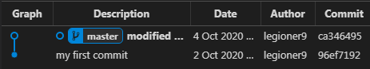
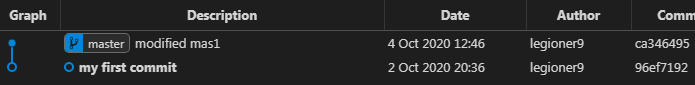

# History    
    
    $ git init

        Initialized empty Git repository in E:/Node_projects/Pre_Git/.git/
    
    $ ls -a

        ./  ../  .git/

    // create and write file
    $ echo comm1 > mas1

    
    $ ls

        mas1
    
    $ git add .
    

    $ git st

        On branch master
        
        No commits yet
        
        Changes to be committed:
          (use "git rm --cached <file>..." to unstage)
                new file:   mas1
            
    $ git commit . -m 'my first commit'

        warning: LF will be replaced by CRLF in mas1.
        The file will have its original line endings in your working directory
        [master (root-commit) b633ae8] my first commit
         1 file changed, 1 insertion(+)
         create mode 100644 mas1

    $ git lg

        * b633ae8 - (HEAD -> master) my first commit (81 seconds ago) <legioner9>
    
    $ ls

        mas1
    
    $ cat mas1

        comm1
    
# checkup init   
    
    $ ls

        mas1
        
    $ cat mas1

        comm1

    $ git st

        On branch master
        nothing to commit, working tree clean
        
    $ git lg

        * 96ef719 - (HEAD -> master) my first commit (52 minutes ago) <legioner9>
        
    
# changes

    $ echo change_comm1 >> mas1  
    $ cat mas1

        comm1
        change_comm1  

    $ git st

        On branch master
        Changes not staged for commit:
        (use "git add <file>..." to update what will be committed)
        (use "git restore <file>..." to discard changes in working directory)
                modified:   mas1

        no changes added to commit (use "git add" and/or "git commit -a")

# add to WD (work Dir)

    $ git add mas1

        warning: LF will be replaced by CRLF in mas1.
        The file will have its original line endings in your working directory

# create second commit

    $ git commit . -m 'modified mas1'

        warning: LF will be replaced by CRLF in mas1.
        The file will have its original line endings in your working directory
        [master ca34649] modified mas1
        1 file changed, 1 insertion(+)

    $ git st

        On branch master
        nothing to commit, working tree clean

    $ git lg

        * ca34649 - (HEAD -> master) modified mas1 (3 minutes ago) <legioner9>* 96ef719 - my first commit (2 days ago) <legioner9>

    $ cat mas1

        comm1
        change_comm1
        

    $ git commit . -m 'modified mas1'

    $ git lg
        * ca34649 - (HEAD -> master) modified mas1 (20 minutes ago) <legioner9>
        * 96ef719 - my first commit (2 days ago) <legioner9>

# onward    

    $ git ch 96ef

        Note: switching to '96ef'.

        You are in 'detached HEAD' state. You can look around, make experimental
        changes and commit them, and you can discard any commits you make in this
        state without impacting any branches by switching back to a branch.

> TRANSLATE: Вы находитесь в состоянии «отключенная ГОЛОВА». Можно осмотреться, поэкспериментировать
         изменения и зафиксировать их, и вы можете отказаться от любых коммитов, сделанных в этом
         состояние, не влияя на какие-либо ветви, переключившись обратно на ветку.

        If you want to create a new branch to retain commits you create, you may
        do so (now or later) by using -c with the switch command. Example:

        git switch -c <new-branch-name>

        Or undo this operation with:

        git switch -

        Turn off this advice by setting config variable advice.detachedHead to false

        HEAD is now at 96ef719 my first commit

> TRANSLATE: Если вы хотите создать новую ветку для сохранения созданных вами коммитов, вы можете
         сделайте это (сейчас или позже), используя -c с командой switch. Пример:

         git switch -c <имя новой ветки>

         Или отмените эту операцию с помощью:

         переключатель git -

         Отключите этот совет, установив для переменной конфигурации advice.detachedHead значение false.

         HEAD сейчас на 96ef719, моя первая фиксация
    
-
    
    $ git lg

        * 96ef719 - (HEAD) my first commit (2 days ago) <legioner9>
    
## RESULT:  HEAD without any branch 
    

= 

    
    
     
 
