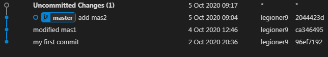
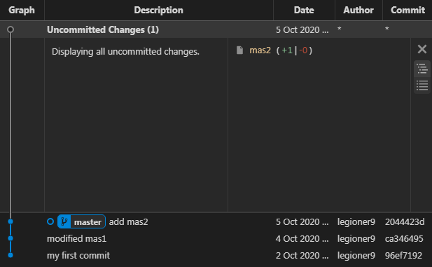

    
    $ git st

        modified:   mas2
    
    $ cat mas2
        comm2
        modified comm2
            
    
# onward

    $ git add mas2

        warning: LF will be replaced by CRLF in mas2.
        The file will have its original line endings in your working directory

    $ git st

        On branch master
        modified:   mas2

    $ cat mas2

        comm2
        modified comm2

    $ echo 'second modified comm2' >> mas2

    $ git st

        On branch master
        modified:   mas2

        Changes not staged for commit:
        modified:   mas2

= 

    
    
     
 
