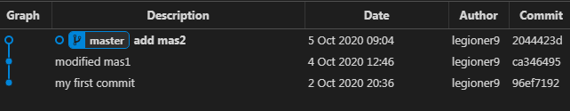

    
    $ git st

        modified:   mas2
    
    $ cat mas2
        comm2
        modified comm2
            
    
# onward

    $ git reset --hard master

        HEAD is now at 2044423 add mas2

    $ git st

        On branch master
        nothing to commit, working tree clean

    $ git reset --hard ca34

        HEAD is now at ca34649 modified mas1

= 

    
    
     
 
