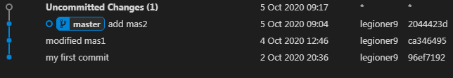
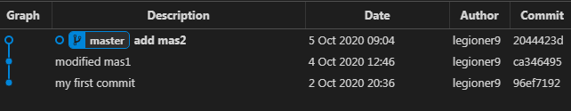

    
    $ git st

        modified:   mas2
    
    $ cat mas2
        comm2
        modified comm2
            
    
# onward

$ git restore mas2

$ git st
On branch master
nothing to commit, working tree clean

= 

    
    
     
 
