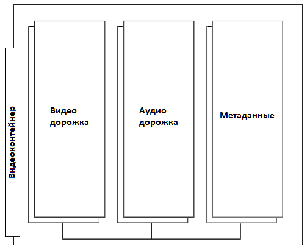

## [1.13. HTML5-видео](https://html5book.ru/html5-video/)

### 1. Элемент \<video>

#### АТРИБУТЫ ТЕГА <VIDEO>

<table class="t3">
<caption>Таблица 1. Атрибуты тега &lt;video&gt;</caption>
<tbody><tr>
<th style="width:20%">Атрибут</th>
<th>Описание, принимаемое значение</th>
</tr>
<tr>
<td style="color:#38BAC7"><kbd>autoplay</kbd></td>
<td>Автоматическое воспроизведение видеоофайла сразу же после загрузки страницы.</td>
</tr>
<tr>
<td style="color:#38BAC7"><kbd>controls</kbd></td>
<td>Указывает браузеру, что нужно отобразить базовые элементы управления воспроизведением (воспроизведение, пауза, громкость).</td>
</tr>
<tr>
<td style="color:#38BAC7"><kbd>height</kbd></td>
<td>Задает высоту окна для отображения видеоданных, возможные значения: <kbd>px</kbd> или <kbd>%</kbd></td>
</tr>
<tr>
<td style="color:#38BAC7"><kbd>loop</kbd></td>
<td>Циклическое воспроизведение видеофайла.</td>
</tr>
<tr>
<td style="color:#38BAC7"><kbd>muted</kbd></td>
<td>Выключает звук при воспроизведении видеофайла.</td>
</tr>
<tr>
<td style="color:#38BAC7"><kbd>poster</kbd></td>
<td>URL файла изображения, которое будет отображаться во время загрузки видеофайла или до тех пор, пока пользователь не нажмет на кнопку PLAY. Если атрибут не задан, то будет отображаться первый кадр видеофайла.</td>
</tr>
<tr>
<td style="color:#38BAC7"><kbd>preload</kbd></td>
<td>Атрибут, отвечающий за предварительную загрузку видеоконтента. Не является обязательным, некоторые браузеры игнорируют его. Возможные значения:<br>
<kbd>auto</kbd> — браузер загружает видеофайл полностью, чтобы он был доступен, когда пользователь начнет его воспроизведение.<br>
<kbd>metadata</kbd> — браузер загружает первую небольшую часть видеофайла, чтобы определить его основные характеристики.<br>
<kbd>none</kbd> — отсутствие автоматической загрузки видеофайла.</td>
</tr>
<tr>
<td style="color:#38BAC7"><kbd>src</kbd></td>
<td>Содержит абсолютный или относительный URL-адрес видеофайла.</td>
</tr>
<tr>
<td style="color:#38BAC7"><kbd>width</kbd></td>
<td>Задает ширину окна для отображения видеоданных, возможные значения: <kbd>px</kbd> или <kbd>%</kbd></td>
</tr>
</tbody></table>

### 2. Встраиваемый интерактивный контент \<embed>

#### АТРИБУТЫ ТЕГА \<EMBED>

<table class="t3">
<caption>Таблица 2. Атрибуты тега &lt;embed&gt;</caption>
<tbody><tr>
<th style="width:20%">Атрибут</th>
<th>Описание, принимаемое значение</th>
</tr>
<tr>
<td style="color:#38BAC7"><kbd>height</kbd></td>
<td>Определяет высоту встраиваемого контента в <kbd>px</kbd> или <kbd>%</kbd>.</td>
</tr>
<tr>
<td style="color:#38BAC7"><kbd>src</kbd></td>
<td>Содержит абсолютный или относительный URL-адрес медиафайла.</td>
</tr>
<tr>
<td style="color:#38BAC7"><kbd>type</kbd></td>
<td>Определяет MIME-тип  встраиваемого файла.</td>
</tr>
<tr>
<td style="color:#38BAC7"><kbd>width</kbd></td>
<td>Определяет ширину встраиваемого контента в <kbd>px</kbd> или <kbd>%</kbd>.</td>
</tr>
</tbody></table>

### 3. Видеокодеки

#### H.264 
— высококачественный кодек от фирмы MPEG, делится на профили для поддержки как устройств с минимальными возможностями, так и устройств высокого разрешения.

#### Ogg Theora 
— открытый бесплатный стандарт для видео, качество и производительность несколько ниже стандарта H.264.

#### VP8 
— открытый бесплатный кодек, сходный по качеству с H.264. Поддерживается в Firefox, Chrome и Opera.

### 4. Видеоконтейнеры



#### Ogg (.ogv, .oga, .ogx, .ogg) 
— формат-контейнер с открытым исходным кодом для видеокодека Theora и аудио Vorbis. Работает в Firefox, Chrome и Opera.
MIME-тип: video/ogg.

#### MPEG 4 (.mp4) 
— формат-контейнер для видеокодека H.264 и аудиокодека AAC. Работает в Safari и Chrome. Кодирует видео, в том числе высокой четкости, для полного спектра устройств, таких как iPhone, iPod и iPad.
MIME-тип: video/mp4.

#### WebM (.webm) 
— формат-контейнер с открытым исходным кодом для видеокодека VP8 от Google и аудиокодека Ogg Vorbis. Работает в Firefox, Chrome, Opera и Adobe Flash Player.
MIME-тип: video/webm.

#### Audio Video Interleave (.avi) 
— формат предназначен для записи звука и движущихся изображений, соответствует спецификации RIFF.
MIME-тип: video/vnd.avi, video/avi, video/msvideo, video/x-msvideo.

#### Matroska (.mkv) 
— популярный видеоконтейнер, может содержать видео в формате H.264, VP8 или Theora.
MIME-тип: video/x-matroska, audio/x-matroska.

#### три основных видео формата:

<table class="t3">
<tbody><tr>
<th>Формат</th>
<th style="border-right:1px solid white">Видеокодек</th>
<th>Аудиокодек</th>
</tr>
<tr>
<td>.mp4</td>
<td>H.264</td>
<td>AAC</td>
</tr>
<tr>
<td>.ogg/.ogv</td>
<td>Theora</td>
<td>Vorbis</td>
</tr>
<tr>
<td>.webm</td>
<td>VP8</td>
<td>Vorbis</td>
</tr>
</tbody></table>

### 5. Альтернативные медиа-ресурсы \<source>

#### АТРИБУТЫ ТЕГА \<SOURCE>

<table class="t3">
<caption>Таблица 3. Атрибуты тега &lt;source&gt;</caption>
<tbody><tr>
<th style="width:20%">Атрибут</th>
<th>Описание, принимаемое значение</th>
</tr>
<tr>
<td style="color:#38BAC7"><kbd>media</kbd></td>
<td>Определяет тип медиа-устройства (т.е. для каких устройств оптимизирован файл).</td>
</tr>
<tr>
<td style="color:#38BAC7"><kbd>src</kbd></td>
<td>Содержит абсолютный или относительный URL-адрес медиафайла.</td>
</tr>
<tr>
<td style="color:#38BAC7"><kbd>type</kbd></td>
<td>Определяет MIME-тип медиафайла.</td>
</tr>
</tbody></table>

### 6. Добавление субтитров и заголовков \<track>

#### АТРИБУТЫ ТЕГА \<TRACK>

<table class="t3">
<caption>Таблица 4. Атрибуты тега &lt;track&gt;</caption>
<tbody><tr>
<th style="width:20%">Атрибут</th>
<th>Описание, принимаемое значение</th>
</tr>
<tr>
<td style="color:#38BAC7"><kbd>default</kbd></td>
<td>Указывает, что данная дорожка воспроизводится по умолчанию. Только один элемент <kbd>&lt;track&gt;</kbd> может содержать данный атрибут.</td>
</tr>
<tr>
<td style="color:#38BAC7"><kbd>kind</kbd></td>
<td>Указывает тип текстовой дорожки, по умолчанию выводятся субтитры (<kbd>subtitles</kbd>). Принимаемые значения:<br>
<kbd>captions</kbd> — перевод диалогов и звуковых эффектов, отображаемый в виде текста поверх видео (для глухих пользователей).<br>
<kbd>chapters</kbd> — добавляет названия глав в виде списка для навигации по медиафайлу.<br>
<kbd>descriptions</kbd> — добавляет звуковое описание происходящего в видео (для невидящих пользователей).<br>
<kbd>metadata</kbd> — метаданные, используемые скриптами, не отображаются для пользователей.<br>
<kbd>subtitles</kbd> — текстовое дублирование звуковой дорожки видео, отображается в виде субтитров к видео.
</td>
</tr>
<tr>
<td style="color:#38BAC7"><kbd>label</kbd></td>
<td>Добавляет название дорожки. Если этот атрибут не задан, браузер применит значение по умолчанию.</td>
</tr>
<tr>
<td style="color:#38BAC7"><kbd>src</kbd></td>
<td>Содержит абсолютный или относительный URL-адрес аудио- или видеофайла.</td>
</tr>
<tr>
<td style="color:#38BAC7"><kbd>srclang</kbd></td>
<td>Язык воспроизводимой дорожки.</td>
</tr>
</tbody></table>

### 7. Пример: размещаем видео на сайте

```html
<video controls width="710" height="538" poster="/examples/media/martynko.png" preload="none">
  <source src="/examples/media/martynko.mp4" type="video/mp4">
</video>
```

### 8. Видеоконвертеры

