# Базовые средства языка C++

## technologies in programming

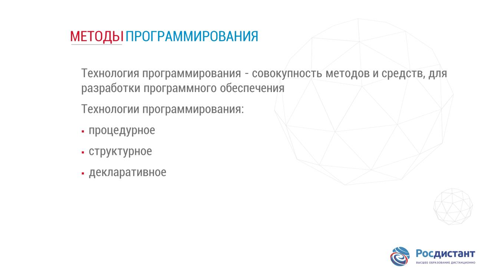

В технологии должны быть определены 
### последовательность выполнения операций, 
### условия, при которых выполняется каждая операция,
### описание самих операций: 
#### исходные данные,
#### нормативные документы,
 в том числе стандарты,
#### критерии и методы оценки, результаты и др.

### процедурное
метод, в соответствии с которым программы пишутся как
#### перечни последовательно выполняемых команд.
 При этом используются
процедурно-ориентированные языки программирования, 
##### например, PL ,Паскаль, С ;

### структурное, модульное
метод написания программ небольшими
#### независимыми структурированными частями, модулями,
 каждый из которых
связан с какой-либо функцией. Основу структурного метода
программирования составляет 
#### декомпозиция создаваемой системы на отдельные функции и задачи,
 которые в свою очередь разбиваться на более
мелкие. Процесс декомпозиции продолжается вплоть до определения
конкретных процедур. Результирующая программа организуется в виде
#### совокупности взаимосвязанных по определенным правилам модулей.
 Это
упрощает разработку сложных программных продуктов и их тестирование.
Языки для модульного программирования – 
##### TurboPascal , С ++ , Ада;

### декларативное
метод, предназначенный для решения задач искусственного
интеллекта. В указанном контексте программа 
#### описывает логическую структуру решения задачи,
 указывая преимущественно, что нужно сделать, 
#### не вдаваясь в детали. 
Используются языки программирования типа 
##### Пролог.

## methods in programming

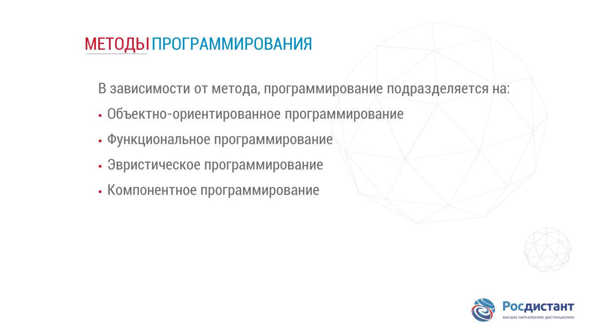

### Объектно-ориентированное программирование
 представляет собой стратегию
#### проектирования программных средств из объектов. 
Объект – это нечто,
способное пребывать в различных состояниях и имеющее множество операций.
Состояние определяется как набор атрибутов объекта. Операции, связанные с
объектом, предоставляют сервисы другим объектам для выполнения
определенных вычислений. Объекты объединяются в классы, каждый из
которых имеет описания всех атрибутов и операций. Объектноориентированное программирование – это метод, основанный на
использовании концепции объекта, абстрагирующего конкретные его
реализации в предметной области. При этом данные тесно связываются с
выполняемыми над объектами процедурами.

### Функциональное программирование 
это метод, основанный на разбиении
алгоритма решения задачи на 
#### отдельные функциональные модули,
 а также
описании их связей и характера взаимодействия.

### Эвристическое программирование
это метод, основанный на 
#### моделировании мыслительной деятельности человека.
 Используется для решения задач, не
имеющих строго формализованного алгоритма или 
#### связанных с неполнотой исходных данных;

### Компонентное программирование
 это метод создания программного
 обеспечения 
#### путем сбора объектов-компонентов в библиотеки или исполняемые файлы.
 Объекты рассматриваются на логическом уровне
проектирования программной системы, а компоненты – как непосредственная
физическая реализация объектов. Один компонент может быть реализацией
нескольких объектов или даже некоторой части объектной системы, полученной
на уровне проектирования. Компоненты в отличие от объектов могут
изменяться и пополняться новыми функциями и интерфейсами. Они
конструируются в виде некоторой программной абстракции, 
#### состоящей из трех частей:
##### информационной,
#####  внешней
#####  и внутренней

## Stages of solving a programming problem

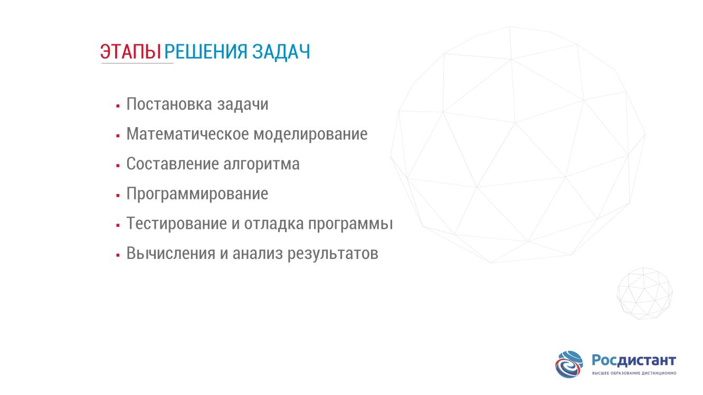

## Compiler

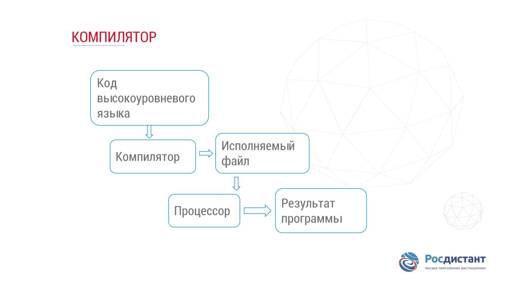

### Линкинг 
это 
#### процесс связывания всех объектных файлов,
 генерируемых компилятором, в единую исполняемую программу, которую вы затем сможете запустить, выполнить. Это делается с помощью программы, которая называется линкер, компоновщик.

 Кроме объектных файлов, линкер 
 #### также подключает файлы из Стандартной библиотеки С ++ ,
  или любой другой библиотеки которую вы используете, например, библиотеки графики или звука. Сам по себе язык С ++ довольно маленький и простой. Тем не менее, к нему подключается большая библиотека дополнительных функций, которые могут использовать ваши программы, и эти функции находятся в Стандартной библиотеке С ++ .

## Interpreter

### Интерпретатор
это программа, которая 
#### напрямую выполняет код,
####  без его предыдущей компиляции в исполняемый файл.

##### C , C++ и Pascal - компилируются,
##### Perl и JavaScript - интерпретируются.
##### Java , могут как компилироваться, так и интерпретироваться.

## Programming compiler

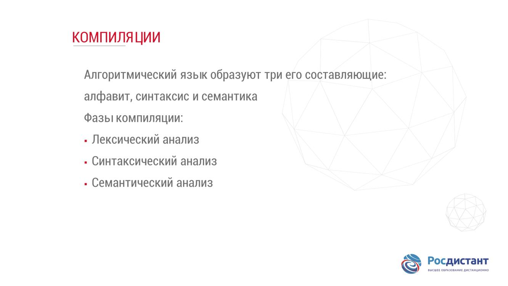

Входом компилятора служит программа на языке программирования. С точки зрения компилятора это просто последовательность символов. 
### Задача первой фазы компиляции,
 лексического анализатора, заключается в
 ####  разборе входной цепочки 
 #### и выделении некоторых более крупных единиц, лексем.
  Примерами лексем являются основные ключевые слова, идентификаторы, константные значения и так далее. На этапе лексического анализа обычно также выполняются такие действия, как удаление комментариев.

### Синтаксис
#### совокупность правил некоторого языка,
 определяющих формирование его элементов. Синтаксис задается с помощью правил, которые описывают понятия некоторого языка. Примерами понятий являются: 
 #### переменная, выражение, оператор, процедура.

 Именно 
 #### иерархия объектов, а не то, как они взаимодействуют между собой,
  определяются через синтаксис. Например, оператор может встречаться только в процедуре, а выражение в операторе, переменная может состоять из имени и необязательных индексов и так далее. Синтаксис не связан с такими явлениями
в программе, как несоответствие типов или переменная с данным именем не определена. Этим занимается семантика.

### Семантика
#### правила и условия, определяющие соотношения
 между элементами языка и их смысловыми значениями, а также 
#### интерпретацию содержательного значения синтаксических конструкций языка.
Текст исходной программы на языке высокого уровня представляет собой обычный тестовый файл. Для его чтения и превращения в последовательность машинных команд, прежде всего, выполняется синтаксический анализ текста программы.

### Синтаксический анализатор
компонента компилятора, осуществляющая проверку исходных операторов на соответствие синтаксическим правилам и семантике данного языка программирования.

#### Форма Бэкуса-Наура, сокращенно БНФ

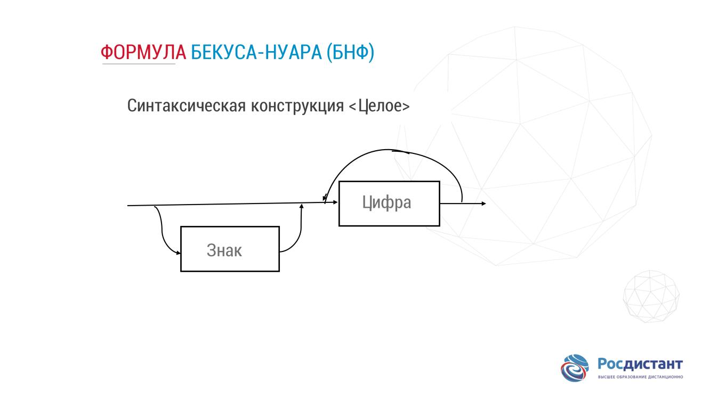

Представлена синтаксическая диаграмма, иллюстрирующая первые два правила 
##### описания конструкции – типа целое.
 Из диаграммы видно, что целое число может быть записано со знаком или без и включать произвольное количество цифр.

#### Расширенная форма Бэкуса — Наура, РБНФ

формальная система определения синтаксиса, в которой 
##### одни синтаксические категории последовательно определяются через другие.
 Используется для описания контекстно-свободных формальных грамматик. Предложена Никлаусом Виртом. Является расширенной переработкой форм Бэкуса - Наура, отличается от БНФ более ёмкими конструкциями, позволяющими при той же выразительной способности упростить и сократить в объёме описание.

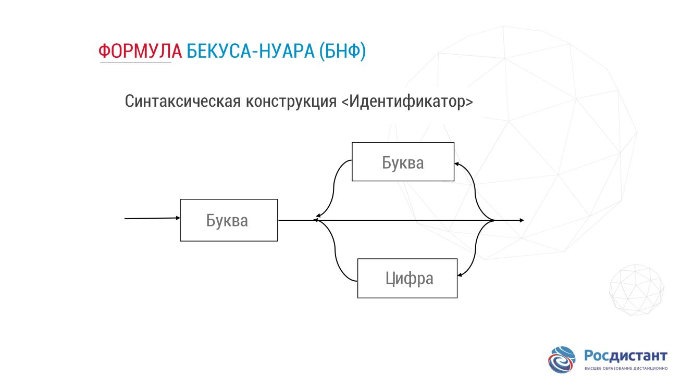

### Интегрированная среда разработки

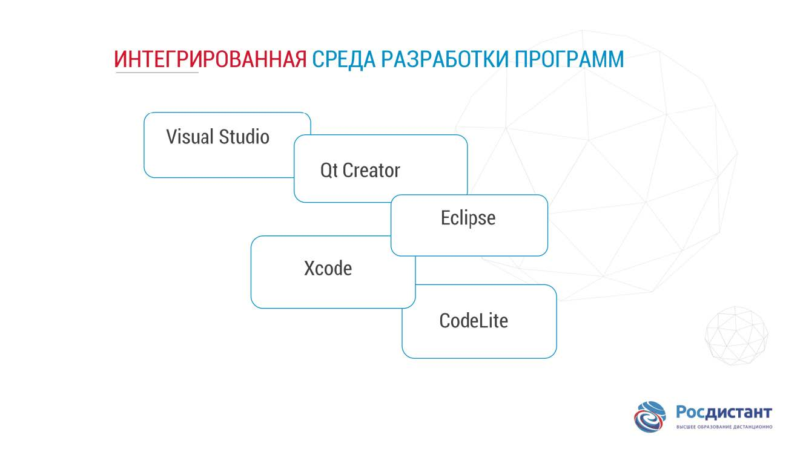

### Statements C++

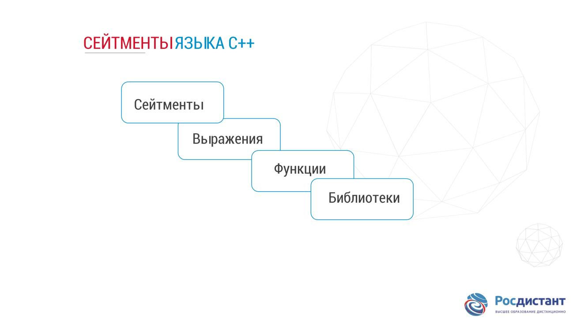

#### statement declaration

стейтмент объявления,

Он сообщает компилятору, имя и тип переменной. В программировании каждая переменная занимает определенное число адресуемых ячеек в памяти в зависимости от её типа. Минимальная адресуемая ячейка — байт. Все переменные в программе должны быть объявлены, прежде чем использованы;

#### assignment statement

стейтмент присваивания,

#### output statement

стейтмент вывода, 

Мы выводим значение переменной на экран.

### критерии качества программы.

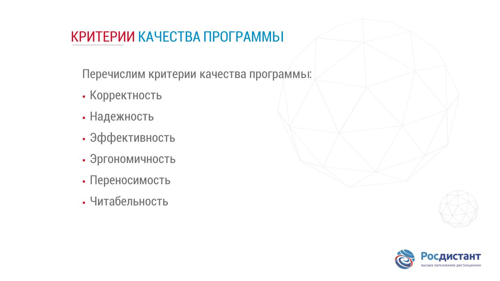

### alphabet C++

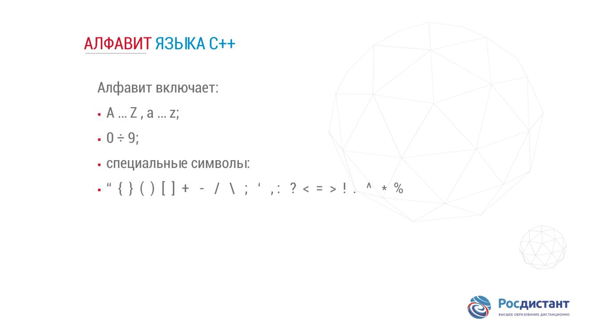

### structure C++

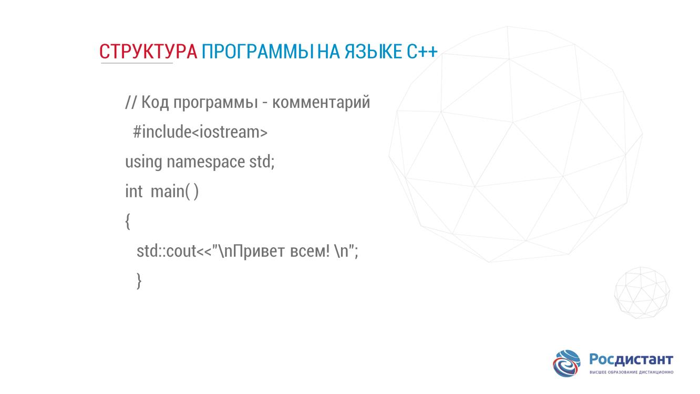

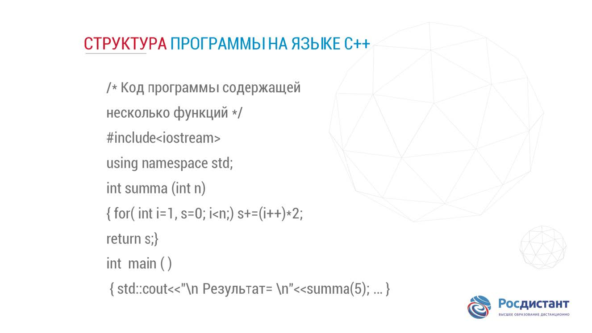

##### not work

### preprocessor directives 

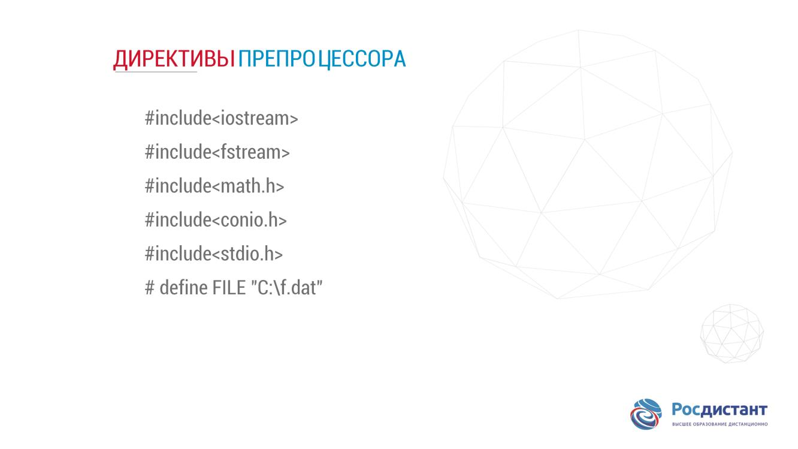

#### include — вставляет текст из указанного файла,
 подключаются стандартные библиотеки, для использования стандартных функций.
На слайде приведены примеры подключения различных заголовочных файлов:
#### iostream 
##### для работы с потоками ввода-вывода;
#### fstream 
##### для работы с файлами данных;
#### math 
##### для использования математических функций;
#### define 
##### подстановка в тексте.

### Lexems C++

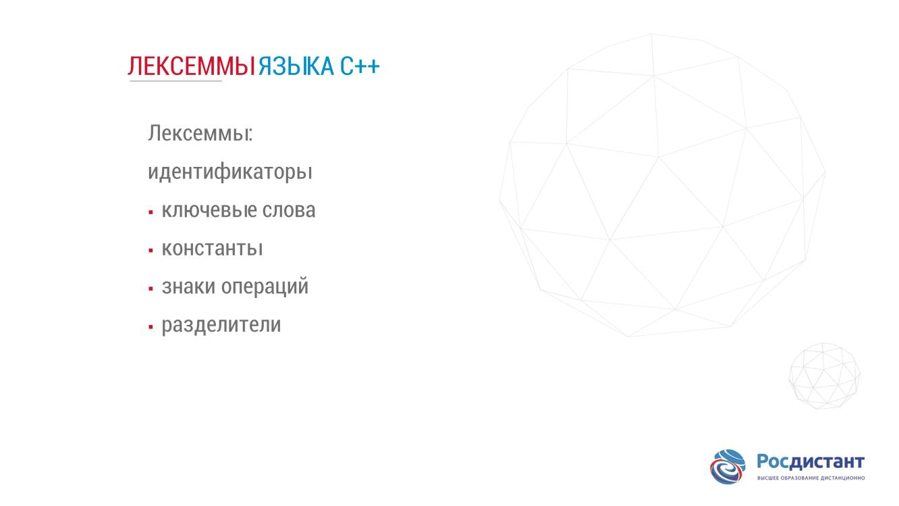

### Identifiers and keywords

### literals

#### целые;

##### Десятичные литералы 
– это, последовательность цифр со знаком плюс или минус.
##### Восьмеричные литералы 
начинаются с литеры ноль, а шестнадцатеричные – с двух литерал, ноль и икс, причем икс может быть прописная или заглавная.
##### вещественные,
###### с фиксированной
###### или с плавающей точкой;
#### символьные;
##### это один символ тип char
#### строковые.

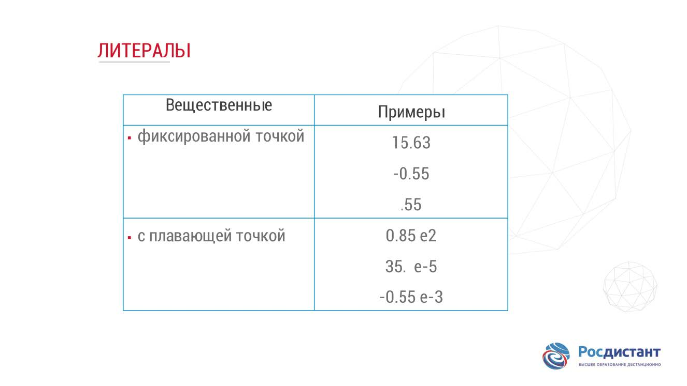

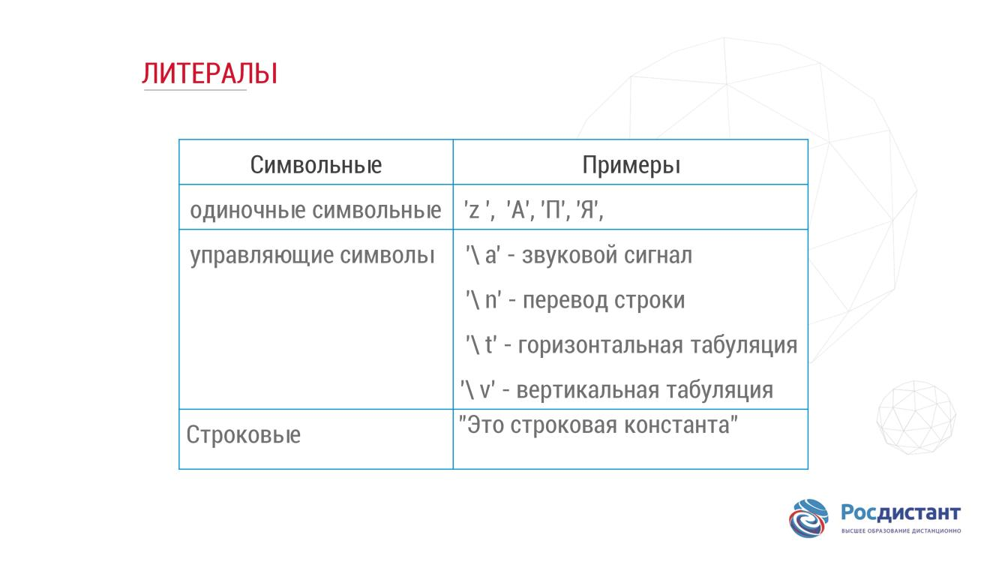

### Data types

![](_src/20.jpg

