# Операции и стандартные библиотечные функции языка

## Unary operation 

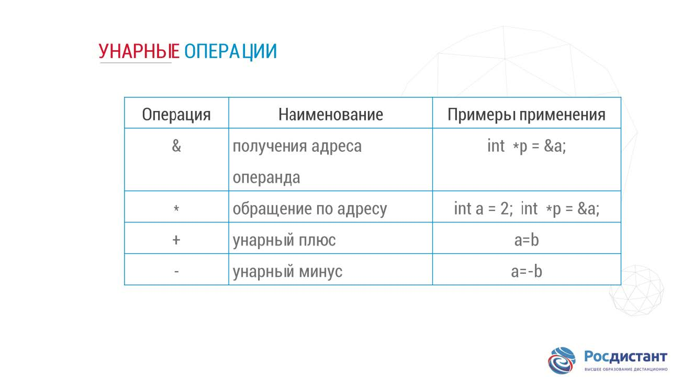

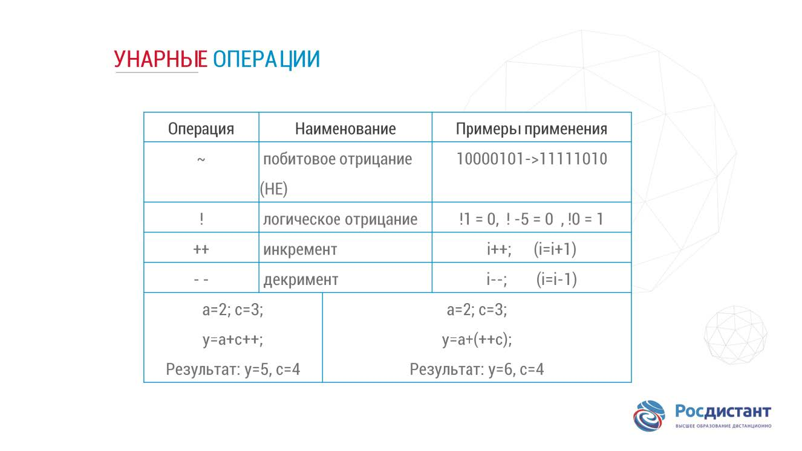

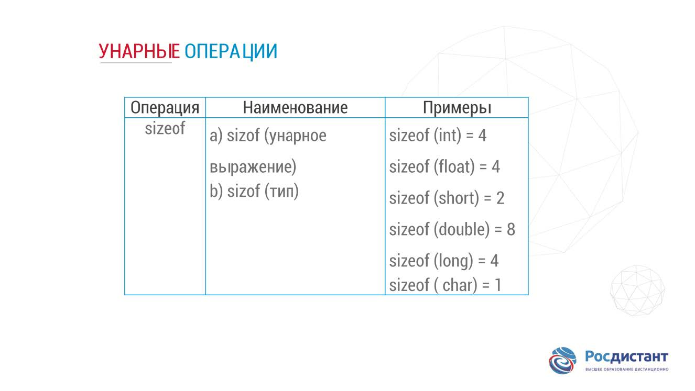

### sizeof 

можно определить объем памяти любого выражения или 
#### объем памяти, отводимых под переменные определенного типа.
 Аргументом функции является обозначения стандартных типов данных. Это очень удобно, так как в разных системах объем памяти, предусмотренный для хранения переменных разных типов данных, могут быть различными.

#### к массиву дает количество байтов, занимаемых массивом,
 а не количество его элементов и не размер в байтах каждого из них.

#### к указателю дает размер самого указателя,
 а не объекта, на который он указывает

## binary operations

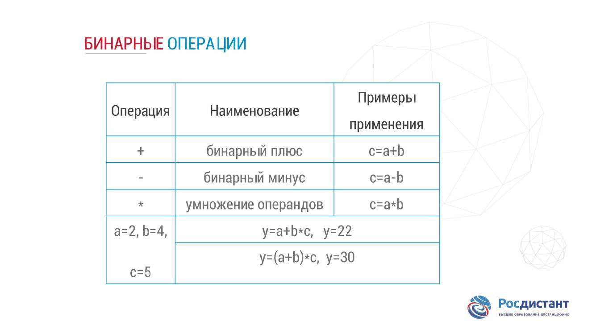

## binary shift operations

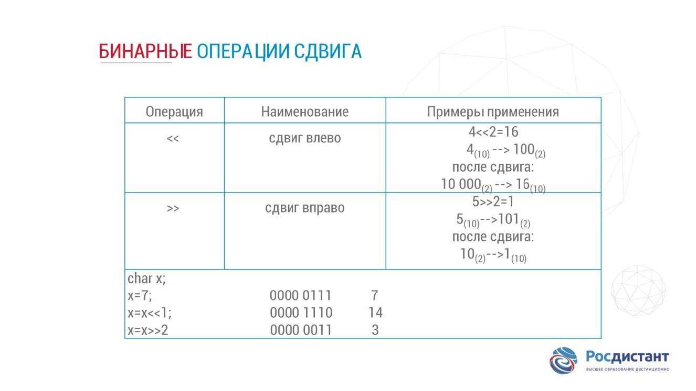

## bitwise logical operations
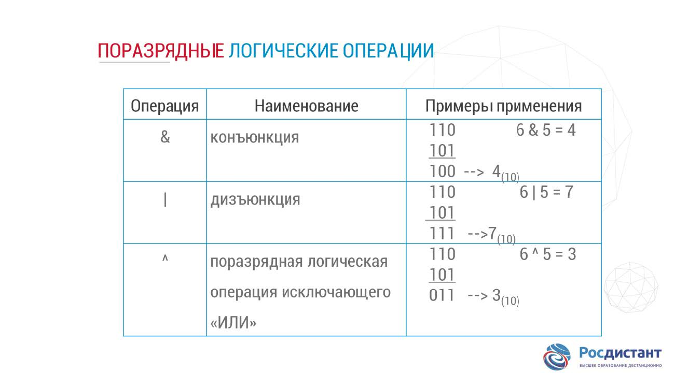

## logical operation of relationships

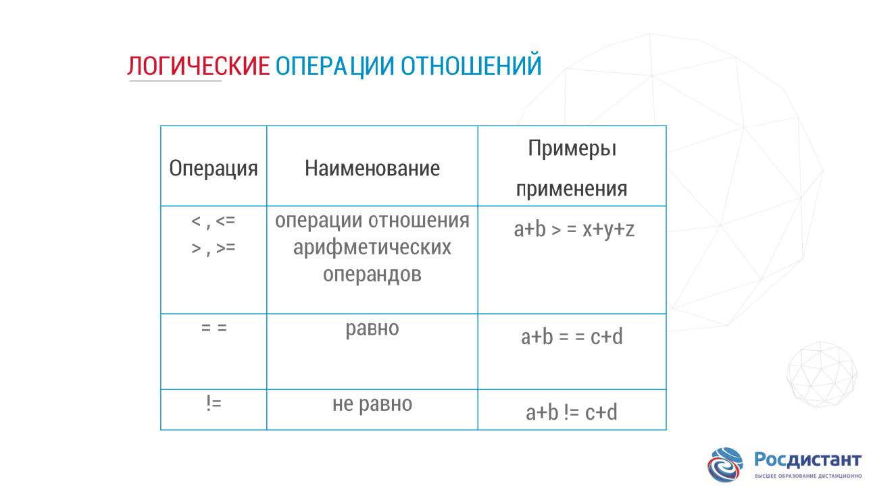

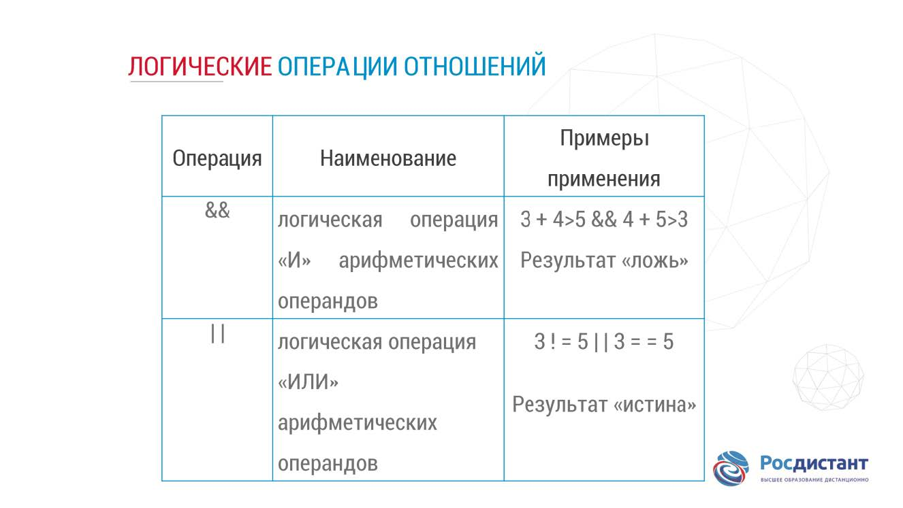

## assignment operations

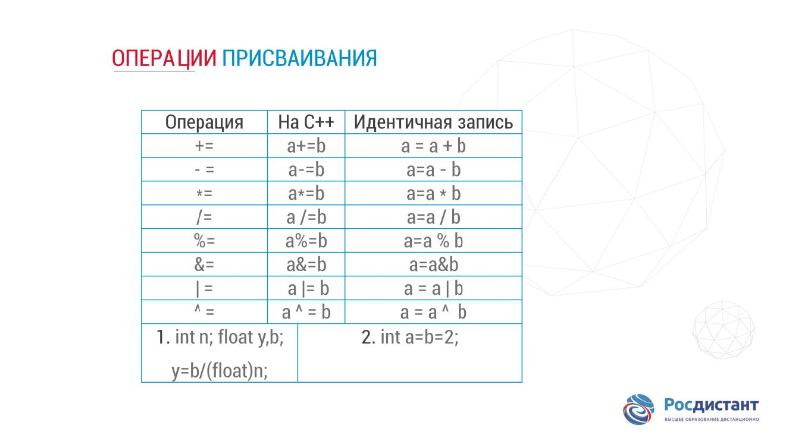

## standart function

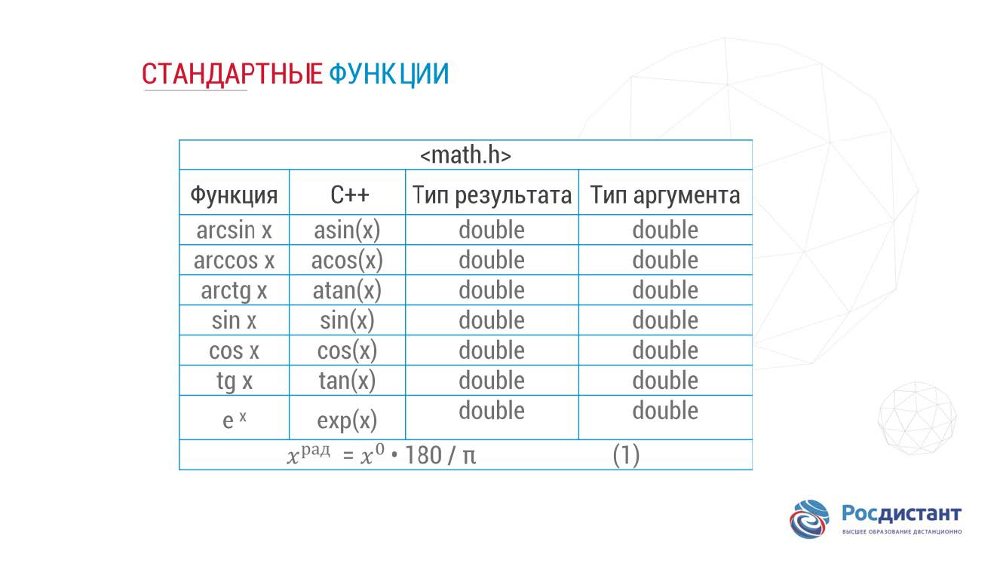

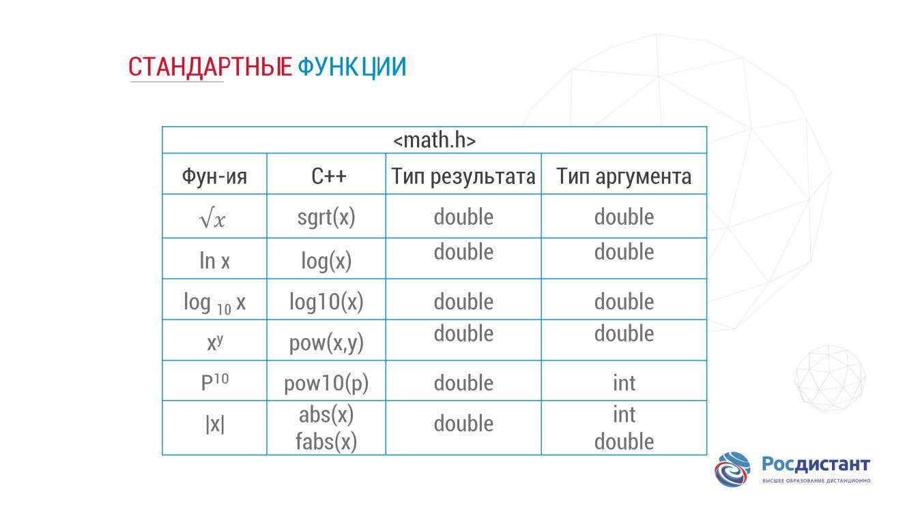

## priority of arithmetic operations

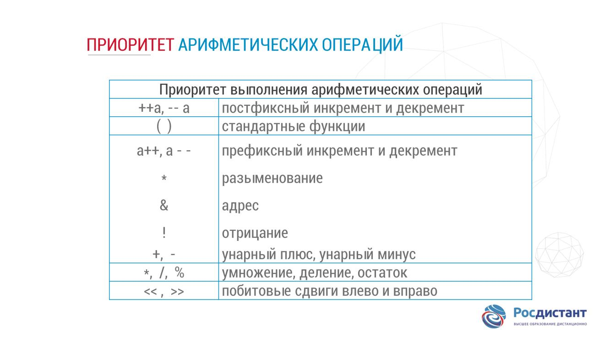

## type coercion
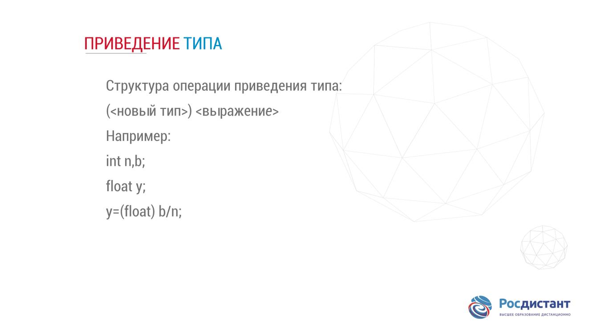

## example of use operation

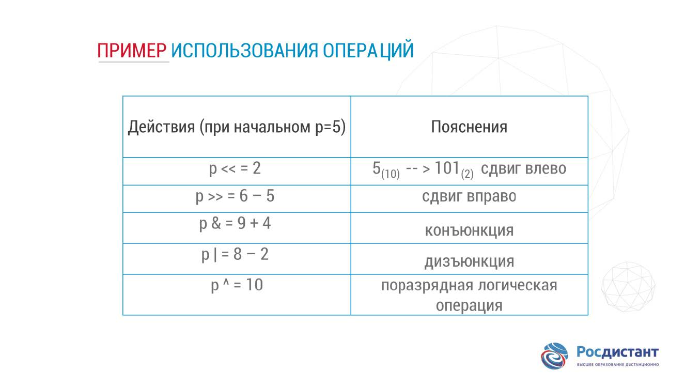

