# Базовые алгоритмические структуры

## Stages of solving applied problems 

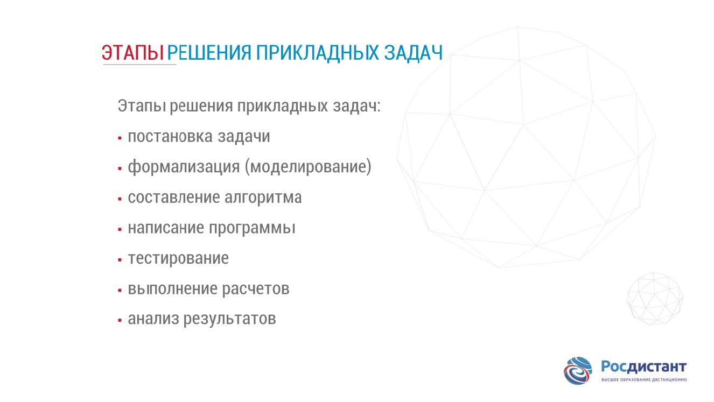

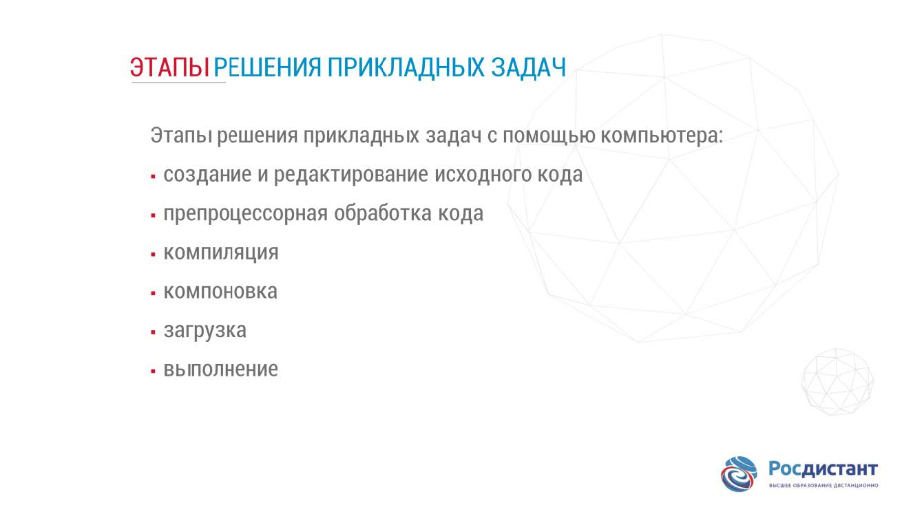

## Propeties of the algorithm

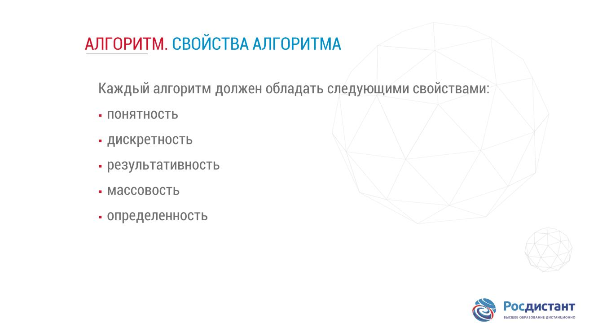

## Algorithm presentation forms

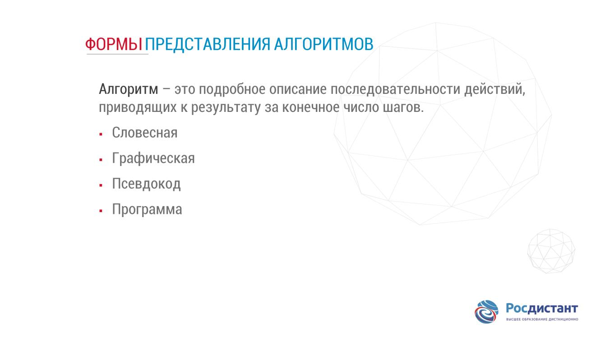

## Flowchart

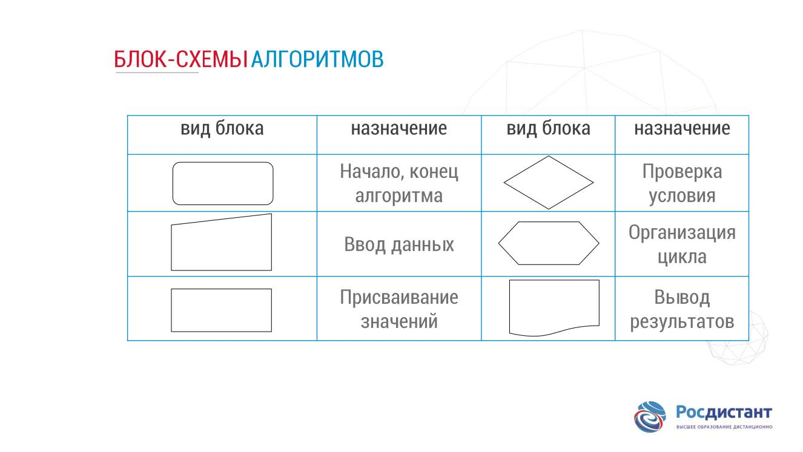

## Structure following

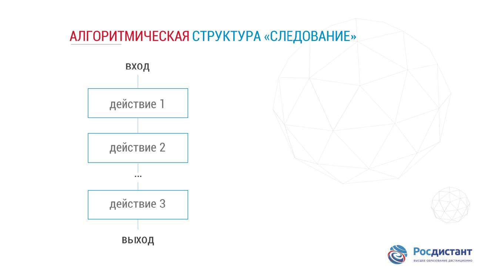

## Structure branching

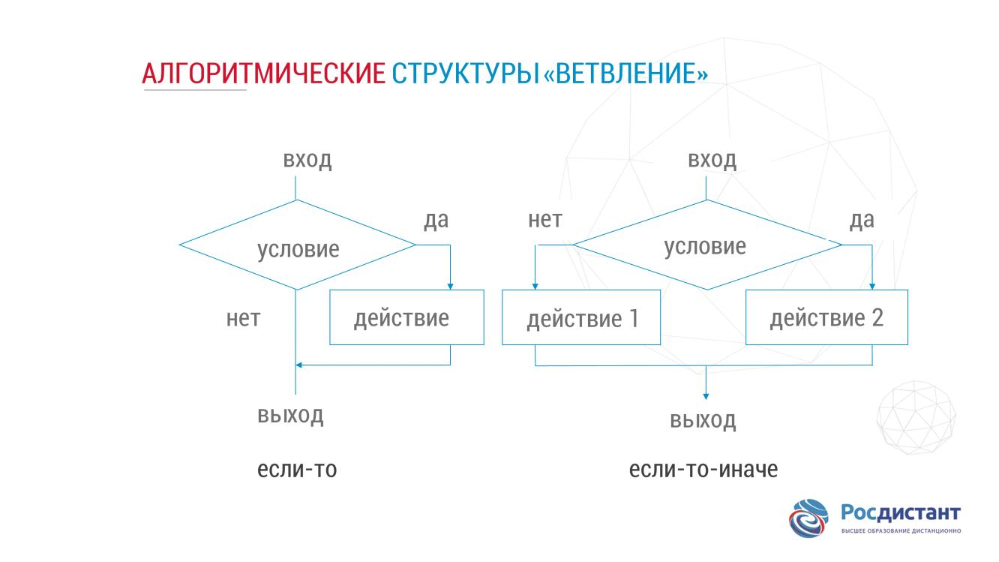

## Structure loop with parameter

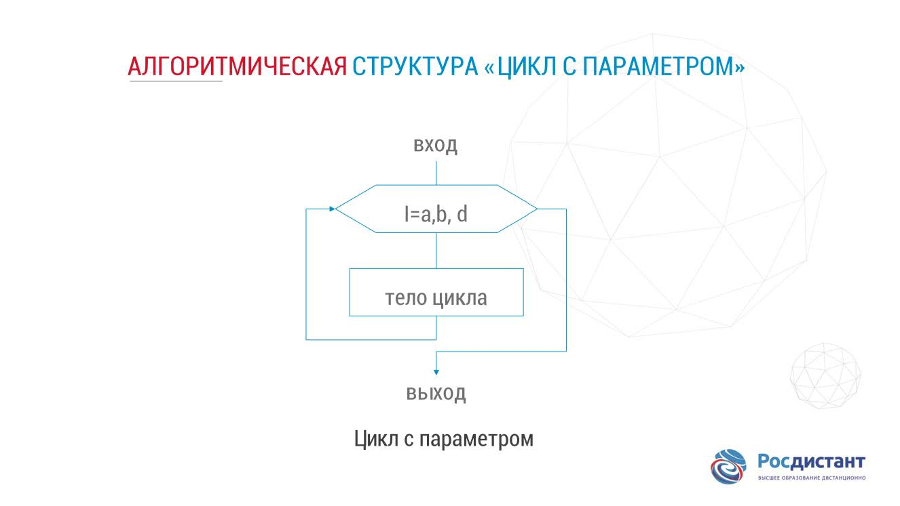

## Structure iteration loop

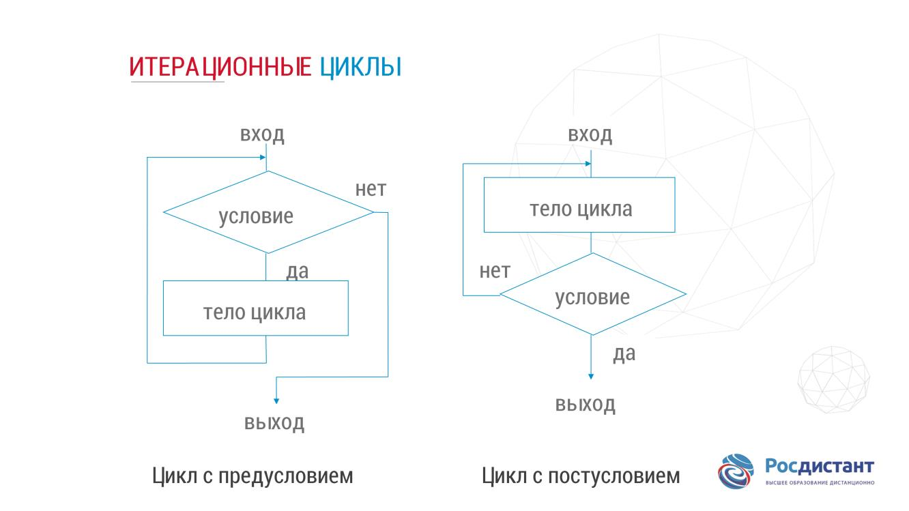

## Examples of sequence structure

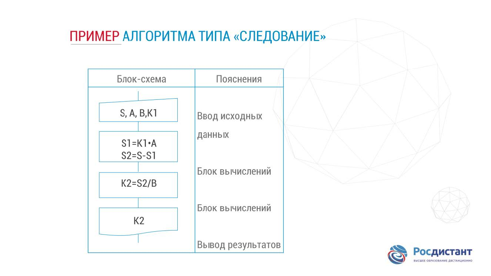

## Examples of branching structure

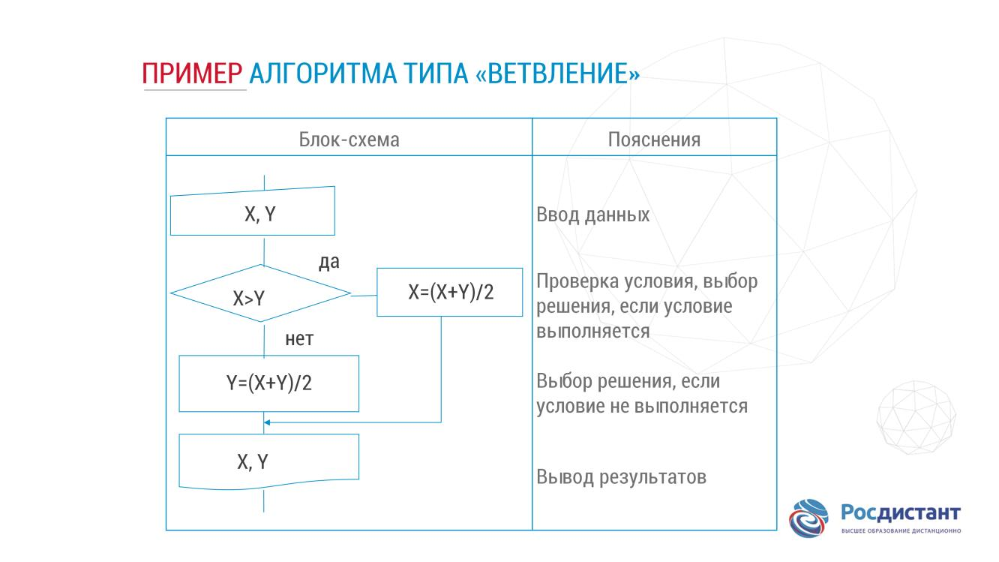

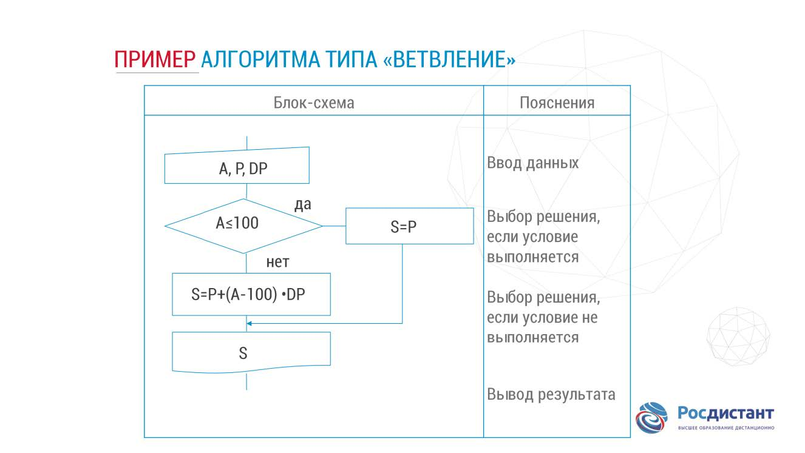

## Examples of loop structure

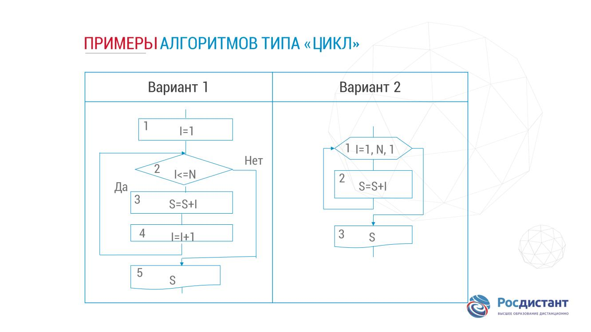

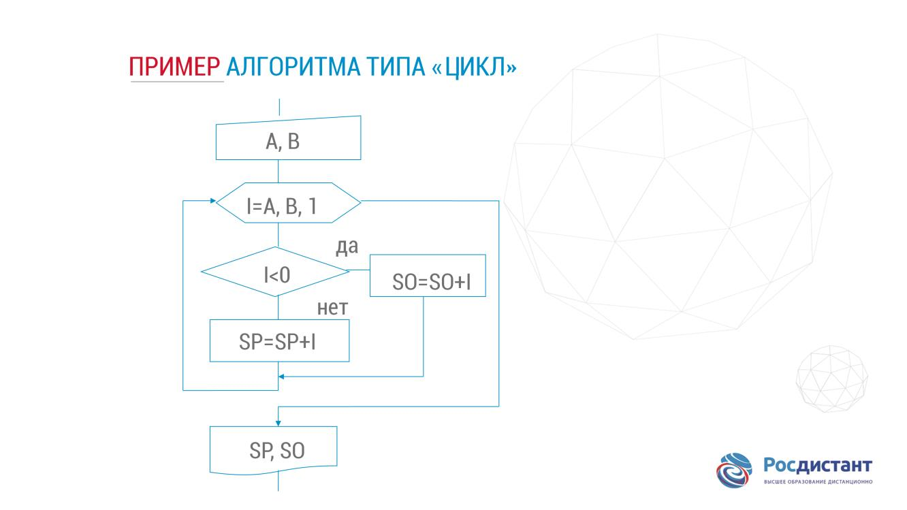

## Examples nested loop

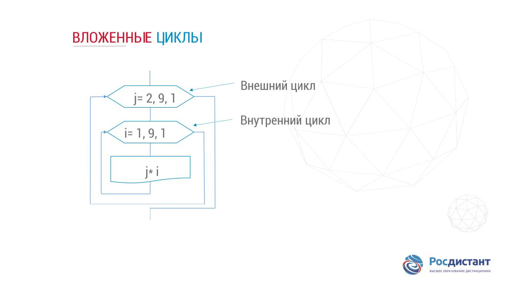

