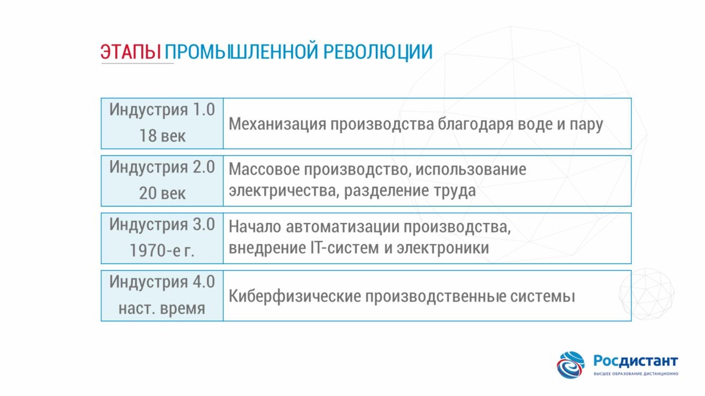
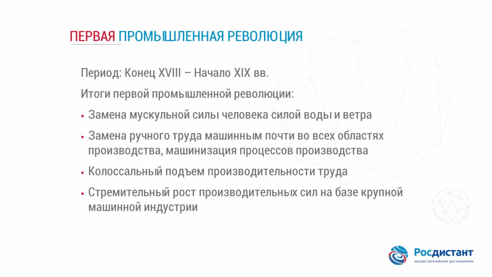
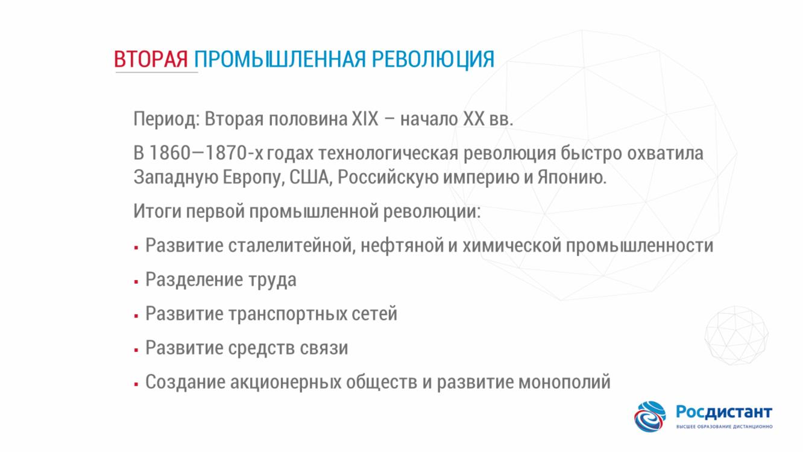
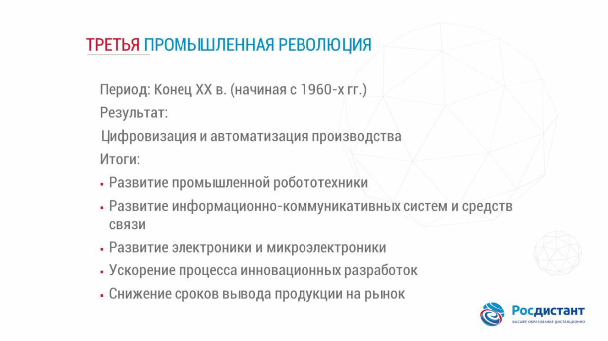
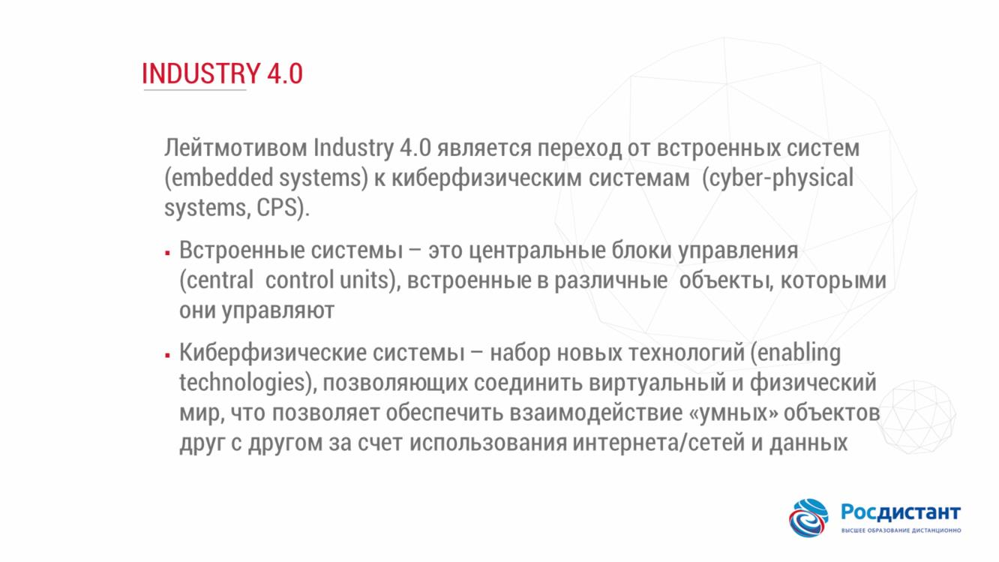
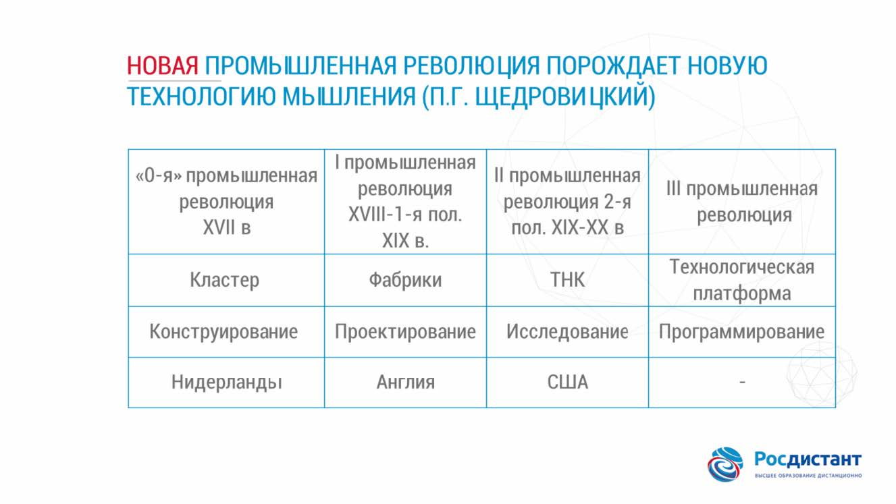

## Тема 2. Промышленные революции

######

### Технологическая революция –это смена технологической парадигмы
, то есть в первую очередь это смена комплекса ключевых технологий, которые лежат в основании производств. Эта смена происходит за счет массового применения технологических решений, позволяющих радикально повысить производительность и в промышленности, и в социальной сфере

###### Первая Промышленная революция

###### Вторая Промышленная революция

###### Тртья Промышленная революция

###### Четвертая Промышленная революция

###### Новая технология мышления SHDR

###### Примеры Технологий Влияния

