## Тема 3. Теория решения изобретательских задач

###### Теория решения изобретательских задач

### Теория решения изобретательских задач, далее ТРИЗ
, –это конструктивная методология генерации эффективных идей и разрешения проблем. Она строится на основе моделей противоречий и методов их разрешения, экстрагированных из известных примеров эффективных решений.

### Изобретательская задача –это проблема
, содержащая противоречие в виде несовместимости требований и/или свойств, вызванных неравномерным развитием частей системы или данной системы и ее окружения.
Изобретение, изобретательская идея, изобретательское решение –это идея, устраняющая противоречие и, соответственно, проблему, содержащую это противоречие.

###### Постулаты ТРИЗ
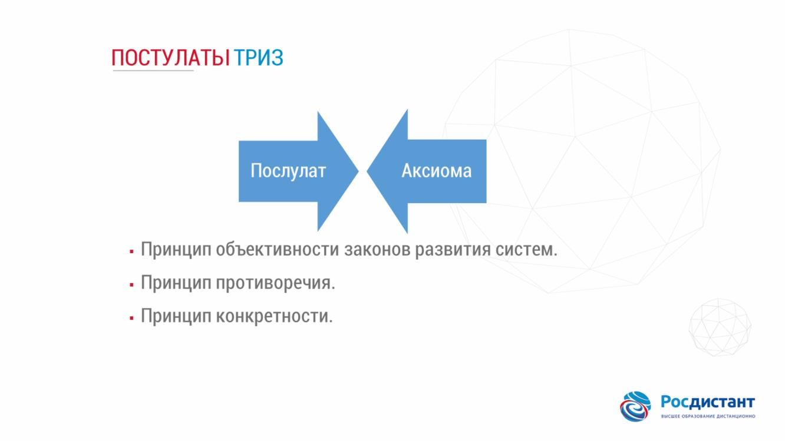

###### Платформы решения задач ТРИЗ
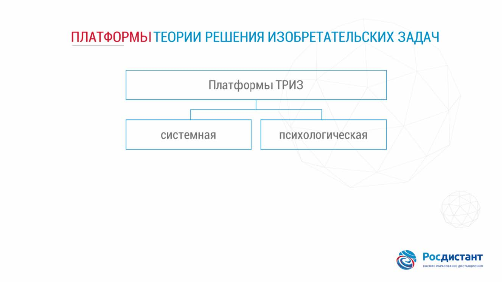

### Психологическая инерция –это стремление применить к новому, создаваемому продукту стереотипы, традиции
, обусловленные опытом, историей, словесным программированием, другими словами –привычки, которые позволяют нам, не задумываясь, делать то, что мы делаем. Таким образом, любая привычка является средством психологической инерции.

###### Психологическая инерция
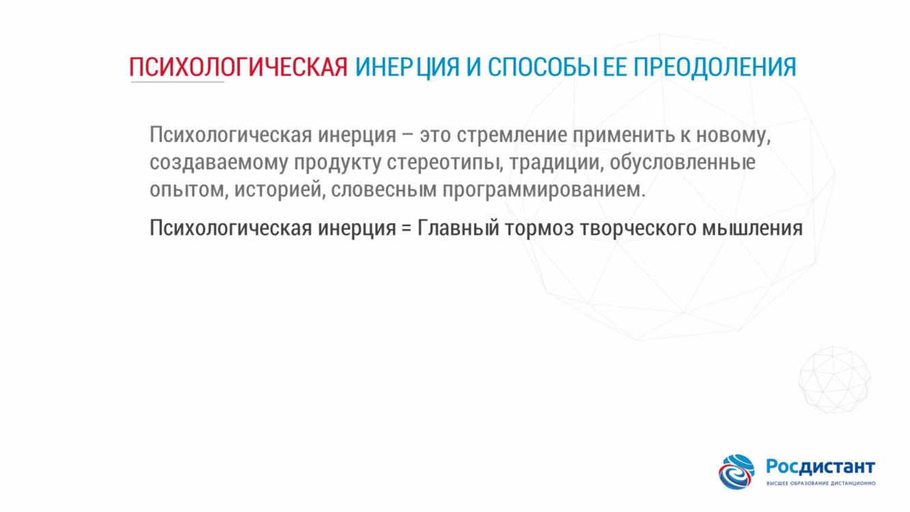

###### Основные ошибки в бизнесе
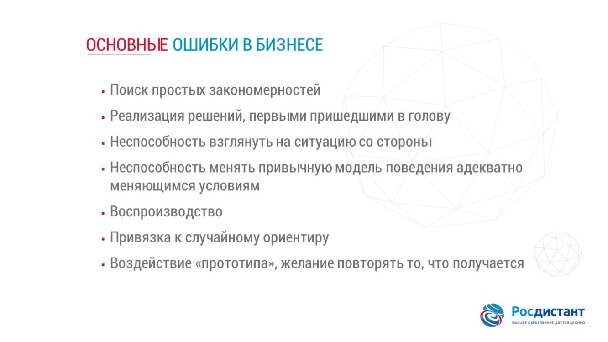

###### Способы борьбы с инерцией
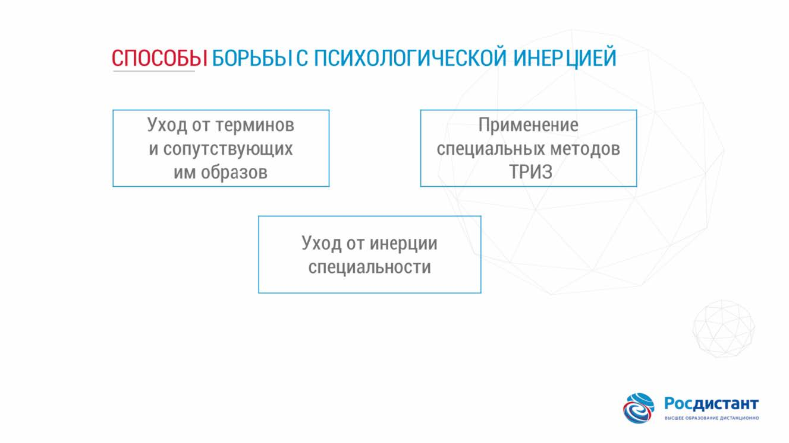

###### Идеальный конечный результат
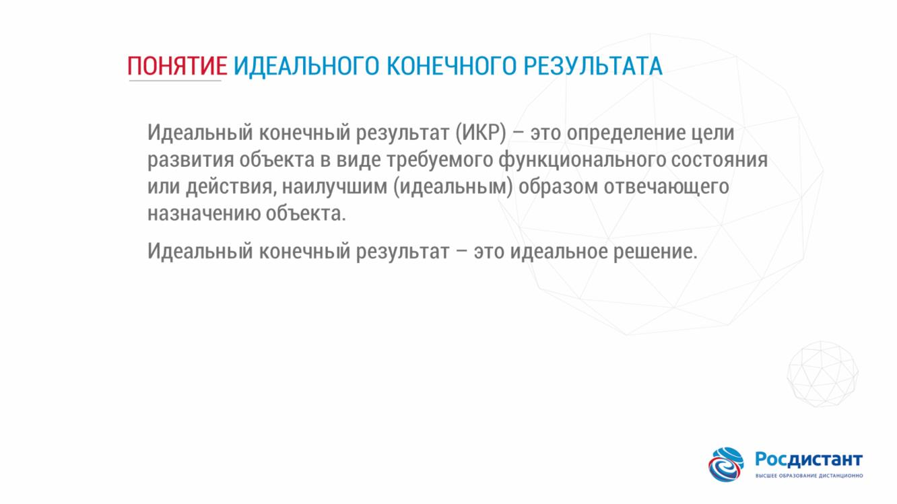

###### Генеральное противоречие
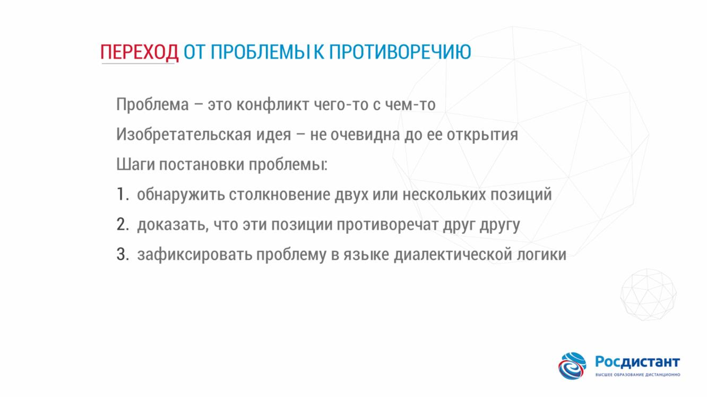

###### Стандартное противоречие
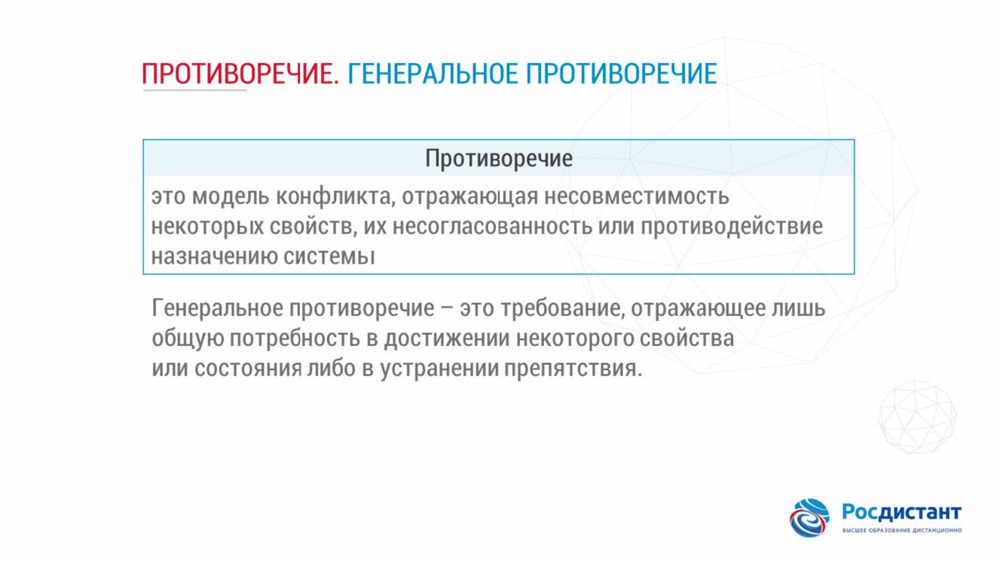

###### Радикальное противоречие
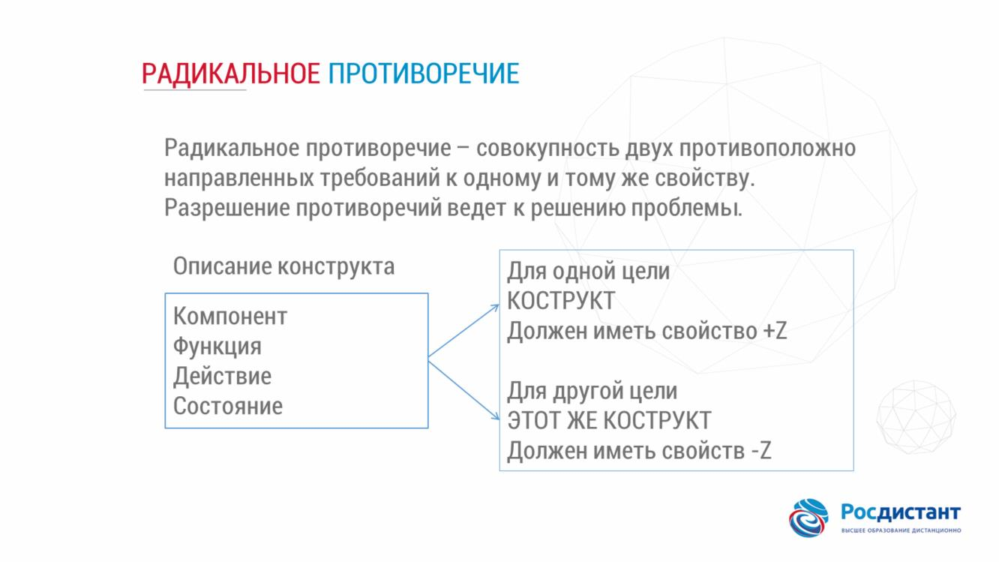

###### 4 модели фундаментальный трансформаций
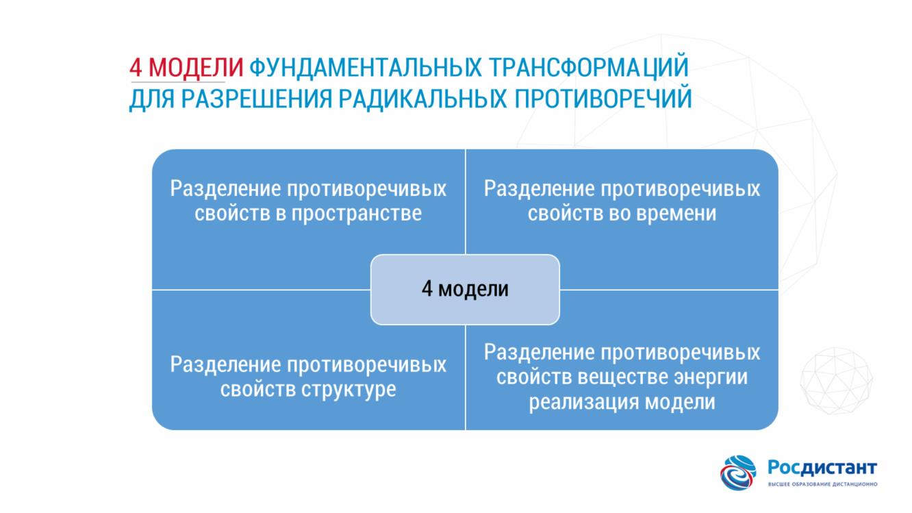

###### Технические ресурсы
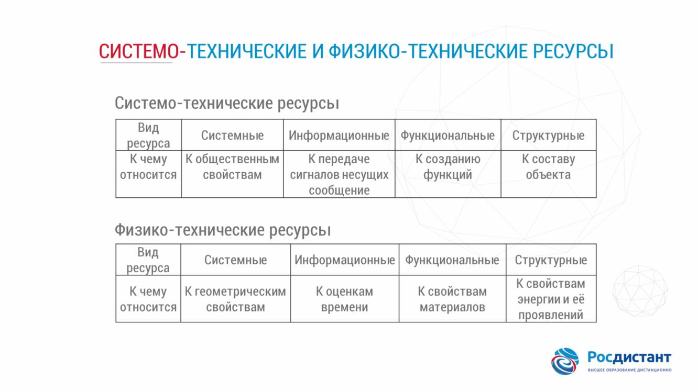

###### Соотношение ресурсов и результат

###### Оперативная зона и время проблемы
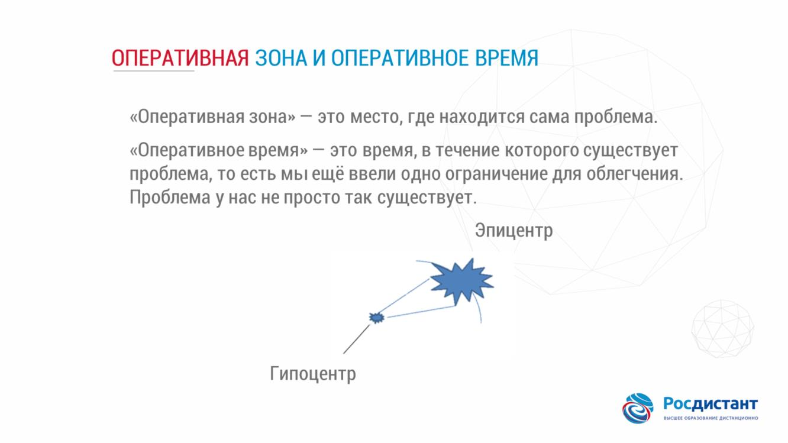

