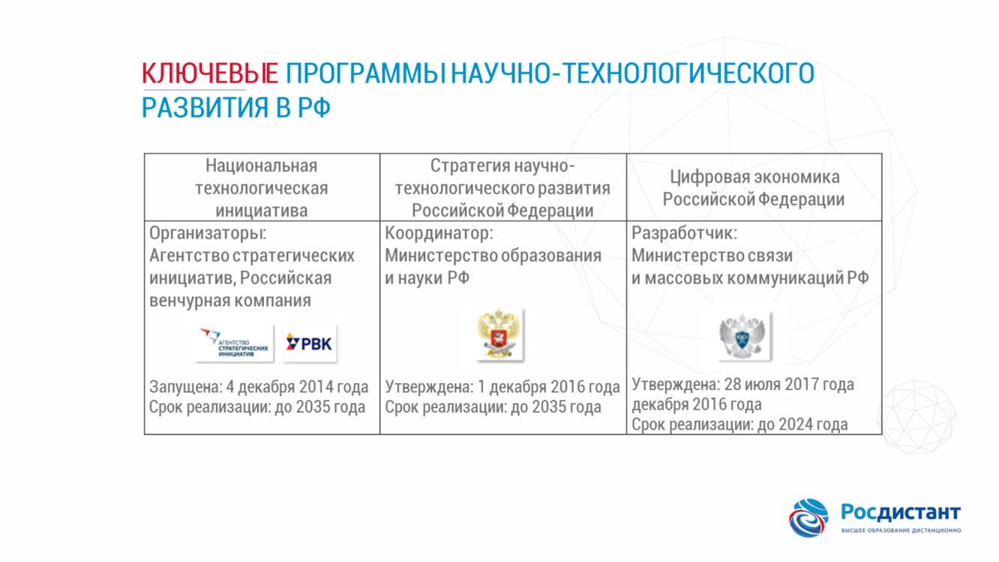
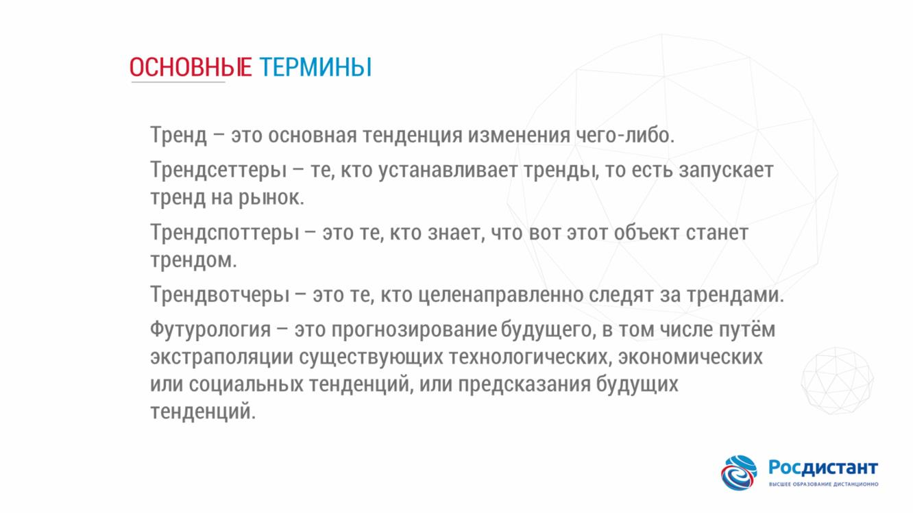
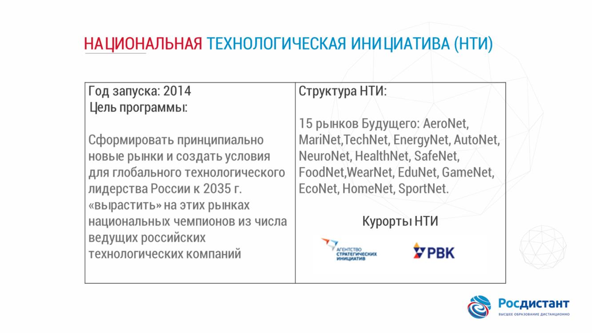
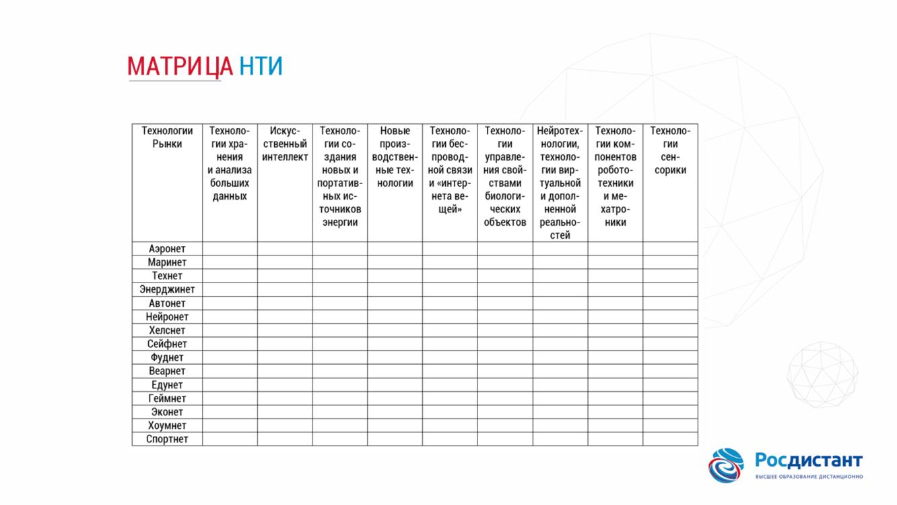
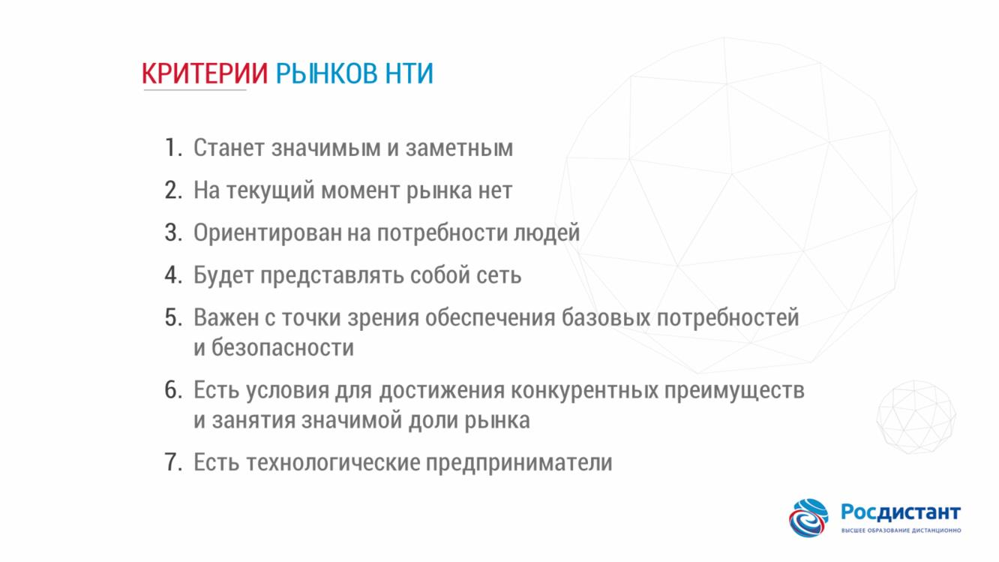
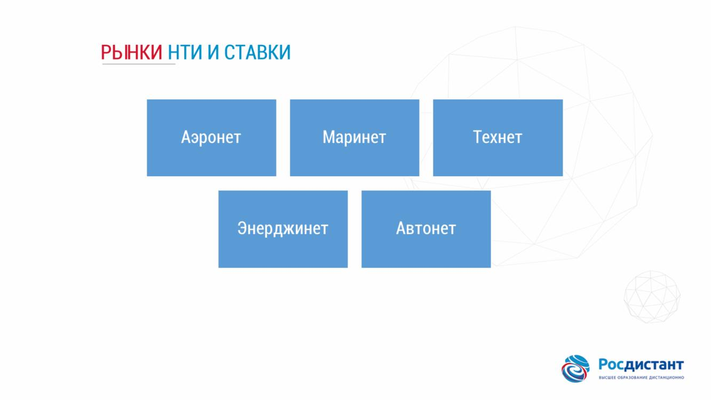
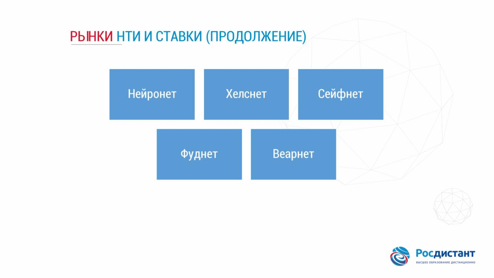
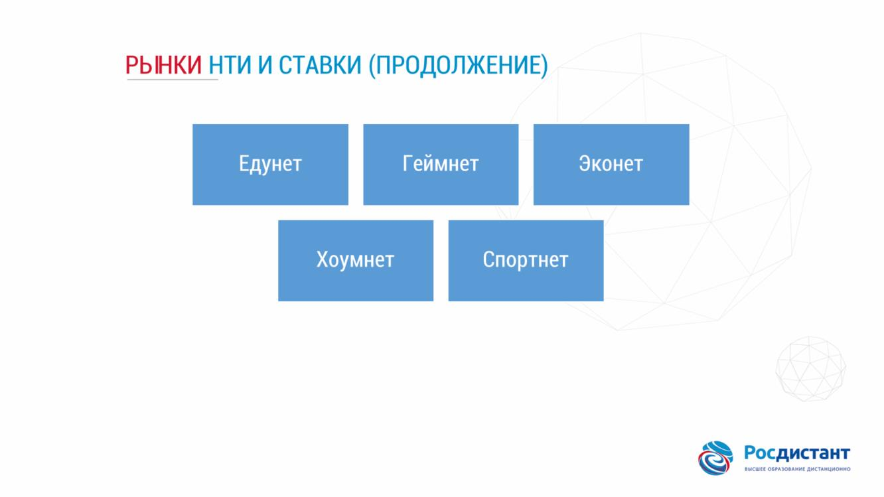
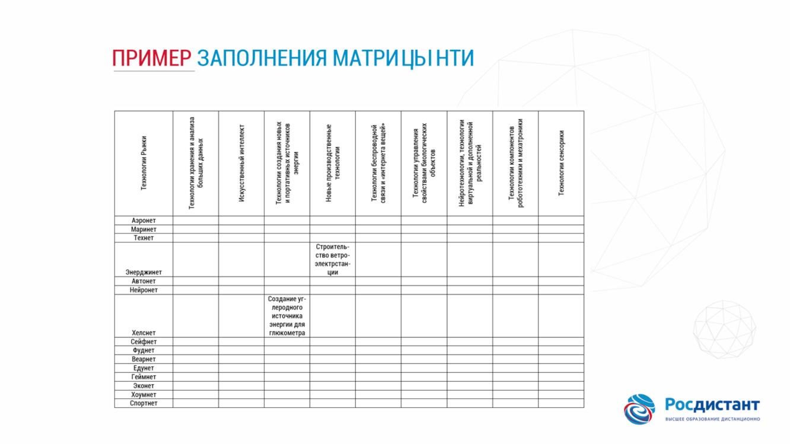

## Тема 4. Научно-технологическое развитие

###### Развитие в России

###### Основные термины

### Тренд –это основная тенденция изменения чего-либо.
### Трендсеттеры–те, кто устанавливает тренды
, то есть запускает тренд на рынок.
### Трендспоттеры–это те, кто знает, что вот этот объект станет трендом.
### Трендвотчеры–это те, кто целенаправленно следят за трендами.

### Футурология –это прогнозирование будущего
, в том числе путём экстраполяции существующих технологических, экономических или социальных тенденций, или предсказания будущих тенденций.

###### Технологические тренды

### 10 основныхтехнологических трендов

На слайде представлены десять главных технологических трендов, которые будут оказывать наибольшее влияние на бизнес в ближайшие годы.
#### Границы отраслей размываются;
#### данные –самый ценный актив компании;
#### использование естественного языка для общения с машиной;
#### клиент –эпицентр цифровой трансформации;
#### машинное обучение и искусственный интеллект;
#### интернет-вещи;
#### облачные вычисления;
#### компания любой отрасли –это IT-компания;
#### открытая архитектура;
#### работа компании в режиме реального времени.

###### Национальная Технологическая инициатива

###### Матрица НТИ

###### Критерии рынков НТИ

###### Рынки НТИ и ставки

###### Пример матрицы НТИ

