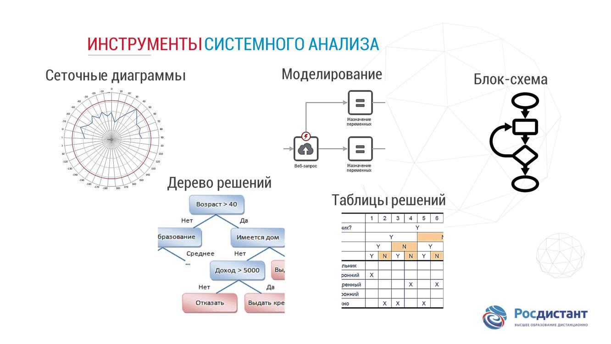
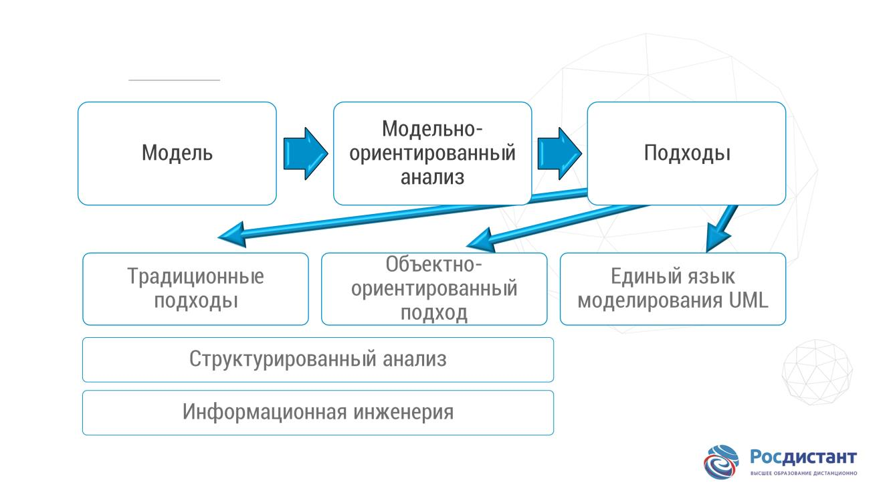

# Основы системного анализа 

Системный анализ – научный метод познания, представляющий собой последовательность действий по установлению структурных связей между переменными или постоянными элементами исследуемой системы.

Возможно, одно из самых простых объяснений основной цели системного анализа заключается в следующем: он направлен на «преобразование потребностей пользователей в спецификации для программистов».

## системный аналитик должен

- Первый шаг, и это, вероятно, наиболее важно, ‒ изучение аналитиком осуществимости системы. Это означает, что он должен тщательно изучить и решить, возможно ли разработать систему и сколько времени и денег это будет стоить.
- Второй шаг – обсудить с целевой группой их потребности, чтобы иметь возможность понять и выявить требования.
- Третий шаг – изучить существующие данные, человеческие ресурсы и доступные компьютерные процедуры, чтобы выяснить ограничения, выбрать техники или методы, которые будут использоваться на более поздних стадиях разработки.

