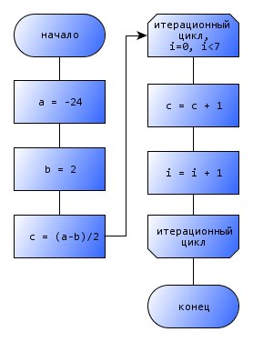
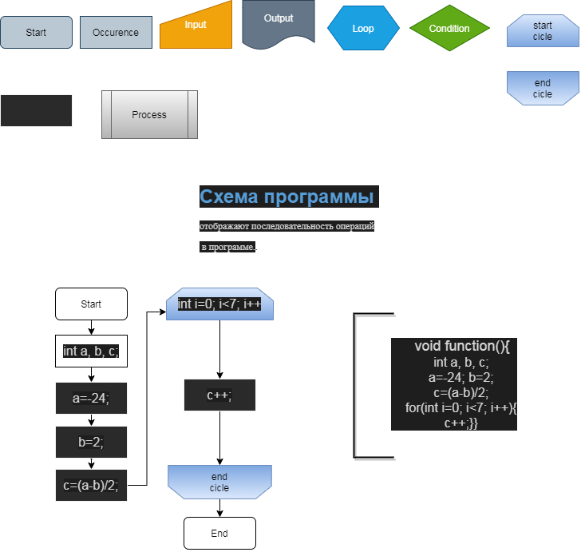

# https://pro-prof.com/archives/1462

## Схема данных 
 отображают пути данных, этапы обработки, показывают носители данных.

## Схема программы 
 отображают последовательность операций в программе.

    void function(){
    int a, b, с;
    a=-24; b=2;
    с=(a-b)/2;
    for(int i=0; i<7; i++){
    c++;}}

[di_chartProg_0.drawio](E:\Node_projects\Node_Way\NBase\_Md\_Index\_SKILLS\_Flowchart\content\Docs\vk.com_topic-60433661_29009863\_diag\di_chartProg_0.drawio)

 ## Схема работы системы 
  отображают управление операциями и потоки данных

  ## Схема взаимодействия программ 
   отображают пути взаимодействия программ (а программы описаны в схемах программ!!!)

## Схема ресурсов системы 
 отображает конфигурацию блоков данных