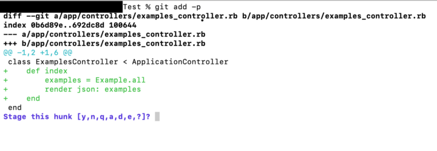
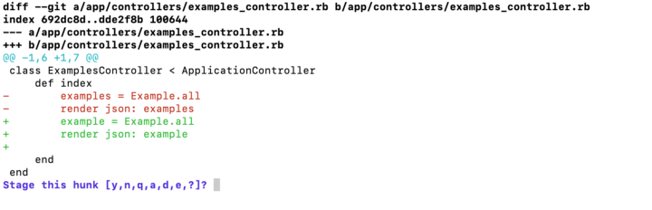
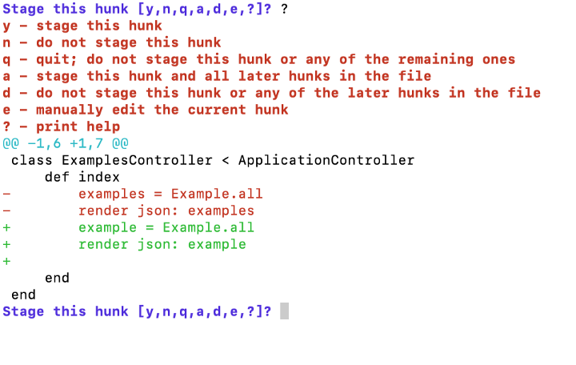
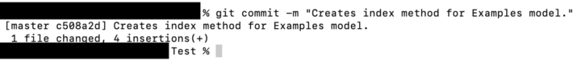

# [Индексирование коммитов с Git Add Patch](https://nuancesprog.ru/p/7502/)

Для разработчика нет, наверное, ничего более увлекательного, чем запуск нового проекта. Начинается он с разработки доменной модели и планирования логики предметной области. Затем происходит создание каркасного представления приложения на стороне клиента и определение того, как оно будет выглядеть в веб-браузере или мобильном устройстве. И, наконец, венчает весь процесс работы над проектом написание кода, призванного воплотить в жизнь идеи разработчика. В прошлом, когда я только начинал работать над новыми проектами и, погружаясь в них с головой, забывал обо всём на свете, мне следовало бы помнить то, о чём говорил мне один мудрый преподаватель:

> «Делай коммиты раньше, делай коммиты чаще. Написал две строчки кода — сделай коммит».

Коммит — это фиксация или сохранение изменений в файле, проекте, репозитории. Когда я сделал свой первый настоящий коммит, выглядел он примерно так:

    $ git add .
    $ git commit -m “I added a bunch of code.”
    $ git push origin master
     
Если вам не знаком Git, мы сейчас это быстренько исправим. В первой строчке добавляем код со всеми внесёнными изменениями в область индексирования Git. Во второй строчке коммитим/сохраняем этот проиндексированный код в локальном гит репозитории. Наконец, в третьей строке отправляем изменения в репозиторий. Что ж, так делать коммиты тоже можно, особенно новичкам, неискушённым в тонкостях гит процесса. Но при работе над более сложными проектами в будущем могут возникнуть затруднения.

Об этом мне поведал один опытный разработчик, от которого я узнал о более продвинутом способе делать гит коммиты, а именно `git add -p`. Узнаем, почему надо делать коммиты маленькими, какая команда поможет делать их более адресными, детализированными и эффектными, а также выработать привычку делать коммиты чаще.

Почему важно делать коммиты маленькими?
Так уж повелось у разработчиков делать маленькие, легкочитаемые коммиты, и для этого есть причины. 
- Во-первых, чем меньше коммит, тем легче отследить изменения. 
- Во-вторых, такие коммиты позволяют быстро вносить исправления, если вы случайно что-то накосячили с приложением. 
- Ну и в маленьком коммите любой желающий понять, для чего вы делали тот или иной апдейт или добавляли новую опцию, без труда найдёт ответ на свой вопрос.

## Что такое git add -patch?
`git add -p`(сокращенно от `git add --patch`) — это гит опция для создания более конкретных, детализированных коммитов. Она пробегает по всем новым изменениям в коде и выводит сразу большие куски с изменениями. Вам лишь остаётся решить, что из этого индексировать, а что нет.

Закончив с изменениями, просто введите команду:

    git add -p
    // или 
    git add --patch
Дальше появится такое сообщение:

В выделенном жирным шрифтом тексте видим файл, в который внесены изменения после предыдущего коммита. Зелёным цветом обозначено то, что было добавлено в файл. Вот как будет выглядеть код, если мы сейчас внесём в него изменения:

То, что было зелёным, стало красным, а зелёным цветом обозначены теперь только что внесённые изменения. Последняя строка содержит вопрос (что делать с этим куском кода?) и варианты ответа на него. Давайте разберём, что означает каждый вариант.

Краткое описание каждого варианта доступно после ввода знака “?” И нажатия на enter. Вот такой текст появится у вас в терминале:

А это более подробное описание:

    y - индексировать этот кусок - этой командой текущий кусок добавляется на индексирование, т.е. он готов к индексированию;
    n - не индексировать этот кусок - не добавлять текущий кусок на индексирование;
    q - выйти, не индексировать этот или любой из оставшихся кусков - выйти из процесса индексирования. Все куски, добавленные на индексирование до текущего, будут проиндексированы. Текущий и все последующие — не будут;
    a - индексировать этот кусок и все последующие куски в файле - по действию команда напоминает вызов `git add`. Проиндексирует все последующие изменения, начиная с этого куска;
    d - не индексировать этот кусок и все последующие куски в файле - этот кусок и любые другие в том же файле не будут индексироваться;
    e - внести изменения в текущем куске вручную - этой командой открывается vim для внесения изменений в текущем куске кода через терминал;
    ? - вывести справку -  а этой командой открывается данное меню.
    //И ещё один вариант, которого нет среди перечисленных здесь:
    s - разделить этот кусок - вариант доступен только при наличии в текущем куске кода среди изменённых строк одной строки без изменений. Этой командой кусок разделяется на два: их можно индексировать отдельно.
     
Самые полезные, по моему мнению, команды: y, n, s и ?. Но использовал я их не одновременно. Переходя от одного куска кода к другому, надо решать, индексировать его или нет, пока не будут пройдены все внесённые изменения или не произойдёт выход из процесса.

По завершении процесса индексирования можно создать гораздо более чёткий коммит:

## Для чего это нужно?
Есть несколько причин начать использовать эту технику индексирования при написании коммитов уже сегодня!

- Первая: если вы тоже уйдёте с головой в программирование, позабыв обо всём на свете, в том числе и про коммиты, использование этой техники поможет вам проанализировать код, разобрать любые внесённые изменения и решить, что коммитить нужно и что коммитить не нужно в каждом конкретном коммите. 

- Вторая: этот процесс индексирования даёт возможность ещё раз пробежаться по сделанным изменениям, перед тем как их закоммитить. 

- Третья (от себя лично): с тех пор как я её использую, у меня сформировалась привычка делать маленькие коммиты.

## Заключение
`git add -p` — это отличная техника, которая помогает делать маленькие, зато более конкретные и детализированные коммиты, прекрасно дополняя любой рабочий процесс на гит. 

Спасибо за внимание!

Читайте также:

- Официальный CLI GitHub
- <a href="https://nuancesprog.ru/p/3111/" target="_blank">Как стать продуктивнее на GitHub</a>
- Репозитории GitHub в помощь каждому веб-разработчику