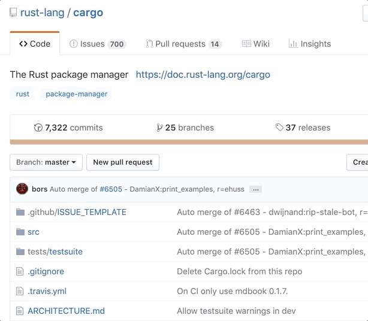
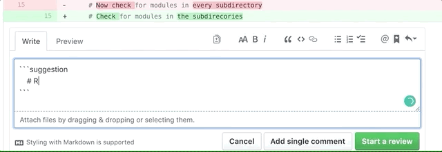
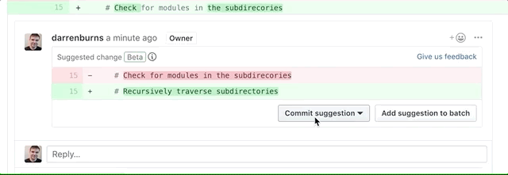
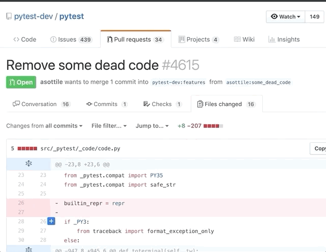
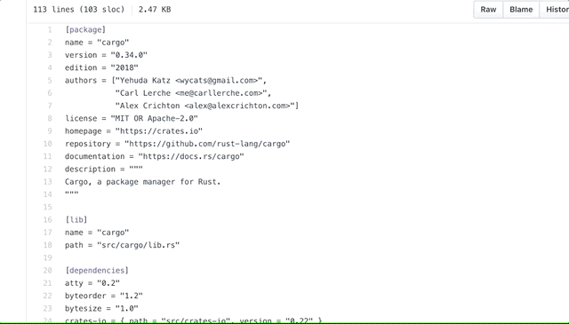
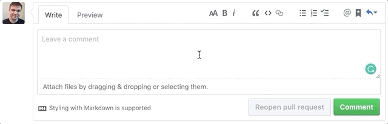

# [Как стать продуктивнее на GitHub](https://nuancesprog.ru/p/3111/)

Недавно GitHub объявил, что теперь пользователи смогут бесплатно создавать приватные репозитории в неограниченном количестве. Прежде чем загружать код в приватный репозиторий, рассмотрим GitHub подробнее: давайте убедимся, что мы на полную используем все его возможности.

На GitHub есть много чрезвычайно полезных горячих клавиш и других функций, которые помогают эффективнее работать. Однако, по собственному опыту могу сказать, что большинство разработчиков не обращают на них внимания. 

Здесь я привожу все известные мне интересные и полезные функции GitHub. Все, что я перечислю ниже — далеко не полный список.

## Быстрый поиск файлов в репозиториях по неточному соответствию
Без сомнения, это самый быстрый способ поиска по хранилищу, если вы знаете, что искать. Откройте любой репозиторий и нажмите t: вы увидите строку поиска, введите в нее название любого файла в репозитории. С помощью стрелок на клавиатуре выберите нужный вам результат. Нажмите Enter, чтобы открыть файл.

## Предложение правок на включение
С помощью функции «предложенные изменения» вы можете предложить правки в код, в комментарии к запросу на включение. Автор запроса на включение сможет принять ваши правки мгновенно, не покидая GitHub. Чтобы предложить правку, заключите фрагмент кода в многострочный Markdown-сниппет и добавьте тег suggestion:

Автор запроса на включение может сразу же применить ваши правки: ему не придется вручную переписывать файл!

## Навигация по дереву кода с помощью IDE
Для этого нужно неофициальное расширение Chrome. По сравнению с интерфейсом по умолчанию, это более привычный способ навигации по коду. С помощью расширения <a href="https://chrome.google.com/webstore/detail/octotree/bkhaagjahfmjljalopjnoealnfndnagc" target="_blank">Octotree</a> можно просматривать репозитории GitHub в виде дерева на боковой панели: такое же дерево можно увидеть в VS Code и других приложениях.

## Переход к функции при проверке кода
В тех случаях, когда вы проверяете больше одной функции, проверка кода — это частые переключения между вызовом функции и ее определением, постоянная прокрутка вверх и вниз. Нажмите t, чтобы перейти к символу при просмотре файлов в запросе на включение.

## Постоянная ссылка на файл
При просмотре файла или директории нажмите `y`: URL-адрес будет преобразован в постоянную ссылку, ей можно поделиться, не опасаясь, что содержимое файла изменится.

Если вы отправляете ссылку на файл или директорию на GitHub, не создавая постоянную ссылку, то она может перестать работать в любой момент и доступ к файлу будет утерян.

## Тепловая карта недавних изменений 
При просмотре файла нажмите `b`, чтобы посмотреть, кто вносил правки в код. Там же вы увидите тепловую карту, которая показывает, когда в последний раз в каждую конкретную строку вносились изменения. С помощью этой горячей клавиши вы увидите, кто, когда и в какую строку вносил правки. Также с помощью этой клавиши можно полностью увидеть строку кода, в которую вносились правки.

В правой части таблицы (в которой содержится информация об авторе и измененный код) вы увидите оранжевую вертикальную полосу. Чем ярче эта полоса, тем новее внесенные в него изменения: можно с легкостью просмотреть самые новые изменения в файле!

## Расширенный поиск по коду
GitHub индексирует большую часть кода и предлагает множество функций поиска по нему. Обычно не нужно брать код из репозитория, если вам нужно что-то в нем найти, не внося никаких изменений. Чтобы найти код в репозитории, нажмите `/`.

Если ваш поисковый запрос содержит несколько слов и вы хотите найти именно сочетание этих слов, возьмите запрос в кавычки. Также можете отфильтровать результаты поиска по таким параметрам, как размер файла, расширение, путь к файлу и многое другое. 

## Сохраненные ответы 
Если вам постоянно приходится повторять один и тот же комментарий, создайте сохраненный ответ. В следующий раз, когда вам понадобится этот комментарий, вы просто выберете его из выпадающего меню:

Чтобы выбрать сохраненный ответ (как показано выше), сначала нажмите `ctrl + /`, а затем `ctrl+ 1`.

## Заключение 
Спасибо, что прочитали. Я надеюсь, хотя бы одна из этих функций поможет вам стать продуктивным пользователем GitHub.