# [Как создать бесплатный сайт на GitHub Pages](https://nuancesprog.ru/p/4318/)

> GitHub Pages — это один из тех классных инструментов, о которых мало кто знает. Практически любой GitHub -репозиторий можно превратить в полноценный сайт в два клика.

Хотите разместить онлайн-портфолио своих работ, но не умеете создавать сайты? А, может, подумываете о собственном блоге или сайте-визитке, но не знаете, с чего начать? Или же просто не хотите тратить время и деньги на хостинги, доменные имена и т.д.?

Тогда эта статья для вас.

## А зачем мне сайт?
Сайт — это ваш способ коммуникации с миром. Если у человек есть собственный сайт, то это поднимает его значимость в глазах окружающих.

Существует несколько способов по созданию простых и бесплатных сайтов для начинающих. В основном такие сайты делаются на базе GitHub и WordPress.

WordPress — это отличный вариант для новичков, которые не разбираются в сайтостроении. К сожалению, здесь есть одно «но». Если создавать бесплатный сайт на WordPress, то все увидят, что вы пользуетесь этой платформой, поскольку адрес сайта будет заканчиваться на wordpress.com, а внизу каждой страницы появится логотип WordPress.

Знакомясь с миром технологий, вы быстро заметите, что умение работать с GitHub даст вам явное преимущество. Ну, а если вы уже прочно обосновались в ИТ-вселенной, то, скорее всего, успели отметиться в каком-то GitHub-репозитории.

При размещении проектов на GitHub люди видят не только ваш код, но и то, что вы делаете и как. GitHub — это настоящий круговорот идей. Так почему бы не создать свой сайт на GitHub и не разместить его в самом репозитории? К тому же так вы добавите несколько коммитов к своему профилю!

## Начинаем!
Существует целых два возможных сценария для создания сайтов. Вы либо создаете сайт с нуля, либо уже имеете некий прототип (или готовый сайт), но не знаете, как бесплатно разместить его на GitHub.

### Начнем со второго варианта.

У меня есть файлы, но я не знаю, что с ними делать!
А вот здесь все предельно просто — работу за вас сделает GitHub!

> Репозиторий — это место, где «живет» ваш проект. Здесь вы создаете структуру проекта, храните папки, файлы, изображения, видео, таблицы, Jupyter notebook, наборы данных и т.д.

Если у вас есть файлindex.html, то GitHub сразу поймет, что от него хотят.

Теперь самое время переключиться на <a href="https://pages.github.com/" target="_blank">GitHub Pages</a>. Зайдите в свой GitHub-репозиторий и нажмите Settings.

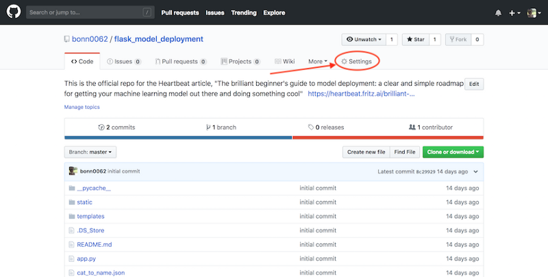

Прокрутите до GitHub pages. Здесь вы увидите следующее:

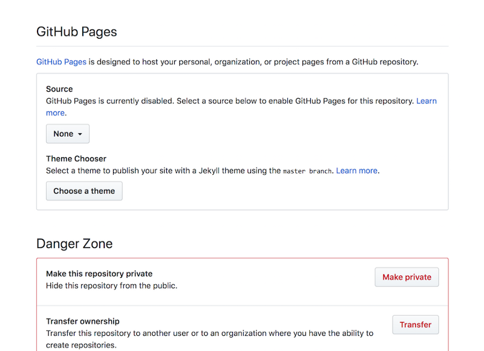

Теперь в выпадающем меню `Source` выберите `master branch` или `master branch/docs folder`. Разница вот в чем: если вы будете размещать проект из папки docs, то эта папка (docs) обязательно должна присутствовать в ветке master, из которой запускается сайт!

Если вы совсем новичок, то, скорее всего, выберете `master branch`. То есть репозиторий будет размещен «как есть».

Далее следует уведомление, что сайт готов к размещению.

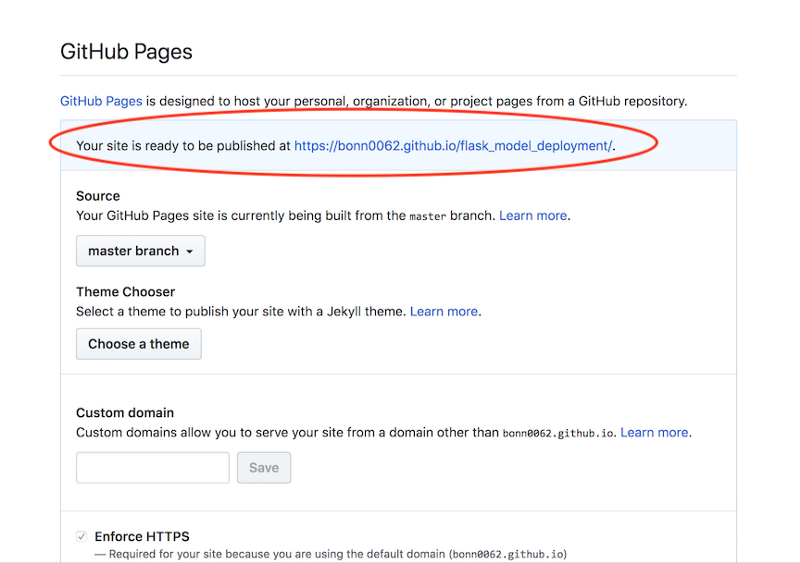

Проявите терпение. Подождите минуту-другую, а затем обновите страницу или попробуйте открыть нужную вам ссылку. Как только сайт будет размещен, вы увидите следующее:

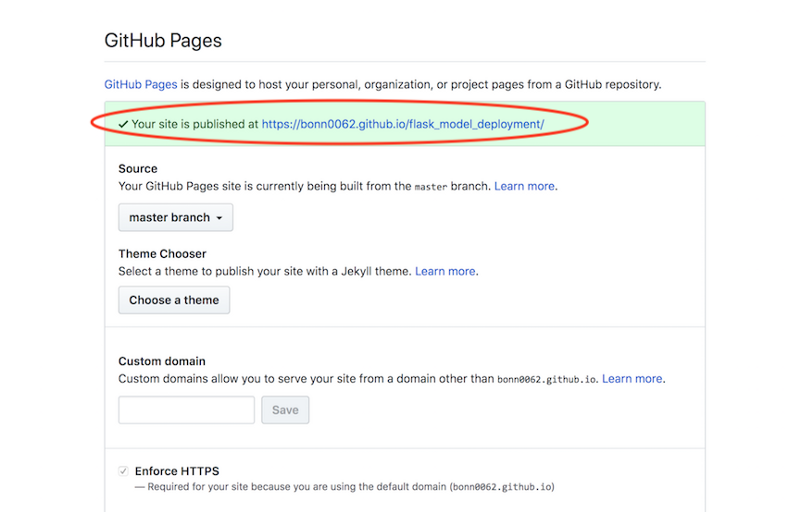

Кликните по этой ссылке.

А вот и ваш бесплатный сайт!

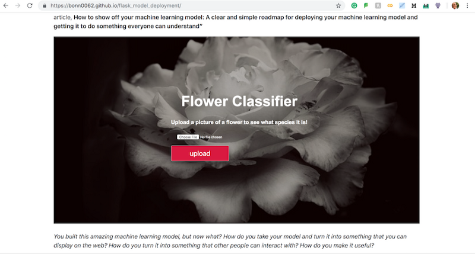

Поздравляем!!!

Теперь попробуем создать сайт с нуля.

## Я не знаю, с чего начать!
Сейчас поговорим об основах, а Bootstrap, верстку и т.д. прибережем до следующего раза.

Раз мы создаем сайт с нуля, то делать это будем в самом GitHub.

Для начала создадим новый репозиторий.

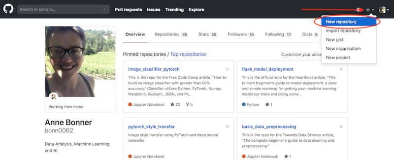

Укажите название репозитория, его краткое описание, отметьте галочкой `Initialize this repository with a README` и нажмите `Create repository`.

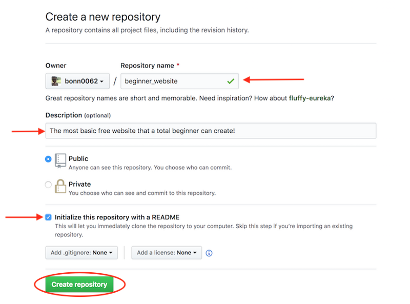

Теперь идем в `Settings` (правый верхний угол) и прокручиваем до раздела `GitHub Pages`. Открываем выпадающее меню, меняем его значение с `None` на `master branch`.

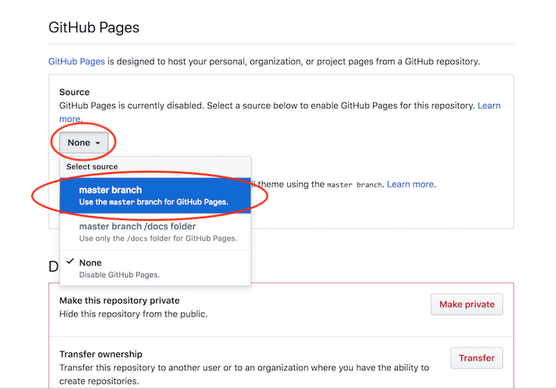

Сначала вы увидите вот это:

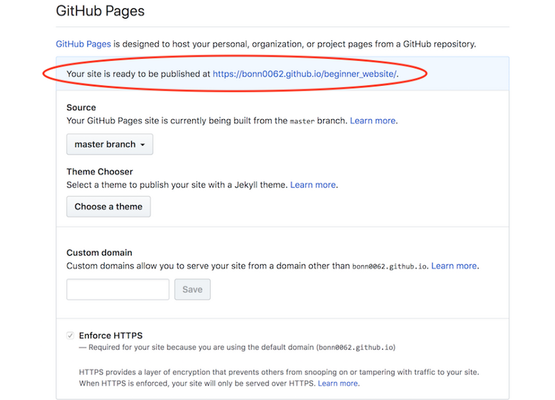

Подождите минуту-другую. Теперь вы видите это:

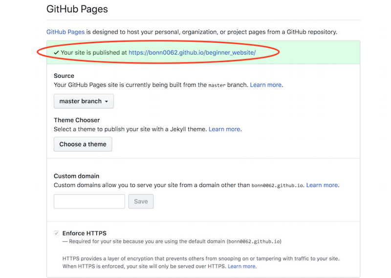

Кликните по ссылке.

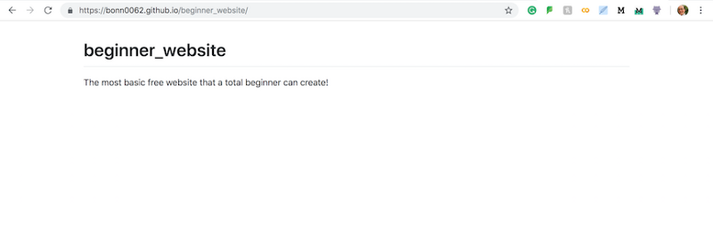

Поздравляю: ваш сайт готов!

## Чего-то не хватает
Да, сайт выглядит немного скучновато. Но здесь отображается содержимое вашего файла README.

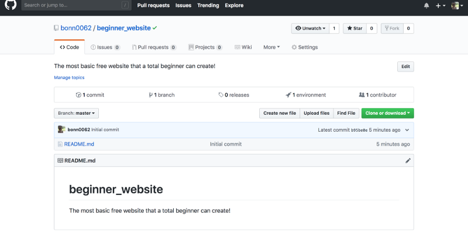

Для внесения изменений подкорректируйте README-файл и добавьте туда все, что сочтете нужным. Вернитесь в свой репозиторий, кликните по иконке с карандашом и начните изменять README.

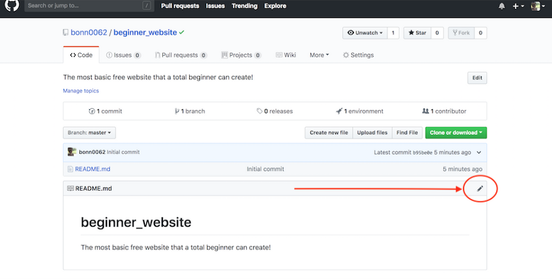

Изменение README-файла

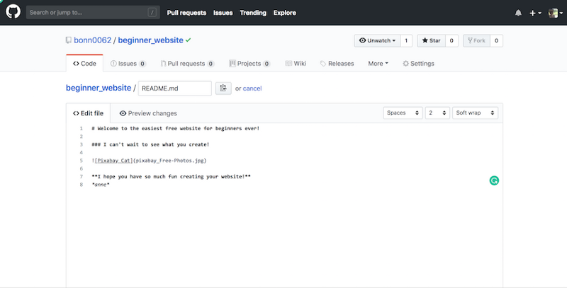

зменение файла (в Markdown-файле)

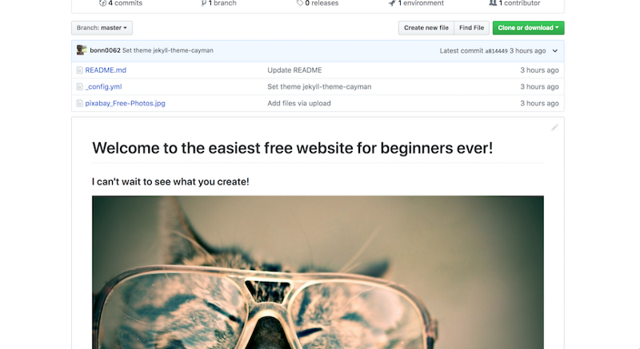

Измененный файл

Markdown дает вам множество разных возможностей. Например, вы можете добавить текст, картинки, ссылки, цвета или выполнить простое форматирование.

(Помните, что при добавлении изображений в README, нужно обязательно загружать их в репозиторий. Иначе GitHub не поймет, о чем речь!)

Теперь вернитесь в свой сайт и оцените результат.

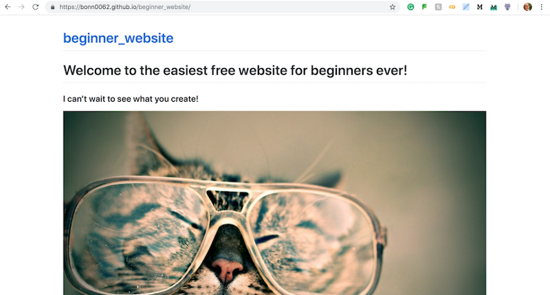

Довольно часто для вступления в силу изменений нужно выждать несколько минут. Если вдруг ваш браузер постоянно откатывается к предыдущей версии сайта, то просто почистите историю в браузере за последние сутки.

## Уже хорошо, но может быть еще лучше
Совсем новичкам, не разбирающимся в CSS, но мечтающим о красивом сайте, может понравиться тема Jekyll. Встроенные темы позволяют изменять внешний вид сайта без каких-либо усилий с вашей стороны. Jekyll и GitHub сделают за вас всю работу, а вам останется лишь нажать одну-две кнопки.

Давайте вернемся к `GitHub Pages` в `Settings` и нажмем `Choose a theme`.

Проверим, как изменится сайт при выборе первой из доступных тем. Для этого нажмите зеленую кнопку `Select theme`, немного подождите и еще раз откройте свой сайт.

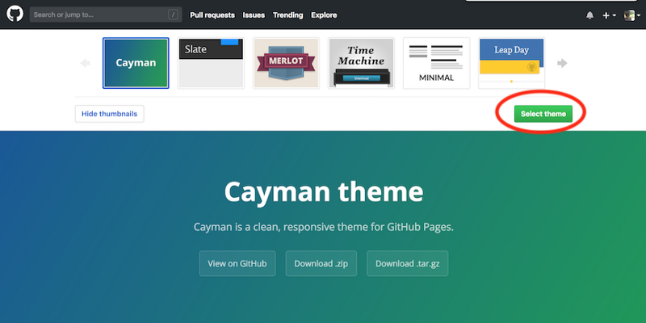

Пару минут спустя видим результат:

Вот и все! Вы создали свой первый бесплатный сайт-визитку, блог или портфолио, разместили его в GitHub-репозитории и готовы представить свое творение миру!

Несколько примечаний:

* Если вдруг вам разонравилась текущая тема, то ее можно запросто удалить. В репозитории есть файл _config.yml, в котором размещается информация о теме. Удалите этот файл, и ваша тема удалится вместе с ним!

* Если вы хотите сменить тему или что-то в нее добавить, то опять же ищите файл _config.yml и меняйте там все, что захотите. Можете даже начать с темы Jekyll Now — это простой и уже готовый блог.

