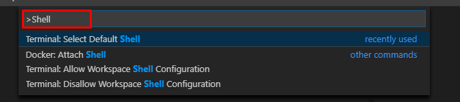
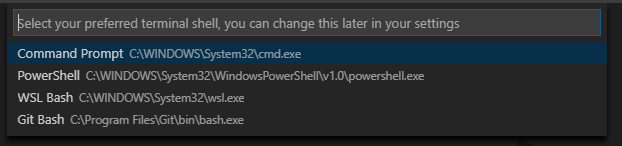
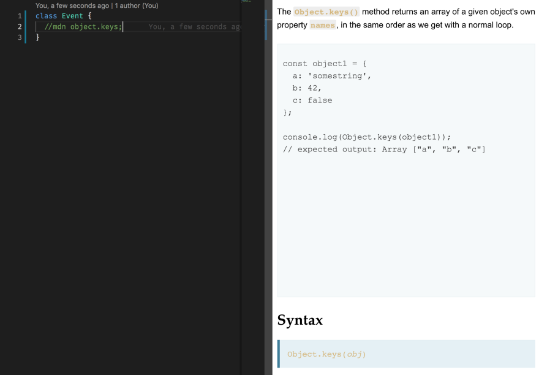

## [Редактор кода Visual Studio Code](https://habr.com/ru/post/490754/)

##  [Самый подробный гайд по настройке и установке плагинов для начинающих](https://habr.com/ru/post/490754/)

### Запуск на слабой машине

    "C:\Users\79059\AppData\Local\Programs\Microsoft VS Code\Code.exe --disable-gpu"


### [VS Code: вам не нужно это расширение](https://techrocks.ru/2020/08/06/vs-code-extensions-vs-settings/)

#### 1. Автоматическое переименование тегов и закрывающие теги

    "editor.renameOnType": true

### Edit default terminal    





## VSCode for js

### [Как настроить VS Code для увеличения продуктивности](https://techrocks.ru/2019/03/31/vs-code-customization/)

### Запуск из командной строки
Хорошо бы иметь возможность запускать VS Code из терминала. Для этого нажмите CMD + SHIFT + P, введите shell command и выберите Install code command in path. После чего перейдите в любой проект из терминала и, находясь в выбранной директории, введите «code .», чтобы запустить проект с помощью VS Code.

### Pragmata 

    "editor.fontFamily": "'Pragmata Pro Mono',Consolas, 'Courier New', monospace"

### 1. Auto Import

### 2. Add jsdoc comments

### 3. ESDoc MDN



### [4. CSS Peek](https://marketplace.visualstudio.com/items?itemName=pranaygp.vscode-css-peek)

### [GitLens](https://marketplace.visualstudio.com/items?itemName=eamodio.gitlens)


### keybindings.json 
%APPDATA% = C:\Users\79059\AppData\Roaming\
%APPDATA%\Code\User\keybindings.json

### Как перезапустить VScode после редактирования конфигурации расширения?


```json  
[
    {
        "key": "shift+f1",
        "command": "workbench.action.reloadWindow",
        "when": "editorTextFocus"
    }
  ]
```
### Как отключить мини-карту VS Code в режиме Windowed?

    "editor.minimap.enabled": false


